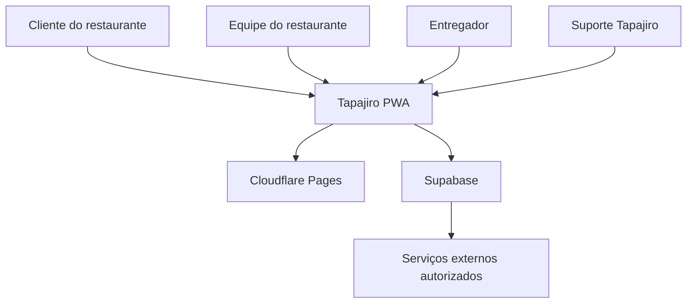
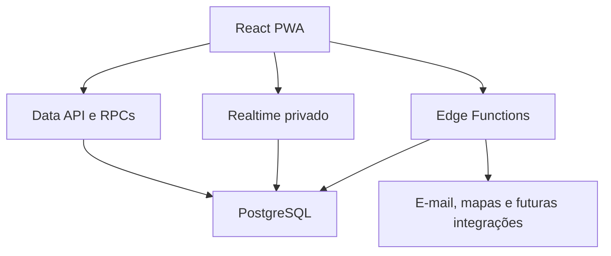
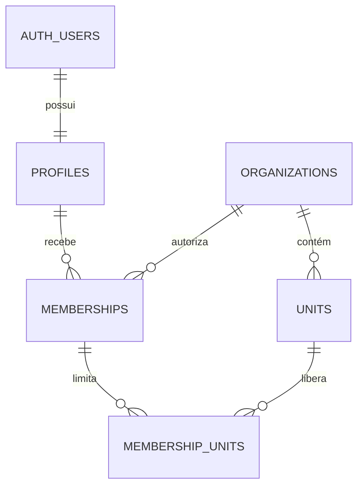
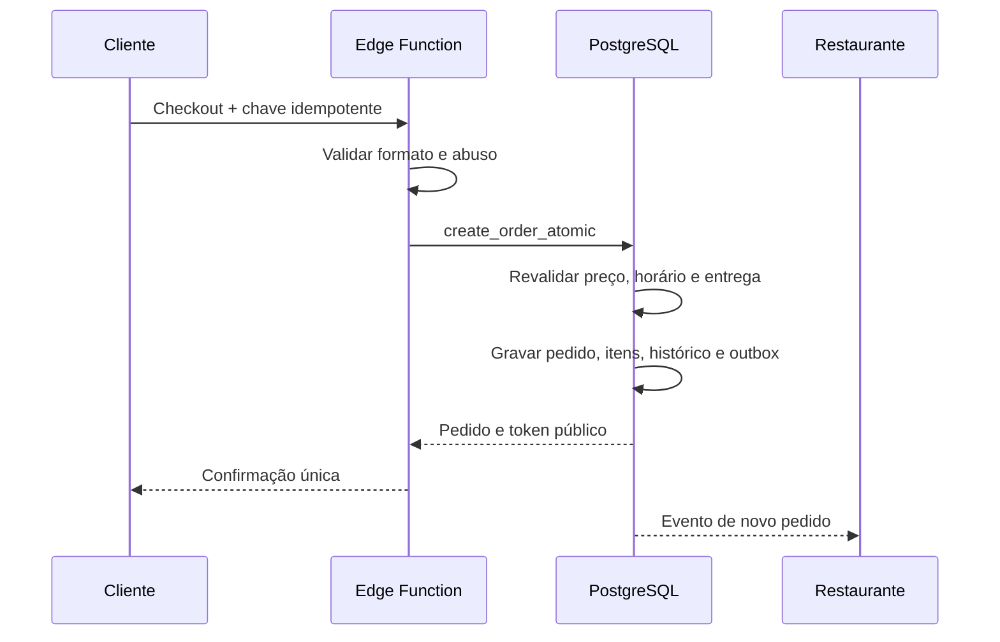
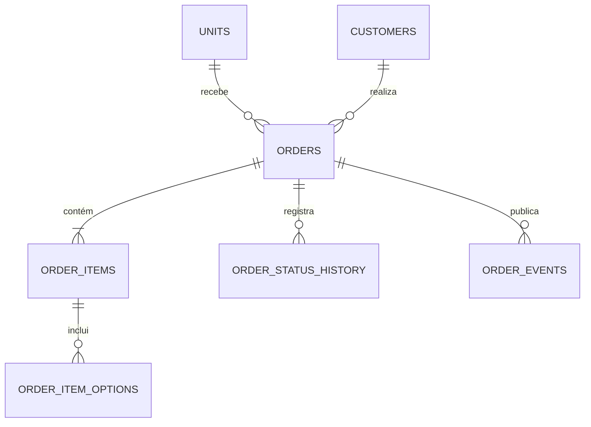
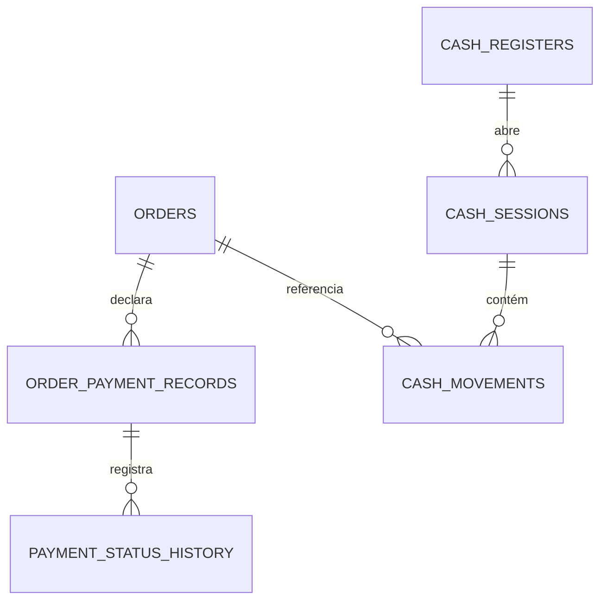
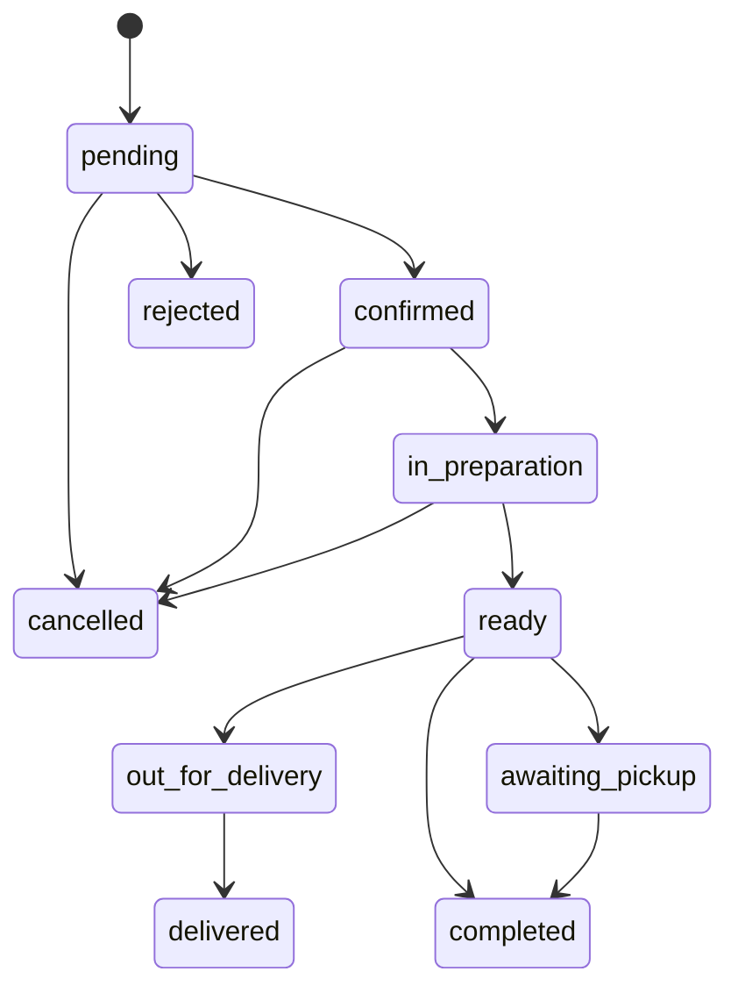

# Tapajiro

## Documento de Arquitetura Técnica — DAT

**Produto:** Tapajiro  
**Tipo:** PWA SaaS multiempresa para gestão de vendas e delivery  
**Versão do documento:** 1.0  
**Data:** 19 de julho de 2026  
**Status:** Proposta técnica para aprovação e execução  
**Documento de origem:** Tapajiro PRD v1.1  
**Responsável técnico:** A definir  

---

## 1. Controle do documento

### 1.1. Finalidade

Este documento transforma os requisitos do PRD do Tapajiro em decisões técnicas executáveis. Ele define a arquitetura do MVP e do primeiro lançamento comercial, orienta banco de dados, segurança, desenvolvimento, testes, implantação e observabilidade e estabelece limites que não podem ser ultrapassados sem uma decisão arquitetural formal.

O documento deve ser utilizado por produto, UX/UI, desenvolvimento, infraestrutura, qualidade, segurança e pelos agentes do Antigravity como referência técnica principal.

### 1.2. Escopo arquitetural

Estão abrangidos:

- painel administrativo e gerencial;
- painel operacional de pedidos, cozinha e expedição;
- cardápio público e checkout;
- acompanhamento público do pedido;
- modo entregador;
- backoffice SaaS;
- autenticação, autorização e multiempresa;
- banco de dados, arquivos, tempo real e funções de backend;
- PWA, cache e operação em conectividade instável;
- auditoria, privacidade, segurança, testes e implantação;
- registro de pagamentos e caixa, sem intermediação financeira;
- diretrizes de execução no Antigravity.

### 1.3. Fora do escopo desta versão

- estoque e ficha técnica completos;
- emissão fiscal;
- integrações com marketplaces;
- WhatsApp oficial;
- pagamento digital integrado;
- roteirização inteligente;
- franquias e royalties;
- aplicativo nativo;
- microsserviços;
- data warehouse independente;
- operação financeira, carteira, custódia, split ou antecipação.

### 1.4. Histórico

| Versão | Data | Alteração | Status |
|---|---|---|---|
| 1.0 | 19/07/2026 | Arquitetura técnica inicial derivada do PRD v1.1 | Para aprovação |

### 1.5. Termos

| Termo | Definição |
|---|---|
| Organização | Empresa cliente do Tapajiro e limite principal de isolamento de dados |
| Unidade | Loja, restaurante ou operação pertencente a uma organização |
| Tenant | Organização usada como fronteira lógica multiempresa |
| RLS | Row Level Security do PostgreSQL |
| KDS | Kitchen Display System |
| PWA | Aplicação web progressiva, instalável quando suportada |
| RPC | Função transacional exposta de forma controlada pelo banco |
| Edge Function | Função server-side usada para integrações e operações privilegiadas |
| Outbox | Registro transacional de eventos que precisam ser processados de forma assíncrona |
| RPO | Perda máxima de dados aceitável após um desastre |
| RTO | Tempo máximo desejado para restauração do serviço |
| Registro de pagamento | Informação operacional sobre recebimento direto do restaurante; não representa valor custodiado pelo Tapajiro |

---

## 2. Resumo executivo

O Tapajiro será construído como um monólito modular, orientado a domínios, com um único PWA React e um núcleo PostgreSQL/Supabase. A arquitetura prioriza velocidade de desenvolvimento, consistência transacional, segurança multiempresa e simplicidade operacional, sem adotar microsserviços prematuramente.

O navegador acessará diretamente apenas operações compatíveis com RLS. Cálculos comerciais, criação de pedidos, mudanças críticas de status, fechamento de caixa e ações privilegiadas serão executados por RPCs transacionais ou Edge Functions. O PostgreSQL será a fonte única da verdade.

Atualizações operacionais serão distribuídas em tempo real. Eventos em tempo real apenas avisam que algo mudou; a interface sempre reconcilia o estado com o banco. Na indisponibilidade do canal, o cliente passa para consulta periódica sem duplicar ações.

O Tapajiro não participará do fluxo de valores dos pedidos. O sistema apenas registrará meios e estados de recebimentos realizados diretamente pelo estabelecimento. Essa restrição existe no modelo de domínio, no banco, nas APIs, na interface, nos testes e na revisão de migrations.

---

## 3. Drivers e atributos de qualidade

### 3.1. Drivers principais

1. O fluxo pedido → cozinha → expedição → entrega deve funcionar com baixa fricção.
2. Nenhuma organização pode acessar dados de outra organização.
3. O mesmo produto deve atender celular, tablet e desktop.
4. A operação deve degradar com clareza em internet instável.
5. Um pedido não pode ser duplicado por reenvio ou reconexão.
6. Totais, permissões e estados críticos devem ser validados no servidor.
7. O sistema deve evoluir por módulos sem exigir reescrita completa.
8. O Tapajiro não pode assumir intermediação financeira por evolução acidental.
9. A equipe deve conseguir operar e auditar o produto com estrutura enxuta.
10. Agentes de IA devem trabalhar dentro de limites técnicos verificáveis.

### 3.2. Metas de qualidade

| Atributo | Meta inicial | Verificação |
|---|---|---|
| Disponibilidade | 99,5% mensal, excluindo manutenção comunicada | Monitoramento mensal |
| Cardápio público | LCP abaixo de 2,5 s no percentil 75 em conexão móvel adequada | RUM e teste de laboratório |
| Resposta visual | Feedback local em até 300 ms para ações comuns | Testes de UX |
| Confirmação crítica | Preferencialmente até 2 s; timeout explícito e recuperável | Métricas p95 |
| Isolamento | Zero leitura ou escrita entre tenants | Testes RLS positivos e negativos |
| Idempotência | Zero pedido duplicado para a mesma chave válida | Testes de concorrência e E2E |
| Acessibilidade | WCAG 2.2 AA nas jornadas críticas | Automação e revisão manual |
| Recuperação MVP | RPO de até 24 h e RTO de até 8 h | Simulação de restauração |
| Recuperação comercial | Meta de RPO de até 1 h e RTO de até 4 h, condicionada ao plano de infraestrutura | Teste documentado |
| Auditoria | 100% das ações críticas previstas registradas | Testes de integração |

### 3.3. Princípios obrigatórios

- Segurança e isolamento são requisitos de banco, não apenas de interface.
- O servidor nunca confia em preço, desconto, taxa, permissão ou total enviados pelo cliente.
- O banco relacional é a fonte de verdade; caches e eventos são projeções descartáveis.
- Ações críticas são transacionais, idempotentes e auditáveis.
- Falha não pode aparentar sucesso.
- Offline não significa confirmado.
- A chave administrativa do backend nunca é entregue ao navegador.
- Integrações usam adaptadores e feature flags.
- Migrations aplicadas são imutáveis.
- Dependências são fixadas pelo lockfile e atualizadas deliberadamente.
- A cobrança da assinatura SaaS é separada dos pedidos dos restaurantes.
- Não haverá carteira, saldo sacável, custódia, split, liquidação, repasse ou antecipação de valores de pedidos.

---

## 4. Visão arquitetural

### 4.1. Estilo escolhido

**Monólito modular com backend gerenciado e fronteiras de domínio explícitas.**

Um único repositório abrigará o PWA, pacotes compartilhados, migrations, funções server-side, testes e documentação. O banco terá schemas e módulos lógicos; não haverá banco separado por organização no MVP.

### 4.2. Diagrama de contexto



### 4.3. Diagrama de contêineres



### 4.4. Responsabilidades por contêiner

| Contêiner | Responsabilidade | Não deve fazer |
|---|---|---|
| React PWA | Interface, navegação, validação de experiência, cache seguro e sincronização | Autorizar acesso, calcular total final ou usar segredo administrativo |
| Data API | CRUD seguro sujeito a RLS | Expor tabelas internas ou ignorar políticas |
| RPCs PostgreSQL | Transações críticas, transições, cálculos e invariantes | Chamar serviços externos lentos durante a transação |
| Edge Functions | Entrada pública protegida, webhooks, integrações e ações privilegiadas | Manter estado como fonte da verdade |
| PostgreSQL | Dados, integridade, RLS, histórico, auditoria e outbox | Assumir que o cliente já validou dados |
| Realtime | Sinalizar mudanças e presença operacional | Ser fonte durável do estado |
| Storage | Imagens de produtos, logos e ativos autorizados | Receber arquivos executáveis ou dados sem política |
| Cloudflare Pages | Servir o PWA, assets e previews | Conter chaves administrativas |

### 4.5. Decisões estruturais

| Código | Decisão | Motivo |
|---|---|---|
| AD-001 | SPA/PWA React com Vite | Uma base responsiva para todas as superfícies e boa experiência operacional |
| AD-002 | PostgreSQL/Supabase | Consistência relacional, Auth, RLS, Realtime, Storage e funções integradas |
| AD-003 | Monólito modular | Menor custo cognitivo e operacional no estágio inicial |
| AD-004 | Acesso direto somente sob RLS | Reduz camada repetitiva sem enfraquecer segurança |
| AD-005 | RPC para invariantes transacionais | Pedidos, estados e caixa precisam de atomicidade |
| AD-006 | Edge Functions para fronteiras externas | Segredos, rate limit, webhooks e provedores não pertencem ao cliente |
| AD-007 | Broadcast privado com refetch | Escala, segurança e tolerância a perda de eventos |
| AD-008 | Valores em centavos inteiros | Evita imprecisão de ponto flutuante |
| AD-009 | PII minimizada no dispositivo | IndexedDB e caches do navegador não oferecem cofre de dados |
| AD-010 | Sem intermediação financeira | Decisão estratégica e restrição permanente do produto |

---

## 5. Stack tecnológica

### 5.1. Stack aprovada

| Camada | Escolha | Uso |
|---|---|---|
| Linguagem | TypeScript estrito | Frontend, funções e bibliotecas compartilhadas |
| Frontend | React + Vite | PWA e superfícies web |
| Rotas | React Router | Rotas públicas, autenticadas e do entregador |
| Dados remotos | TanStack Query | Cache, invalidação, retry controlado e sincronização |
| Formulários | React Hook Form + Zod | Formulários performáticos e schemas compartilhados |
| UI | Tailwind CSS + primitives acessíveis | Design System Tapajiro |
| Estado local | React state; store mínima somente quando transversal | Sessão visual, filtros e preferências não persistentes |
| Banco | PostgreSQL gerenciado pelo Supabase | Fonte única da verdade |
| Autenticação | Supabase Auth | Identidade de usuários internos |
| Autorização | RLS + permissões no banco | Multiempresa e menor privilégio |
| Backend | RPCs PostgreSQL + Supabase Edge Functions | Transações e integrações |
| Tempo real | Supabase Realtime Broadcast privado | Atualizações operacionais |
| Arquivos | Supabase Storage | Logos e imagens de cardápio |
| PWA | Manifest + Service Worker + Workbox | Instalação, app shell e cache controlado |
| Hospedagem web | Cloudflare Pages | Produção, homologação e previews |
| Testes unitários | Vitest | Domínio e utilitários |
| Testes de UI | Testing Library | Comportamento de componentes |
| Testes E2E | Playwright | Chromium, WebKit e Firefox |
| Testes de banco | pgTAP e scripts SQL | RLS, constraints, funções e migrations |
| Repositório | GitHub | Código, revisão e automação |
| CI/CD | GitHub Actions | Qualidade, preview e promoção |
| Pacotes | pnpm workspaces | Lockfile único e módulos compartilhados |

### 5.2. Política de versões

- Não fixar versões no documento; o lockfile é a referência executável.
- Iniciar com versões estáveis e compatíveis na data do scaffold.
- Proibir dependências `latest` em CI e produção.
- Atualizações maiores exigem PR próprio, changelog revisado e testes completos.
- Dependências críticas devem passar por análise de vulnerabilidade e licença.
- O Node usado localmente e no CI deve ser fixado em arquivo de versão.

### 5.3. Tecnologias conscientemente adiadas

| Tecnologia | Decisão | Critério de reavaliação |
|---|---|---|
| Microsserviços | Adiar | Limite comprovado de escala, autonomia de equipe ou implantação |
| GraphQL | Adiar | Necessidade real não atendida pela Data API/RPC |
| Kubernetes | Não usar no MVP | Infraestrutura dedicada e múltiplos serviços independentes |
| Redis | Adiar | Contenção, rate limit ou cache distribuído não atendido pela plataforma |
| Aplicativo nativo | Adiar | Capacidade essencial indisponível no PWA e demanda validada |
| Data warehouse | Adiar | Volume e análise que prejudiquem o banco operacional |

---

## 6. Organização do repositório

### 6.1. Estrutura proposta

```text
tapajiro/
├── apps/
│   └── web/
│       ├── src/
│       │   ├── app/
│       │   ├── routes/
│       │   ├── modules/
│       │   ├── components/
│       │   ├── hooks/
│       │   ├── lib/
│       │   └── styles/
│       ├── public/
│       └── tests/
├── packages/
│   ├── domain/
│   ├── schemas/
│   ├── ui/
│   ├── config/
│   └── test-utils/
├── supabase/
│   ├── migrations/
│   ├── functions/
│   ├── seed.sql
│   ├── tests/
│   └── config.toml
├── docs/
│   ├── architecture/
│   ├── adr/
│   ├── runbooks/
│   └── product/
├── scripts/
├── .github/workflows/
├── AGENTS.md
├── PROJECT_CONTEXT.md
├── pnpm-workspace.yaml
└── package.json
```

### 6.2. Regras de dependência

- `packages/domain` não importa React, Supabase ou componentes visuais.
- `packages/schemas` contém schemas de entrada e contratos serializáveis.
- `packages/ui` não acessa banco nem conhece regras específicas de tenant.
- Módulos do app importam domínio e UI por APIs públicas.
- Um módulo não acessa arquivos internos de outro módulo.
- Funções server-side reutilizam schemas, mas não componentes web.
- SQL é a autoridade para constraints e transações; TypeScript mantém contratos equivalentes.
- Imports circulares falham no CI.

### 6.3. Módulos do frontend

| Módulo | Responsabilidade |
|---|---|
| `identity` | Sessão, login, convite e recuperação |
| `organizations` | Organização, unidade e horários |
| `catalog` | Categorias, produtos, opções e publicação |
| `customers` | Clientes, endereços e histórico autorizado |
| `ordering` | Carrinho, checkout, pedido e detalhes |
| `operations` | Central de pedidos e KDS |
| `dispatch` | Expedição e atribuição |
| `delivery` | Entregas e modo entregador |
| `payment-records` | Meios e estados declarados de pagamento |
| `cash` | Abertura, movimentos e fechamento de caixa |
| `reports` | Indicadores e exportações |
| `settings` | Usuários, permissões e configurações |
| `platform` | Assinatura e backoffice SaaS |

---

## 7. Domínios e fronteiras

### 7.1. Mapa de domínios

| Domínio | Dono dos dados | Publica eventos | Consome eventos |
|---|---|---|---|
| Identity & Access | profiles, memberships, roles | usuário vinculado, permissão alterada | organização criada |
| Organizations | organizations, units, hours | unidade aberta/fechada | assinatura alterada |
| Catalog | menus, categories, products | cardápio publicado, produto indisponível | unidade alterada |
| Customers | customers, addresses, consents | cliente criado/atualizado | pedido concluído |
| Ordering | orders, items, adjustments | pedido criado/confirmado/cancelado | catálogo e cliente |
| Fulfillment | preparation/status history | preparo iniciado, pedido pronto | pedido confirmado |
| Delivery | drivers, deliveries | entrega atribuída/em rota/concluída | pedido pronto |
| Payment Records | order_payment_records | recebimento registrado/confirmado | pedido criado |
| Cash Management | cash sessions/movements | caixa aberto/fechado | pedido concluído e recebimento confirmado |
| Reporting | projeções e views | relatório gerado | eventos operacionais |
| Notifications | jobs e deliveries | envio concluído/falho | eventos de pedido |
| Subscription | plans e subscriptions | plano alterado/suspenso | uso da organização |
| Audit | audit_logs | não publica | todas as ações críticas |

### 7.2. Regras entre domínios

- Ordering recebe snapshots do Catalog; nunca referencia preço mutável para reconstruir venda histórica.
- Fulfillment altera status por comandos do Ordering, não por update livre.
- Delivery não altera total do pedido.
- Payment Records não confirma automaticamente o pedido operacional.
- Cash Management registra reflexos gerenciais; não cria liquidação financeira.
- Reporting lê views/projeções e não altera entidades operacionais.
- Notifications não pode reverter ou confirmar pedidos.
- Subscription pode limitar acesso comercial, mas não apaga dados operacionais.
- Audit recebe fatos imutáveis e não participa de regras de negócio como fonte primária.

---

## 8. Arquitetura multiempresa

### 8.1. Estratégia

Será adotado banco compartilhado e schema compartilhado, com `organization_id` obrigatório em toda tabela pertencente ao tenant. `unit_id` será obrigatório quando o dado pertencer a uma unidade específica.

O isolamento é aplicado por:

1. foreign keys compostas quando necessárias;
2. RLS em todas as tabelas expostas;
3. funções auxiliares de autorização;
4. filtros explícitos em operações privilegiadas;
5. testes negativos entre duas ou mais organizações;
6. logs de auditoria com organização e unidade;
7. ausência de chaves administrativas no cliente.

### 8.2. Estrutura de acesso



### 8.3. Regras de tenant

- Um usuário pode ter vínculos independentes com várias organizações.
- O tenant ativo é selecionado na interface, mas validado pelo banco.
- O cliente nunca define uma organização arbitrária para obter acesso.
- O `organization_id` de inserts autenticados deriva do vínculo validado ou é conferido com `WITH CHECK`.
- Acesso a unidade exige vínculo geral autorizado ou registro em `membership_units`.
- Suspensão de vínculo bloqueia acesso imediatamente no banco, ainda que o JWT não tenha expirado.
- Backoffice SaaS não compartilha automaticamente o papel de usuário do restaurante.
- Acesso excepcional de suporte exige concessão específica, justificativa, escopo, expiração e auditoria.

### 8.4. Padrão RLS

Todas as tabelas de tenant devem:

```sql
alter table public.example enable row level security;
alter table public.example force row level security;
```

As políticas devem ser específicas por operação. O padrão conceitual é:

```sql
create policy example_select
on public.example
for select
to authenticated
using (
  public.has_unit_permission(
    auth.uid(), organization_id, unit_id, 'example.read'
  )
);

create policy example_insert
on public.example
for insert
to authenticated
with check (
  public.has_unit_permission(
    auth.uid(), organization_id, unit_id, 'example.create'
  )
);
```

O SQL acima é uma especificação de padrão, não uma migration pronta. As funções auxiliares deverão ser `stable`, possuir `search_path` fixo, privilégios mínimos e índices que evitem varreduras por linha.

### 8.5. Testes obrigatórios de RLS

- usuário sem vínculo não lê nem escreve;
- usuário da organização A não acessa a organização B;
- usuário limitado à unidade A1 não acessa A2;
- cozinha não altera preço ou caixa;
- entregador acessa apenas entregas atribuídas/autorizadas;
- financeiro não altera cardápio sem permissão adicional;
- vínculo suspenso perde acesso;
- usuário anônimo acessa somente views/RPCs públicos permitidos;
- suporte sem concessão não acessa dados do cliente;
- Testes de usuário não podem usar `service_role`; quando necessário em testes de integração, seu uso fica restrito ao ambiente server-side controlado.

---

## 9. Identidade, autenticação e autorização

### 9.1. Identidades

- Usuários internos usam Supabase Auth.
- Cliente do cardápio não precisa criar conta tradicional no MVP.
- Acompanhamento público usa token aleatório de alta entropia e escopo restrito.
- Entregadores usam conta individual e papel restrito.
- Contas compartilhadas são proibidas.
- Administradores da plataforma usam identidade separada e MFA obrigatório antes da produção comercial.

### 9.2. Fluxos de autenticação

| Fluxo | MVP | Observação |
|---|---|---|
| E-mail e senha | Sim | Proprietários e equipe |
| Convite por e-mail | Sim | Vínculo criado somente após aceite válido |
| Recuperação de senha | Sim | Redirecionamentos permitidos explicitamente |
| Magic link/OTP | Opcional | Pode reduzir suporte, sujeito a validação do piloto |
| MFA para proprietário | P1 | Recomendado |
| MFA para suporte Tapajiro | Obrigatório no comercial | Acesso privilegiado |
| Login social | Não no MVP | Reavaliar por demanda |

### 9.3. Modelo RBAC

Papéis iniciais são modelos editáveis de permissões; a autorização real usa permissões atômicas.

| Papel | Escopo típico |
|---|---|
| Proprietário | Administração total da organização, exceto funções exclusivas da plataforma |
| Gerente | Operação, equipe limitada, descontos, cancelamentos e caixa conforme configuração |
| Atendente | Clientes, pedidos e consulta de cardápio |
| Caixa | Balcão, registros de recebimento e sessão de caixa |
| Cozinha | Visualização do KDS e transições de preparo |
| Expedição | Conferência, atribuição e saída para entrega |
| Entregador | Apenas entregas autorizadas e seus estados |
| Financeiro | Caixa, relatórios e exportação gerencial |

### 9.4. Catálogo inicial de permissões

```text
organization.read
organization.update
unit.read
unit.update
catalog.read
catalog.manage
catalog.publish
customer.read
customer.manage
order.read
order.create
order.accept
order.cancel
order.discount
kds.operate
dispatch.operate
delivery.assign
delivery.operate_own
payment_record.read
payment_record.confirm
cash.open
cash.move
cash.close
cash.reopen
report.read
report.export
team.manage
audit.read
subscription.read
```

### 9.5. Regras de sessão

- JWT identifica o usuário; associação e permissões são verificadas no banco.
- Não depender exclusivamente de claims de organização, pois podem ficar obsoletas.
- Logout deve revogar a sessão quando aplicável.
- Mudança de senha, suspensão e remoção de vínculo devem invalidar acesso efetivo.
- A aplicação deve ocultar módulos não permitidos, mas isso não substitui a autorização do servidor.
- Tokens e dados de sessão nunca aparecem em logs.

---

## 10. Arquitetura do frontend

### 10.1. Superfícies no mesmo PWA

| Área | Prefixo | Autenticação |
|---|---|---|
| Cardápio público | `/[slug]` | Não obrigatória |
| Acompanhamento | `/pedido/[token]` | Token restrito |
| Painel | `/app/*` | Usuário interno |
| Entregador | `/driver/*` | Usuário entregador |
| Backoffice | `/backoffice/*` | Administrador da plataforma |

As superfícies compartilham infraestrutura e Design System, mas usam layouts, guardas de rota e bundles lógicos separados. Rotas de backoffice não devem ser liberadas apenas por ocultação visual.

### 10.2. Camadas do frontend

1. **Routes:** composição de páginas, loaders e guardas.
2. **Features/modules:** casos de uso por domínio.
3. **Domain:** tipos, estados, cálculos locais não autoritativos e regras de apresentação.
4. **Data access:** queries, mutations, RPCs e adaptadores.
5. **UI:** componentes do Design System.
6. **Platform:** sessão, telemetria, PWA, feature flags e conectividade.

### 10.3. Estado e cache

- TanStack Query controla dados remotos.
- Query keys sempre incluem organização e unidade quando aplicável.
- Troca de tenant cancela requests e limpa caches restritos.
- Dados de pedido usam `staleTime` curto e invalidação por evento.
- Catálogo público pode usar cache maior, invalidado por versão de publicação.
- Estado local não duplica entidades remotas completas.
- Mutação otimista somente em ações reversíveis e de baixo risco.
- Aceite, cancelamento, pagamento e caixa aguardam confirmação do servidor.

### 10.4. Tratamento de erros

Erros são normalizados em um contrato comum:

```ts
type AppError = {
  code: string;
  message: string;
  correlationId?: string;
  fieldErrors?: Record<string, string[]>;
  retryable: boolean;
};
```

- Mensagens públicas não revelam SQL, stack ou segredo.
- Erros de validação retornam campos específicos.
- Conflito de versão oferece atualização e nova tentativa consciente.
- Falha desconhecida mostra código de correlação para suporte.
- Toast não substitui mensagem persistente em erro crítico.

### 10.5. Design System

- Tokens de cor seguem a paleta oficial do Tapajiro.
- Cores semânticas podem complementar a paleta para sucesso, alerta e erro, com contraste validado.
- Sora é usada em títulos e KPIs; Inter em texto e dados.
- Base espacial de 8 px.
- Controles: 12 px; cards: 16 px; modais: 20 px.
- Status sempre usam texto, ícone e cor.
- Alvos de toque devem ter dimensão apropriada à operação.
- Componentes críticos incluem estados loading, empty, error, offline, stale e forbidden.
- Imagens de produtos devem ser locais ou armazenadas pelo produto, com origem e direitos definidos.

### 10.6. SEO e compartilhamento do cardápio

- O MVP pode usar metadados gerais do Tapajiro no shell público.
- Título, descrição e imagem específicos por estabelecimento serão tratados no P1 por mecanismo server-side/edge, sem expor o painel autenticado.
- Slugs devem possuir URL canônica e redirecionamento controlado após alteração.
- Páginas privadas, checkout e acompanhamento não devem ser indexadas.
- Sitemap deve incluir somente cardápios públicos ativos quando a estratégia de descoberta orgânica for aprovada.

---

## 11. Backend e contratos de acesso

### 11.1. Regra de escolha

| Necessidade | Mecanismo |
|---|---|
| Leitura simples autenticada | Data API sob RLS |
| CRUD administrativo simples | Data API sob RLS e constraints |
| Transação de múltiplas tabelas | RPC PostgreSQL |
| Cálculo comercial autoritativo | RPC PostgreSQL |
| Entrada pública sujeita a abuso | Edge Function + RPC |
| Uso de segredo externo | Edge Function |
| Webhook | Edge Function |
| Trabalho assíncrono | Outbox + worker/função agendada |
| Relatório complexo | View/RPC de leitura, com RLS |

### 11.2. RPCs previstas

| RPC | Responsabilidade |
|---|---|
| `create_order_atomic` | Revalidar catálogo, calcular totais, criar snapshot, histórico e outbox |
| `transition_order_status` | Validar transição, permissão, versão e auditoria |
| `assign_driver` | Verificar disponibilidade, unidade e pedido pronto |
| `transition_delivery_status` | Validar entregador e sequência da entrega |
| `confirm_payment_record` | Registrar confirmação direta, origem e autor |
| `open_cash_session` | Garantir uma sessão aplicável e saldo inicial |
| `record_cash_movement` | Registrar movimento permitido e auditado |
| `close_cash_session` | Calcular esperado, diferença, justificativa e bloquear sessão |
| `publish_menu_version` | Publicar snapshot coerente do cardápio |
| `apply_coupon` | Validar período, regras, limites e desconto |

### 11.3. Segurança de funções SQL

- Preferir `security invoker` quando possível.
- `security definer` somente quando necessário e revisado.
- Definir `search_path` fixo.
- Revogar execução de `public` e conceder apenas aos papéis necessários.
- Validar `auth.uid()`, tenant, unidade e permissão dentro da função.
- Nunca confiar em `organization_id` recebido sem associação validada.
- Usar transação, constraints e locks mínimos.
- Retornar contrato enxuto, sem dados internos.
- Incluir testes de concorrência e negação.

### 11.4. Edge Functions previstas

| Função | Fase | Responsabilidade |
|---|---|---|
| `public-create-order` | P0 | Rate limit, idempotência, validação de entrada e chamada atômica |
| `public-order-status` | P0 | Retornar estado mínimo por token seguro |
| `notification-dispatch` | P0/P1 | Processar outbox de notificações |
| `export-report` | P1 | Gerar exportações autorizadas com limite |
| `auth-email-hook` | P1 | Personalizar e rastrear e-mails de autenticação sem conteúdo sensível |
| `webhook-payment-status` | P2 | Registrar status de provedor contratado pelo restaurante, sem movimentar valores |
| `webhook-marketplace` | P2 | Traduzir eventos externos para contratos internos |

### 11.5. Contrato HTTP

- JSON em UTF-8.
- Datas em ISO 8601 UTC.
- Valores monetários em centavos inteiros.
- IDs internos não sequenciais.
- Cabeçalho de correlação propagado.
- Chave de idempotência obrigatória no checkout.
- Códigos de erro estáveis e documentados.
- Paginação por cursor em listas crescentes.
- Limite de payload e timeout por endpoint.
- CORS restrito aos domínios autorizados.

---

## 12. Criação de pedido e idempotência

### 12.1. Fluxo autoritativo



### 12.2. Regras de idempotência

- O cliente cria uma UUID por tentativa lógica de checkout.
- A chave é persistida antes de reenviar após falha de conexão.
- O servidor mantém unicidade por unidade, chave e operação.
- O hash do payload acompanha a chave.
- Mesma chave e mesmo hash retornam a resposta anterior.
- Mesma chave e hash diferente retornam conflito.
- A transação de pedido grava chave, pedido e resposta lógica de forma atômica.
- Expiração da chave deve ser maior que a janela razoável de reenvio; pedidos permanecem únicos por constraints definitivas.

### 12.3. Cálculo do pedido

O servidor deve:

1. resolver unidade pelo slug ativo;
2. validar abertura, pausa e modalidade;
3. carregar a versão publicável do produto;
4. validar variante, grupos, mínimos, máximos e disponibilidade;
5. calcular itens e opções;
6. validar cupom e limites;
7. calcular taxa de entrega;
8. validar pedido mínimo;
9. calcular subtotal, desconto, taxa e total;
10. criar snapshots textuais e monetários;
11. registrar o meio de pagamento escolhido, sem processá-lo;
12. criar histórico e outbox na mesma transação.

### 12.4. Concorrência

- Produto indisponibilizado durante o checkout deve falhar com informação acionável.
- Cupom limitado usa lock ou atualização condicional.
- Numeração amigável é gerada no servidor sob constraint única.
- Transições usam `expected_version` ou condição de status atual.
- Uma operação concorrente vencida recebe conflito, nunca sobrescreve silenciosamente.

---

## 13. Modelo de dados

### 13.1. Convenções gerais

- Tabelas e colunas em `snake_case`, no idioma técnico inglês.
- Chaves primárias UUID geradas no servidor.
- `organization_id` e `unit_id` indexados quando aplicáveis.
- Datas técnicas em `timestamptz`, persistidas em UTC.
- Fuso da unidade em nome IANA, por exemplo `America/Santarem`.
- Dinheiro em `bigint` de centavos e moeda em código ISO, inicialmente `BRL`.
- Percentuais em basis points quando precisão for necessária.
- Estados em tipos controlados ou constraints explícitas.
- `created_at`, `updated_at`, autor e `version` nas entidades mutáveis relevantes.
- Exclusão lógica somente quando histórico ou referência exigir preservação.
- Nenhum cálculo financeiro usa `float` ou `double precision`.
- Dados derivados não substituem os fatos que permitem sua reconstrução.

### 13.2. Organização e acesso

| Tabela | Campos essenciais | Regras |
|---|---|---|
| `organizations` | id, legal_name, trade_name, document, status | Tenant principal |
| `units` | id, organization_id, name, slug, timezone, status | Slug único; pertence a uma organização |
| `unit_settings` | unit_id, modalities, order_minimums, prep_times | Configuração versionada ou auditada |
| `business_hours` | unit_id, weekday, opens_at, closes_at | Suporta mais de uma faixa diária |
| `business_hour_exceptions` | unit_id, date, state, times, reason | Feriados e exceções |
| `profiles` | id/auth_user_id, name, phone, status | Extensão mínima de `auth.users` |
| `memberships` | profile_id, organization_id, role_id, status | Único por usuário/organização |
| `membership_units` | membership_id, unit_id | Restringe unidades quando necessário |
| `roles` | organization_id nullable, name, system_key | Papéis padrão ou customizados |
| `permissions` | key, description | Catálogo atômico |
| `role_permissions` | role_id, permission_id | Relação controlada |
| `support_access_grants` | organization_id, support_user_id, scope, reason, expires_at | Acesso excepcional e temporário |

### 13.3. Cardápio

| Tabela | Campos essenciais | Regras |
|---|---|---|
| `menus` | unit_id, name, status, current_version | Uma unidade pode evoluir para vários cardápios |
| `menu_versions` | menu_id, version, published_at | Snapshot lógico de publicação |
| `categories` | menu_id, name, position, active | Ordenação estável |
| `products` | category_id, name, description, image_path, active | Exclusão lógica após uso |
| `product_variants` | product_id, name, price_cents, active | Ao menos uma opção vendável |
| `option_groups` | product_id, name, min_select, max_select, required | Constraints coerentes |
| `options` | option_group_id, name, price_delta_cents, active | Acréscimo pode ser zero |
| `availability_rules` | product_id/variant_id, schedule, state | Regra de horário e indisponibilidade |
| `product_allergens` | product_id, allergen_key | Informação, não diagnóstico médico |

### 13.4. Clientes e endereços

| Tabela | Campos essenciais | Regras |
|---|---|---|
| `customers` | organization_id, name, phone_normalized, status | Deduplicação configurável por telefone |
| `customer_addresses` | customer_id, label, street, number, district, city, reference, coordinates | PII protegida e minimizada |
| `customer_consents` | customer_id, purpose, granted, source, occurred_at | Marketing separado de comunicação operacional |
| `customer_notes` | customer_id, note, author_id | Permissão e auditoria |

### 13.5. Pedidos



| Tabela | Campos essenciais | Regras |
|---|---|---|
| `orders` | organization_id, unit_id, public_id, order_number, channel, modality, status, totals, version | Snapshot e totais autoritativos |
| `order_items` | order_id, product_ref, name_snapshot, quantity, unit_price_cents, total_cents, notes | Não depende do catálogo mutável |
| `order_item_options` | order_item_id, group_name, option_name, unit_delta_cents, quantity | Snapshot completo |
| `order_adjustments` | order_id, type, amount_cents, reason, authorized_by | Desconto, taxa ou correção auditada |
| `order_addresses` | order_id, address_snapshot, coordinates_snapshot | Preserva o destino histórico |
| `order_status_history` | order_id, from_status, to_status, actor, source, occurred_at, reason | Append-only |
| `order_events` | order_id, type, payload_safe, occurred_at | Eventos de domínio seguros |
| `idempotency_keys` | scope, key, payload_hash, resource_id, response_code | Constraint única |

### 13.6. Produção, entrega e expedição

| Tabela | Campos essenciais | Regras |
|---|---|---|
| `preparation_records` | order_id, started_at, ready_at, operator_id | Tempos de KDS |
| `drivers` | organization_id, profile_id, display_name, status | Pode existir sem login somente se não operar app |
| `deliveries` | order_id, driver_id, status, assigned_at, picked_up_at, delivered_at, version | Um pedido de entrega possui uma entrega ativa |
| `delivery_status_history` | delivery_id, from_status, to_status, actor, reason | Append-only |
| `driver_compensation_rules` | unit_id, rule_type, amount_cents, active | Apenas cálculo gerencial |
| `driver_compensation_records` | delivery_id, calculated_amount_cents, rule_snapshot, status | Não executa pagamento |

### 13.7. Registro de pagamento e caixa



| Tabela | Campos essenciais | Regras |
|---|---|---|
| `payment_methods` | unit_id, type, label, enabled, modality | Configura o que o restaurante recebe diretamente |
| `order_payment_records` | order_id, method_id, amount_cents, status, source, confirmed_by | Registro informativo, sem saldo Tapajiro |
| `payment_status_history` | payment_record_id, from_status, to_status, actor, source, occurred_at | Append-only |
| `external_payment_references` | payment_record_id, provider_key, external_reference, external_status | P2; sem dados completos de cartão |
| `cash_registers` | unit_id, name, active | Caixa lógico da unidade |
| `cash_sessions` | register_id, opened_by, opening_cents, status, opened_at, closed_at | Uma sessão aplicável por regra |
| `cash_movements` | session_id, order_id nullable, type, amount_cents, method, description, actor | Entradas, saídas, sangrias e suprimentos |
| `cash_reconciliations` | session_id, expected_cents, counted_cents, difference_cents, reason | Fechamento gerencial |

### 13.8. Tabelas proibidas

Migrations não podem introduzir, para valores dos pedidos:

```text
wallets
balances
merchant_balances
payouts
settlements
transfers
split_rules
beneficiaries
advances
withdrawals
escrow_accounts
custody_ledgers
```

Nomes diferentes com finalidade equivalente também são proibidos. Qualquer proposta relacionada a movimentação de valores deve ser interrompida e levada ao responsável pelo produto.

### 13.9. Plataforma, auditoria e processamento

| Tabela | Campos essenciais | Regras |
|---|---|---|
| `plans` | name, status, limits | Catálogo SaaS |
| `subscriptions` | organization_id, plan_id, status, dates, external_ref | Cobrança própria do Tapajiro, separada dos pedidos |
| `usage_counters` | organization_id, metric, period, value | Limites server-side |
| `audit_logs` | organization_id, unit_id, actor, action, resource, safe_diff, correlation_id | Append-only e sem segredo |
| `outbox_events` | organization_id, type, payload_safe, status, attempts, next_attempt_at | Processamento confiável |
| `notification_jobs` | outbox_event_id, channel, recipient_ref, template, status | Sem conteúdo excessivo |
| `integration_events` | integration_key, external_id, payload_hash, status | Idempotência de entrada externa |
| `feature_flags` | key, scope, enabled, config | Ativação controlada |

### 13.10. Índices iniciais

- Todas as foreign keys relevantes.
- `(organization_id, unit_id)` em tabelas operacionais.
- `(unit_id, status, created_at desc)` em pedidos.
- `(unit_id, order_number, created_at)` com unicidade conforme regra.
- `(order_id, occurred_at)` em históricos.
- `(driver_id, status, assigned_at)` em entregas.
- `(cash_register_id, status)` em sessões.
- `(organization_id, phone_normalized)` em clientes, conforme política de deduplicação.
- `(status, next_attempt_at)` em outbox.
- `(scope, key)` único em idempotência.
- Índices usados por funções RLS para evitar custo por linha.

Índices adicionais devem ser guiados por `EXPLAIN ANALYZE`, métricas e consultas reais, não por especulação.

---

## 14. Máquinas de estado

### 14.1. Pedido



As transições são comandos de servidor. Update direto da coluna `status` pelo cliente é proibido.

### 14.2. Entrega

```text
unassigned
→ assigned
→ accepted_by_driver
→ picked_up
→ on_route
→ delivered
```

Estados alternativos: `failed` e `cancelled`. Toda falha exige motivo. A conclusão pode exigir código no P1.

### 14.3. Registro de pagamento

```text
pending
├─→ pay_on_delivery
├─→ reported_as_paid
├─→ confirmed
├─→ failed
└─→ cancelled

confirmed → refunded_externally
```

- `confirmed` significa recebimento confirmado pelo estabelecimento ou status informado por provedor direto.
- `refunded_externally` significa que o reembolso ocorreu fora do Tapajiro.
- O estado de pagamento não move dinheiro e não conclui automaticamente a entrega.
- A origem deve ser `operator`, `customer_report`, `external_provider` ou outra origem controlada.

### 14.4. Caixa

```text
draft → open → closing → closed
                     ↘ discrepancy_review
```

- Movimento comum somente em sessão `open`.
- Fechamento é transacional.
- Reabertura não apaga fechamento; cria procedimento gerencial auditado.

### 14.5. Organização

```text
trial → active → past_due → suspended → cancelled
```

Transições de assinatura não apagam dados. Política de carência e modo somente leitura serão definidas antes do lançamento comercial.

---

## 15. Tempo real e sincronização

### 15.1. Estratégia

O sistema usará canais privados de Broadcast com autorização por RLS. Exemplo lógico:

```text
org:{organization_id}:unit:{unit_id}:orders
org:{organization_id}:unit:{unit_id}:kds
org:{organization_id}:unit:{unit_id}:dispatch
driver:{profile_id}:deliveries
```

O payload contém somente identificador, tipo, versão e horário. Ao receber um evento, o cliente invalida a query afetada e busca o estado autorizado no banco.

### 15.2. Regras

- Canal é privado e autorizado por usuário/tenant.
- Eventos não carregam endereço, telefone ou observações completas.
- Perda de evento não causa inconsistência permanente.
- Reconexão sempre executa refetch.
- Eventos possuem versão ou timestamp para descartar atualização obsoleta.
- O cliente não aplica transição apenas porque recebeu um broadcast.
- Presence pode indicar telas ativas, mas não bloqueia operação.

### 15.3. Fallback

- Após falha do canal, mostrar estado `reconectando`.
- Ativar polling com intervalo inicial entre 10 e 20 segundos nas telas operacionais.
- Aumentar intervalo em segundo plano.
- Ao recuperar o canal, executar refetch e encerrar polling duplicado.
- Alertar se os dados ultrapassarem o limite de desatualização definido.

### 15.4. Alertas sonoros

- Som de novo pedido exige interação/permissão compatível com navegador.
- Deve existir indicador visual equivalente.
- Cada pedido dispara alerta uma única vez por dispositivo, com deduplicação local.
- Falha sonora não afeta a criação do pedido.

---

## 16. PWA, cache e conectividade instável

### 16.1. Objetivos

- instalação em navegadores compatíveis;
- carregamento rápido do app shell;
- cardápio público resiliente;
- preservação de carrinho e rascunhos elegíveis;
- indicação inequívoca de conexão e conteúdo desatualizado;
- atualização controlada da versão do app.

### 16.2. Estratégia de cache

| Recurso | Estratégia | Observação |
|---|---|---|
| HTML/app shell | Network first com fallback | Evitar servir versão incompatível por longo período |
| JS/CSS versionado | Cache first | Assets com hash e longa validade |
| Fontes e ícones | Stale while revalidate | Somente ativos próprios/autorizados |
| Imagens de produto | Cache first com limite e expiração | Placeholder e compressão |
| Cardápio publicado | Network first com último snapshot | Exibir aviso se desatualizado |
| Pedidos autenticados | Network only para mutações | Leituras podem manter snapshot marcado como stale |
| Endereços e PII | Não persistir em cache do Service Worker | Minimização obrigatória |

### 16.3. IndexedDB

Pode armazenar:

- carrinho público com prazo de expiração;
- versão do cardápio usada no carrinho;
- preferências não sensíveis;
- rascunhos administrativos sem PII;
- chave idempotente de checkout até resolução.

Não deve armazenar de forma persistente:

- tokens administrativos em estrutura customizada;
- dados completos de cartão;
- listas de clientes;
- endereços de entregas concluídas;
- relatórios financeiros completos;
- logs com dados pessoais.

### 16.4. Operações offline

| Operação | Offline no MVP |
|---|---|
| Navegar em cardápio já carregado | Sim, com aviso de possível desatualização |
| Editar carrinho | Sim |
| Confirmar pedido | Não; manter tentativa e solicitar reconexão |
| Alterar status de pedido | Não; mostrar snapshot e bloquear confirmação |
| Confirmar recebimento | Não |
| Abrir, movimentar ou fechar caixa | Não |
| Editar rascunho de produto sem publicar | Opcional P1 |

Nenhuma operação crítica offline pode aparecer como concluída. O MVP privilegia integridade sobre automação silenciosa de filas.

### 16.5. Atualização do Service Worker

- Detectar nova versão e informar o operador.
- Não forçar reload durante preenchimento ou ação crítica.
- Aplicar atualização após confirmação ou em ponto seguro.
- Invalidar caches incompatíveis por versão.
- Registrar versão do frontend no erro e na telemetria.

---

## 17. Storage e imagens

### 17.1. Buckets

| Bucket | Visibilidade | Conteúdo |
|---|---|---|
| `public-branding` | Público controlado | Logo e capa publicados |
| `public-catalog` | Público controlado | Imagens publicadas de produtos |
| `private-exports` | Privado | Relatórios temporários |
| `private-support` | Privado | Evidências autorizadas, se necessárias |

### 17.2. Regras de upload

- Upload exige tenant, permissão e caminho gerado no servidor.
- Tipos permitidos: imagens aprovadas; SVG somente após política específica de sanitização.
- Validar MIME real, extensão, tamanho e dimensões.
- Remover metadados EXIF desnecessários.
- Gerar variantes otimizadas e formatos modernos.
- Nome de arquivo do usuário não define caminho final.
- Substituição cria novo objeto versionado; publicação troca referência.
- Exclusão respeita referências e retenção.
- Ativos enviados no protótipo não são automaticamente ativos de produção.

### 17.3. Política de URL

- Assets públicos usam URL estável e cacheável por versão.
- Arquivos privados usam URL assinada de curta duração.
- URLs externas de geradores de tela não podem permanecer na implementação final.

---

## 18. Arquitetura sem intermediação financeira

### 18.1. Limite invariável

O Tapajiro registra informações sobre pagamentos recebidos diretamente pelo restaurante. Ele não participa da autorização, captura, custódia, liquidação ou transferência dos valores dos pedidos.

### 18.2. Fluxos permitidos

| Meio | Fluxo permitido |
|---|---|
| Dinheiro | Cliente paga à equipe ou entregador do restaurante; Tapajiro registra valor e troco |
| Cartão na entrega/balcão | Restaurante usa terminal contratado por ele; operador confirma o recebimento |
| Pix manual | Tapajiro exibe chave/QR do próprio estabelecimento; operador confirma ou cliente informa |
| Provedor externo futuro | Estabelecimento contrata e recebe diretamente; Tapajiro pode abrir fluxo externo ou consultar status |
| Assinatura Tapajiro | Tapajiro cobra sua própria mensalidade em domínio separado |

### 18.3. Fluxos proibidos

- receber pagamento de pedido em conta do Tapajiro;
- distribuir valor entre restaurante, entregador e plataforma;
- criar saldo disponível ou carteira;
- permitir saque ou transferência;
- antecipar recebíveis;
- executar reembolso ou estorno;
- armazenar PAN, CVV ou dados completos de cartão;
- usar a mesma tabela ou conta para assinatura SaaS e vendas do restaurante;
- apresentar relatórios gerenciais como extrato bancário.

### 18.4. Guardrails técnicos

1. Lista de entidades proibidas revisada em toda migration.
2. Catálogo de termos sensíveis verificado no CI e revisado por contexto.
3. Nenhuma Edge Function recebe valor de pedido em conta da plataforma.
4. Integração P2 exige ADR, parecer de produto e revisão jurídica.
5. Merchant ID e recebedor devem pertencer ao estabelecimento.
6. Webhook externo apenas registra referência e estado.
7. Interfaces usam “vendas registradas”, “recebimento confirmado” e “resumo gerencial”.
8. Interfaces não usam “saldo Tapajiro”, “sacar”, “antecipar” ou “repasse disponível”.
9. Testes de aceite verificam ausência dessas capacidades.
10. Cobrança SaaS fica no domínio `platform/subscription`, com secrets e tabelas separados.

### 18.5. Remuneração do entregador

O sistema pode calcular valor gerencial por entrega e gerar relatório. O pagamento é realizado fora do Tapajiro pelo estabelecimento. O status permitido é descritivo, como `calculated`, `reviewed` ou `marked_as_paid_externally`; nunca `settled_by_tapajiro`.

---

## 19. Caixa e relatórios gerenciais

### 19.1. Fonte dos valores

- pedidos concluídos;
- registros de recebimento confirmados;
- movimentos manuais autorizados;
- sangrias e suprimentos;
- cancelamentos e reembolsos externos declarados;
- contagem informada no fechamento.

### 19.2. Regras

- O esperado é calculado, não editado livremente.
- O contado é informado pelo operador.
- Diferença exige justificativa e permissão.
- Fechamento preserva snapshot dos totais.
- Correção posterior gera novo evento, sem apagar o histórico.
- Relatórios distinguem data do pedido, da conclusão e da confirmação do recebimento.
- Exportações incluem aviso de caráter gerencial.
- Não há “saldo a receber do Tapajiro”.

### 19.3. Tela Financeiro

Pode apresentar:

- vendas brutas e líquidas registradas;
- cancelamentos e descontos;
- recebimentos confirmados e pendentes;
- resumo por meio de pagamento;
- diferenças de caixa;
- reembolsos externos declarados;
- comparação por período e unidade.

Não pode apresentar saque, antecipação, liquidação, carteira ou saldo custodiado.

---

## 20. Integrações e processamento assíncrono

### 20.1. Padrão de adaptador

Cada provedor implementa uma interface interna estável:

```ts
interface IntegrationAdapter<TInput, TResult> {
  validateConfig(): Promise<void>;
  execute(input: TInput, context: IntegrationContext): Promise<TResult>;
  normalizeError(error: unknown): IntegrationError;
}
```

O domínio não deve importar SDK de provedor diretamente.

### 20.2. Outbox transacional

Quando uma ação precisa gerar notificação ou integração, a mesma transação grava um `outbox_event`. Um worker:

1. seleciona eventos vencidos com lock;
2. marca processamento;
3. chama o adaptador;
4. registra sucesso ou erro normalizado;
5. agenda retentativa com backoff e jitter;
6. move para falha definitiva após limite;
7. alerta quando o evento é crítico.

### 20.3. Idempotência de integrações

- Webhooks possuem chave única por provedor e evento externo.
- Assinatura/autenticidade é verificada antes do processamento.
- Payload bruto sensível não é persistido sem necessidade.
- Reenvio retorna sucesso idempotente quando já processado.
- Ordem fora de sequência é resolvida por versão ou consulta ao provedor.
- Integração indisponível não corrompe pedido.

### 20.4. Integrações por fase

| Integração | Fase | Arquitetura |
|---|---|---|
| E-mail transacional | P0/P1 | Outbox → Edge Function → provedor |
| Mapas/geocodificação | P1 | Adaptador server-side, cache e limite de uso |
| WhatsApp oficial | P2 | Templates, consentimento e webhook idempotente |
| Fiscal | P2 | Adaptador especializado, estados independentes |
| Marketplaces | P2/P3 | Anti-corruption layer e mapeamento de catálogo/pedidos |
| Status de pagamento externo | P2 | Contrato direto do restaurante; registro somente informativo |

---

## 21. Notificações

### 21.1. Canais

- atualização na própria página do pedido;
- alerta visual e sonoro no painel;
- Web Push, quando autorizado, no P1;
- e-mail transacional;
- WhatsApp oficial no P2.

### 21.2. Regras

- Comunicação operacional é separada de marketing.
- Falha de notificação não muda status do pedido.
- Templates são versionados.
- Mensagens não expõem endereço ou dados excessivos em push.
- Retentativa tem limite.
- Preferências e consentimentos são respeitados.
- Status entregue pelo provedor não equivale a leitura pelo usuário.

---

## 22. Impressão

### 22.1. MVP

- Usar impressão do navegador com CSS dedicado.
- Suportar A4 e largura térmica validada.
- Comanda inclui número, modalidade, itens, opções, observações e meio de pagamento registrado.
- Reimpressão exibe marcação e gera auditoria.
- Falha de impressão não reverte pedido.

### 22.2. Evolução

Conector local para impressora térmica somente será criado após validação do piloto. Deve usar protocolo autenticado, fila local observável e allowlist de comandos. Instalação silenciosa de executável não faz parte do PWA.

---

## 23. Segurança da aplicação

### 23.1. Baseline

- OWASP ASVS como referência de verificação proporcional ao risco.
- HTTPS obrigatório.
- RLS e menor privilégio.
- CSP restritiva e headers de segurança.
- Proteção contra XSS, CSRF aplicável, injeção e abuso.
- Rate limit em login, recuperação, checkout, status público e convites.
- Validação de entrada no cliente e servidor.
- Escape de saída e componentes que não renderizam HTML arbitrário.
- Dependências e secrets analisados no CI.
- MFA para contas privilegiadas.
- Logs sem senha, token, chave, CVV, PAN ou PII desnecessária.

### 23.2. Headers mínimos

```text
Content-Security-Policy
Strict-Transport-Security
X-Content-Type-Options: nosniff
Referrer-Policy
Permissions-Policy
frame-ancestors via CSP
```

A CSP definitiva será gerada a partir dos domínios realmente usados. `unsafe-eval` é proibido em produção; `unsafe-inline` deve ser eliminado ou justificado com nonce/hash.

### 23.3. Secrets

- Chave pública do Supabase pode existir no cliente, sempre protegida por RLS.
- `service_role` existe somente em ambiente server-side seguro.
- Secrets externos ficam no gerenciador da plataforma, separados por ambiente.
- Nenhum secret em código, commit, screenshot, log ou variável `VITE_*`.
- Rotação possui runbook.
- Acesso a produção usa MFA e menor privilégio.

### 23.4. Ameaças prioritárias

| Ameaça | Controle principal |
|---|---|
| Vazamento entre tenants | RLS, FK, testes negativos e revisão SQL |
| Pedido duplicado | Chave idempotente, hash e unicidade |
| Manipulação de preço | Recálculo server-side e snapshots |
| Escalada de permissão | Permissões no banco e RPC |
| Abuso do checkout | Rate limit, limite de payload e proteção adaptativa |
| Roubo de sessão | CSP, higiene de dependências, MFA privilegiado e revogação |
| Exposição de PII | Minimização, logs seguros e Storage privado |
| Webhook forjado | Assinatura, timestamp e idempotência |
| Agente alterar segurança | CI, revisão obrigatória e escopo de arquivos |
| Intermediação financeira acidental | Guardrails de schema, interface, ADR e testes |

### 23.5. Auditoria

Devem ser auditados:

- login e eventos de segurança relevantes;
- convites, vínculos, papéis e permissões;
- acesso excepcional de suporte;
- preço, desconto e disponibilidade;
- criação, aceite, rejeição e cancelamento de pedido;
- transições de produção e entrega;
- confirmação e alteração de registro de pagamento;
- abertura, movimentos, fechamento e reabertura de caixa;
- publicação de cardápio;
- exportação de relatório;
- mudança de plano e suspensão.

Audit log é append-only. O `safe_diff` não guarda segredo, token ou dados completos do cliente.

---

## 24. Privacidade e LGPD

### 24.1. Papéis

Como hipótese inicial, o restaurante tende a ser controlador dos dados de seus clientes e o Tapajiro operador no fornecimento do SaaS. O Tapajiro pode ser controlador de dados de sua própria relação comercial, usuários administrativos e segurança. Essa divisão deve ser validada juridicamente antes da produção.

### 24.2. Inventário mínimo

| Categoria | Finalidade | Acesso |
|---|---|---|
| Identidade de usuário | Acesso e auditoria | Organização e plataforma conforme papel |
| Cliente e telefone | Processar pedido e contato operacional | Equipe autorizada |
| Endereço | Realizar entrega | Atendimento, expedição e entregador autorizado |
| Histórico de pedido | Operação, suporte e relatório | Organização autorizada |
| Consentimento | Comprovar preferência de marketing | Perfis autorizados |
| Logs técnicos | Segurança e diagnóstico | Equipe técnica restrita |

### 24.3. Controles

- Minimização na coleta e nos payloads.
- Finalidade documentada por categoria.
- Marketing separado do serviço solicitado.
- Canal para solicitação de titular.
- Exportação, correção, anonimização ou exclusão conforme política e obrigação legal.
- Retenção definida antes do lançamento, com bloqueio de exclusão quando houver obrigação válida.
- Subprocessadores e regiões documentados.
- Processo de incidente e comunicação aplicável.
- Dados de demonstração completamente separados.
- Analytics sem PII direta.
- Endereço do cliente entregue ao entregador somente durante o período operacional necessário.

### 24.4. Retenção proposta para validação

| Dado | Proposta técnica | Decisão necessária |
|---|---|---|
| Carrinho anônimo | Expirar em até 30 dias | Produto/privacidade |
| Token público de acompanhamento | Invalidar acesso detalhado após período definido | Produto/privacidade |
| Logs de aplicação | 30 a 90 dias | Segurança/custo |
| Auditoria | 12 a 24 meses | Jurídico/segurança |
| Pedidos e caixa | Conforme obrigação comercial, fiscal e contratual | Jurídico/contábil |
| Exports temporários | 24 h a 7 dias | Segurança/produto |

Os períodos não devem ser aplicados em produção sem validação jurídica e contábil.

---

## 25. Observabilidade

### 25.1. Três pilares

| Pilar | Implementação |
|---|---|
| Logs | JSON estruturado em funções e processos server-side |
| Métricas | Indicadores técnicos e de jornada sem PII desnecessária |
| Erros/traces | Rastreamento de exceções e correlação entre cliente, função e banco |

### 25.2. Correlação

- Cada request crítica recebe `correlation_id`.
- O frontend envia o identificador nas chamadas aplicáveis.
- Edge Function propaga para RPC, outbox e log.
- Erro mostrado ao usuário pode exibir versão curta do identificador.
- `correlation_id` não contém tenant, telefone ou dado derivável.

### 25.3. Métricas técnicas

- disponibilidade do PWA e das funções críticas;
- latência p50, p95 e p99 de criação e transição de pedidos;
- taxa de erro por endpoint e versão;
- conexões e reconexões Realtime;
- uso de fallback polling;
- tamanho e idade da outbox;
- falhas e retentativas de notificações;
- erros de RLS e autorização por código, sem vazar dados;
- tempo de queries e crescimento do banco;
- taxa de checkout idempotente reutilizado;
- falhas de deploy e rollback;
- versão ativa de frontend, functions e migrations.

### 25.4. Métricas de negócio seguras

- organizações e unidades ativas;
- pedidos criados, aceitos, concluídos e cancelados;
- tempo de aceite, preparo e entrega;
- ticket médio e conversão;
- uso de canal próprio;
- incidentes por mil pedidos.

Dados analíticos devem usar IDs internos ou agregados e evitar nome, telefone, endereço e observações.

### 25.5. Alertas

| Severidade | Exemplo | Resposta |
|---|---|---|
| Crítica | Falha generalizada ao criar pedidos ou suspeita de vazamento | Acionamento imediato e possível bloqueio de release |
| Alta | Aumento sustentado de erros, outbox parada ou RLS inesperada | Investigação urgente |
| Média | Realtime degradado com polling funcional | Análise no horário operacional |
| Baixa | Crescimento gradual de latência ou armazenamento | Backlog de capacidade |

Alertas devem ser acionáveis, ter dono e link para runbook.

### 25.6. Saúde da aplicação

- Página pública de saúde não revela dependências internas.
- Health checks distinguem frontend, banco, Auth, Realtime, Storage e workers.
- Backoffice exibe versão, degradações e filas, com acesso restrito.
- O status comercial não depende apenas de um ping superficial.

---

## 26. Desempenho e capacidade

### 26.1. Orçamento do frontend

- Divisão de bundle por superfície e rota.
- Carregamento tardio de gráficos, mapas e backoffice.
- Imagens responsivas, comprimidas e dimensionadas.
- Evitar bibliotecas grandes para funções triviais.
- Fontes com subconjuntos e estratégia que não bloqueie conteúdo crítico.
- Virtualização em KDS/listas somente quando volume justificar.
- Medição de Core Web Vitals em produção.

### 26.2. Banco

- Consultas sempre delimitadas por tenant e período em listas operacionais.
- Paginação por cursor para pedidos históricos.
- Dashboard diário pode usar view materializada ou tabela de projeção somente após medição.
- Queries críticas avaliadas com `EXPLAIN ANALYZE` em dados representativos.
- RLS deve usar funções e índices eficientes.
- Evitar N+1 no cliente e em funções.
- Exportações grandes são assíncronas.

### 26.3. Cenário inicial de capacidade

O piloto deve ser testado ao menos com:

- 10 organizações simuladas;
- 5 unidades por organização em teste de isolamento, ainda que o piloto real use uma;
- 50 usuários simultâneos por unidade operacional em cenário de pico;
- 100 pedidos em curto intervalo por unidade;
- 10 mil produtos/opções agregados no tenant de teste;
- 100 mil pedidos históricos no conjunto de dados de performance;
- reconexão simultânea dos painéis após interrupção.

Esses números são cenários de validação, não promessa comercial. Limites reais serão definidos a partir dos testes e do plano de infraestrutura.

### 26.4. Estratégia de escala

1. Medir e corrigir índices/queries.
2. Reduzir payloads e frequência de atualização.
3. Adotar projeções para relatórios.
4. Separar jobs pesados do caminho síncrono.
5. Ajustar plano e recursos gerenciados.
6. Somente então considerar extração de serviço ou banco analítico.

---

## 27. Disponibilidade, backup e recuperação

### 27.1. Resiliência

- Realtime pode falhar sem impedir leitura periódica.
- Notificação pode falhar sem reverter pedido.
- Provedor externo fica atrás de circuit breaker lógico e timeout.
- Funções assíncronas usam retentativa limitada.
- A interface diferencia indisponibilidade temporária de erro definitivo.
- Mudanças críticas usam idempotência.
- Deploy do frontend não deve exigir indisponibilidade programada.

### 27.2. Backup

- Usar backups gerenciados do PostgreSQL compatíveis com o plano contratado.
- Antes do piloto, documentar frequência, retenção e acesso.
- Para o lançamento comercial, avaliar PITR e ajustar RPO/RTO.
- Storage deve possuir política de recuperação ou retenção compatível.
- Configurações de infraestrutura e migrations permanecem versionadas no Git.
- Export de banco não deve circular por máquinas pessoais sem proteção e autorização.

### 27.3. Teste de restauração

Executar antes do piloto e depois trimestralmente no comercial:

1. restaurar backup em ambiente isolado;
2. validar migrations e versão do schema;
3. executar checks de integridade;
4. autenticar usuário de teste;
5. abrir cardápio e pedido de teste;
6. verificar isolamento entre tenants;
7. registrar tempo real de recuperação;
8. eliminar ambiente temporário com procedimento seguro.

### 27.4. Recuperação por falha de release

- Frontend: promover artefato anterior conhecido.
- Edge Function: redeploy da versão anterior.
- Migration: aplicar correção forward; nunca editar ou desfazer destrutivamente sem plano aprovado.
- Feature: desativar por flag quando possível.
- Dados: restauração somente após avaliação de impacto e autorização.

---

## 28. Ambientes

### 28.1. Ambientes obrigatórios

| Ambiente | Uso | Dados |
|---|---|---|
| Local | Desenvolvimento e teste isolado | Seed sintético |
| Teste CI | Pipeline automatizado efêmero | Seed sintético |
| Homologação | QA, UX e piloto técnico | Dados sintéticos ou autorizados |
| Produção | Operação real | Dados reais protegidos |

### 28.2. Isolamento

- Projeto Supabase separado para homologação e produção.
- Credenciais e provedores separados.
- Buckets e domínios separados.
- E-mails e notificações de homologação não podem atingir clientes reais por padrão.
- Preview de PR usa backend local/efêmero ou homologação com permissões controladas; nunca produção.
- Seeds são idempotentes e identificados.
- Dados de produção não são copiados para desenvolvimento sem processo formal de anonimização.

### 28.3. Variáveis

| Tipo | Exemplo | Local |
|---|---|---|
| Pública | URL do projeto e chave pública | Config do frontend |
| Server-side | service role, webhook secret | Secrets da função/CI |
| Configuração | feature flags padrão | Banco/config versionada |
| Build | versão e commit SHA | Pipeline |

Variáveis públicas não podem conter segredo. Prefixo de exposição do bundler exige revisão.

---

## 29. CI/CD e implantação

### 29.1. Fluxo Git

- Branch principal protegida.
- Trabalho em branches curtas.
- Pull request obrigatório.
- Pelo menos uma revisão humana para migrations, RLS, Auth, secrets, pagamentos, caixa e infraestrutura.
- Commits devem ser pequenos e semanticamente claros.
- Releases são identificadas por tag e changelog.

### 29.2. Pipeline de pull request

1. instalar dependências pelo lockfile;
2. verificar formatação;
3. executar lint;
4. executar typecheck;
5. executar testes unitários e de componentes;
6. subir banco local e aplicar migrations do zero;
7. executar testes pgTAP/RLS;
8. executar build de produção;
9. executar E2E smoke;
10. verificar dependências e secrets;
11. gerar preview do frontend quando seguro;
12. anexar evidências.

### 29.3. Promoção

| Origem | Destino | Regra |
|---|---|---|
| PR | Preview | Sem dados ou secrets de produção |
| Principal | Homologação | Automática após pipeline aprovado |
| Homologação | Produção | Aprovação manual e checklist |

### 29.4. Ordem de deploy

Para mudanças compatíveis:

1. migration expansiva;
2. funções/RPCs compatíveis;
3. frontend novo;
4. validação;
5. remoção posterior em release separada.

O padrão expand-contract evita quebrar clientes ainda carregados com a versão anterior do PWA.

### 29.5. Cloudflare Pages

- Build do Vite gera assets estáticos versionados.
- Rotas SPA recebem fallback para o documento principal, sem interceptar assets e APIs.
- Headers de segurança e cache são versionados.
- Previews não são indexados e não recebem configuração de produção.
- Domínio, TLS e redirecionamentos canônicos são validados antes do piloto.

### 29.6. Release checklist

- migrations revisadas e testadas do zero;
- RLS habilitada e testada;
- alteração compatível com a versão anterior do cliente;
- feature flag definida;
- métricas e logs disponíveis;
- rollback/roll-forward descrito;
- runbook atualizado;
- changelog pronto;
- smoke test de pedido, KDS, entrega e caixa;
- ausência de função de intermediação financeira confirmada quando a entrega toca pagamentos ou financeiro.

---

## 30. Migrations e governança do banco

### 30.1. Regras

- Migrations são ordenadas, imutáveis e revisadas.
- Toda tabela exposta recebe RLS na mesma migration.
- Toda FK relevante recebe índice quando necessário.
- Constraints carregam invariantes simples.
- Funções privilegiadas declaram `search_path` e grants.
- DDL destrutivo exige plano de migração e aprovação explícita.
- Coluna nova crítica começa nullable ou com default seguro antes do backfill.
- Backfill grande é separado e observável.
- Remoção ocorre somente após nenhuma versão ativa depender do campo.

### 30.2. Checklist de migration

- [ ] Tenant e unidade corretamente modelados.
- [ ] RLS com `USING` e `WITH CHECK` quando aplicável.
- [ ] Testes positivos e negativos.
- [ ] Índices e constraints.
- [ ] Grants mínimos.
- [ ] Auditoria das ações críticas.
- [ ] Compatibilidade com rollback por roll-forward.
- [ ] Sem secret ou dado real em seed.
- [ ] Sem entidades de custódia, saldo, split, repasse ou antecipação.
- [ ] Documentação e diagrama atualizados.

### 30.3. Seeds

- Organização demo claramente identificada.
- Usuários e senhas apenas de desenvolvimento.
- Dados realistas, inteiramente fictícios.
- Cenários de pedidos em todos os estados.
- Duas organizações obrigatórias para teste de isolamento.
- Seed nunca executado automaticamente em produção.

---

## 31. Estratégia de testes

### 31.1. Camadas

| Camada | Foco | Ferramenta |
|---|---|---|
| Unitário | Regras puras, formatadores e state guards | Vitest |
| Componente | Formulários, acessibilidade e estados | Testing Library |
| Banco | Constraints, RPCs, RLS e concorrência | pgTAP/SQL |
| Integração | Edge Functions, banco, Storage e Auth | Vitest/ambiente local |
| E2E | Jornadas completas e permissões | Playwright |
| Contrato | Adaptadores e webhooks | Fixtures e schemas |
| Performance | Checkout, listas e reconexão | Ferramenta de carga a definir |
| Segurança | ASVS, autorização e abuso | Automação + revisão manual |

### 31.2. Pirâmide

- Maior volume de testes unitários e de banco.
- Testes de integração para fronteiras reais.
- E2E focado nas jornadas de maior risco.
- Nenhuma dependência exclusiva de snapshots visuais.
- Testes de UI validam comportamento e acessibilidade.

### 31.3. Jornadas E2E P0

1. Login e seleção de unidade.
2. Criar e publicar produto.
3. Cliente carregar cardápio e montar carrinho.
4. Confirmar pedido com idempotência.
5. Aceitar, preparar e marcar pronto.
6. Atribuir entregador e concluir entrega.
7. Retirada e balcão.
8. Rejeitar e cancelar com permissão/motivo.
9. Registrar dinheiro, cartão na entrega e Pix manual.
10. Abrir, movimentar e fechar caixa.
11. Realtime cair e polling assumir.
12. Perder conexão durante checkout sem duplicar pedido.
13. Usuário A não acessar tenant B.
14. Cozinha não alterar preço, cliente ou caixa.
15. Entregador não acessar entrega alheia.
16. Suporte sem grant não acessar organização.
17. Reimpressão gerar auditoria.
18. PWA detectar atualização sem perder formulário.

### 31.4. Testes específicos de não intermediação

- Schema não contém entidades proibidas.
- UI Financeiro não oferece saldo, saque ou antecipação.
- Registro de pagamento não cria movimento bancário.
- Pix aponta para chave do estabelecimento.
- Cartão na entrega é marcado como externo.
- Webhook P2 apenas registra estado.
- Reembolso somente pode ser marcado como executado externamente.
- Remuneração do entregador não executa transferência.
- Assinatura SaaS não aparece em relatórios de pedidos.

### 31.5. Browsers e dispositivos

- Chromium desktop e Android emulados.
- WebKit desktop e Mobile Safari emulado.
- Firefox desktop.
- Pelo menos um Android físico de baixo/médio desempenho.
- Pelo menos um iPhone físico suportado no piloto.
- Tablet na orientação usada pelo KDS.
- Impressão A4 e térmica suportada.

### 31.6. Critérios para merge

- lint, typecheck e build aprovados;
- testes afetados aprovados;
- coverage não pode cair sem justificativa, mas não substitui qualidade;
- RLS testada para mudanças de dados;
- evidência de UI para alteração visual;
- nenhuma vulnerabilidade crítica conhecida introduzida;
- documentação atualizada.

---

## 32. Acessibilidade

### 32.1. Baseline

- WCAG 2.2 AA nas jornadas críticas.
- Navegação por teclado no painel quando aplicável.
- Foco visível e ordem lógica.
- Labels associados e mensagens de erro descritivas.
- Diálogos com foco gerenciado.
- Contraste validado nos tokens e estados.
- Status não depende apenas de cor.
- Áreas de toque adequadas.
- Zoom e texto ampliado sem perda funcional.
- Alertas sonoros possuem alternativa visual.

### 32.2. Automação e revisão humana

Automação detecta parte dos problemas; cada release crítica exige revisão manual do fluxo com teclado, leitor de tela em amostra, zoom e contraste.

---

## 33. Feature flags

### 33.1. Escopos

- global;
- plano;
- organização;
- unidade;
- usuário interno de teste.

### 33.2. Regras

- Flag não substitui autorização.
- Estado padrão deve ser seguro.
- Flags temporárias têm dono e data de remoção.
- Configuração sensível é avaliada no servidor.
- Uma flag pode desligar integração ou nova tela sem migration reversa.
- O frontend não deve assumir que a flag recebida autoriza acesso.

---

## 34. Backoffice e suporte

### 34.1. Capacidades

- listar organizações e status;
- consultar plano e limites;
- visualizar saúde técnica agregada;
- suspender/reativar com justificativa;
- criar grant de suporte temporário;
- consultar auditoria da plataforma;
- executar ações de suporte predefinidas.

### 34.2. Restrições

- Nenhuma busca global de cliente final por padrão.
- Nenhum acesso automático ao tenant.
- Impersonação irrestrita é proibida.
- Toda ação privilegiada exige MFA, motivo e auditoria.
- Exibição de PII é minimizada e mascarada quando possível.
- Ações destrutivas requerem confirmação forte e autorização específica.

---

## 35. Runbooks obrigatórios

Antes do piloto devem existir:

1. falha na criação de pedido;
2. Realtime indisponível;
3. fila/outbox parada;
4. falha de e-mail/notificação;
5. suspeita de vazamento entre tenants;
6. conta privilegiada comprometida;
7. restauração de banco;
8. rollback/roll-forward de release;
9. falha de impressão;
10. domínio ou certificado indisponível;
11. perda de acesso ao provedor;
12. solicitação de titular de dados;
13. incidente com dado pessoal;
14. indisponibilidade do cardápio durante operação.

Cada runbook contém gatilho, severidade, responsável, diagnóstico, contenção, recuperação, comunicação e pós-incidente.

---

## 36. Desenvolvimento com Antigravity

### 36.1. Princípio

O Antigravity executará tarefas pequenas, verificáveis e delimitadas. O agente não recebe autorização genérica para reestruturar o projeto, alterar segurança, adicionar dependências ou expandir escopo.

### 36.2. Arquivos de contexto

| Arquivo | Conteúdo |
|---|---|
| `PROJECT_CONTEXT.md` | Visão, personas, domínios, stack, comandos e decisões atuais |
| `AGENTS.md` | Regras permanentes para agentes, segurança e validação |
| `docs/architecture/` | Este documento e diagramas |
| `docs/adr/` | Decisões arquiteturais numeradas |
| `docs/product/` | PRD e requisitos |
| `docs/runbooks/` | Operação e incidentes |

### 36.3. Template obrigatório de tarefa

```markdown
# Tarefa

## Contexto
## Objetivo
## História do usuário
## Requisitos PRD relacionados
## Decisões arquiteturais relacionadas
## Escopo permitido
## Fora do escopo
## Arquivos permitidos
## Regras de negócio
## Segurança e RLS
## Estados de UI
## Critérios de aceite
## Testes obrigatórios
## Evidências esperadas
## Comandos proibidos ou sujeitos a aprovação
```

### 36.4. Fluxo do agente

1. Ler `AGENTS.md`, contexto, requisito e arquivos afetados.
2. Inspecionar estado atual e mudanças locais.
3. Propor plano curto.
4. Implementar uma fatia vertical.
5. Executar testes proporcionais ao risco.
6. Validar build e tipos.
7. Produzir evidência visual quando houver UI.
8. Atualizar documentação estrutural.
9. Informar limitações e riscos.
10. Não declarar conclusão com falha pendente.

### 36.5. Ações proibidas ao agente sem aprovação explícita

- desativar RLS;
- usar `service_role` no frontend;
- remover teste para fazer pipeline passar;
- editar migration já aplicada;
- executar comando destrutivo amplo;
- inserir dados reais em seed;
- expor secrets;
- criar carteira, saldo, split, repasse, liquidação ou antecipação;
- adicionar SDK de pagamento ao domínio de pedidos;
- fazer update direto de status crítico;
- trocar stack ou framework;
- adicionar dependência sem justificar;
- acessar produção;
- copiar interface ou ativo de concorrente.

### 36.6. Evidências esperadas

- diff claro;
- comandos e resultados de teste;
- screenshot desktop e mobile quando aplicável;
- vídeo curto para fluxo complexo, quando necessário;
- teste RLS para dados;
- exemplo de payload e resposta para contrato;
- ADR para decisão estrutural.

### 36.7. Spec-driven development

Cada épico parte de especificação aprovada. A implementação não deve preencher decisão de negócio crítica por suposição. Quando a especificação for ambígua, a tarefa para e registra a decisão necessária.

---

## 37. Roadmap técnico

### 37.1. Fase 0 — Fundação documental

**Saídas:**

- PRD v1.1 aprovado;
- arquitetura v1.0 aprovada;
- ADRs iniciais;
- Design System consolidado;
- backlog P0;
- `PROJECT_CONTEXT.md` e `AGENTS.md`.

### 37.2. Fase 1 — Scaffold e qualidade

- monorepo pnpm;
- React/Vite/TypeScript;
- Tailwind e tokens;
- Supabase local;
- CI base;
- testes e lint;
- PWA shell;
- ambientes e secrets.

**Gate:** build, teste e preview funcionando.

### 37.3. Fase 2 — Identidade e multiempresa

- organizations, units e memberships;
- Auth;
- papéis e permissões;
- RLS helpers;
- testes entre tenants;
- app shell autenticado.

**Gate:** organização A nunca acessa B nos testes.

### 37.4. Fase 3 — Cardápio

- categorias, produtos, variantes e opções;
- imagens;
- disponibilidade;
- publicação versionada;
- cardápio público responsivo.

**Gate:** cardápio publicável, rápido e acessível.

### 37.5. Fase 4 — Cliente e checkout

- cliente e endereço;
- área/taxa por bairro;
- carrinho persistido;
- recálculo server-side;
- idempotência;
- acompanhamento público.

**Gate:** reenvio não duplica pedido.

### 37.6. Fase 5 — Operação e KDS

- central de pedidos;
- aceite/rejeição;
- KDS;
- transições controladas;
- Realtime e polling;
- impressão.

**Gate:** fluxo até `ready` em tablet e desktop.

### 37.7. Fase 6 — Expedição e entrega

- entregadores;
- atribuição;
- modo entregador;
- rota externa;
- conclusão e falhas;
- cálculo gerencial de remuneração.

**Gate:** entrega completa com acesso restrito.

### 37.8. Fase 7 — Registro de pagamento e caixa

- meios diretos;
- estados informativos;
- dinheiro/troco;
- abertura, movimento e fechamento;
- financeiro gerencial;
- guardrails de não intermediação.

**Gate:** fechamento confiável sem saldo, custódia ou transferência.

### 37.9. Fase 8 — Hardening e piloto

- observabilidade;
- backup/restauração;
- segurança e acessibilidade;
- carga;
- runbooks;
- onboarding;
- piloto assistido.

**Gate:** critérios de produção aprovados.

---

## 38. Definition of Ready técnica

Uma história pode entrar em desenvolvimento quando:

- problema, usuário e resultado estão claros;
- requisito e prioridade estão identificados;
- domínio responsável está definido;
- contratos de entrada/saída estão descritos;
- permissões e tenant estão definidos;
- impacto no banco e RLS está definido;
- estados de UI estão descritos;
- falhas e idempotência foram consideradas;
- testes são verificáveis;
- dependências e feature flag estão definidas;
- não há decisão financeira, jurídica ou estrutural em aberto.

---

## 39. Definition of Done técnica

Uma entrega está concluída quando:

- código revisado e dentro das fronteiras;
- lint, typecheck e build aprovados;
- testes unitários, integração, banco e/ou E2E relevantes aprovados;
- RLS e permissões possuem testes negativos;
- migration é reversível por estratégia de roll-forward;
- estados loading, empty, error, forbidden, offline e stale foram tratados;
- acessibilidade básica foi verificada;
- métricas, logs e auditoria foram incluídos quando necessários;
- documentação e ADR foram atualizados;
- evidências visuais foram produzidas;
- não há secret, PII indevida ou vulnerabilidade crítica conhecida;
- guardrail de não intermediação foi verificado quando aplicável;
- critérios de aceite foram homologados.

---

## 40. Critérios de aprovação da arquitetura

Esta arquitetura estará aprovada quando produto e responsável técnico confirmarem:

- monólito modular e stack;
- Supabase/PostgreSQL como núcleo;
- Cloudflare Pages para frontend;
- banco compartilhado com RLS;
- uma base PWA para todas as superfícies;
- RPCs para transações críticas;
- Edge Functions para entradas públicas e integrações;
- Broadcast privado com refetch e polling de contingência;
- armazenamento monetário em centavos;
- estratégia de Auth/RBAC;
- modelo de idempotência;
- fronteira de não intermediação financeira;
- ambientes e pipeline;
- RPO/RTO iniciais;
- gates do roadmap.

---

## 41. Decisões pendentes

| Decisão | Prazo | Recomendação |
|---|---|---|
| Responsável técnico | Antes do scaffold | Nomear aprovador de arquitetura e migrations |
| Região dos serviços | Antes de criar produção | Escolher a menor latência compatível com residência, contrato e disponibilidade |
| Domínios | Antes da homologação pública | Separar app e domínio público conforme estratégia de marca |
| Provedor de e-mail | Fase 1 | Avaliar entrega no Brasil, logs e custo |
| Monitoramento | Fase 1 | Escolher solução com source maps e redaction |
| RPO/RTO comercial | Antes do piloto | Contratar plano e validar restauração |
| Login magic link/OTP | Durante onboarding | Testar com operadores reais |
| Política de retenção | Antes de produção | Validar com jurídico e contabilidade |
| Limites de plano | Antes do comercial | Definir métricas e comportamento de carência |
| Provedor de mapas | Antes do P1 | Comparar cobertura em Santarém e custo |
| Impressão térmica | Durante piloto | Validar navegador antes de criar conector |

---

## 42. ADRs iniciais a registrar

| ADR | Título | Estado |
|---|---|---|
| ADR-001 | Monólito modular em monorepo | Proposto |
| ADR-002 | React/Vite como PWA único | Proposto |
| ADR-003 | PostgreSQL/Supabase como plataforma de dados | Proposto |
| ADR-004 | Multiempresa por coluna e RLS | Proposto |
| ADR-005 | RPCs para comandos transacionais | Proposto |
| ADR-006 | Realtime Broadcast com reconciliação | Proposto |
| ADR-007 | Valores monetários em centavos inteiros | Proposto |
| ADR-008 | Idempotência de checkout | Proposto |
| ADR-009 | Sem intermediação financeira | Aceito pelo produto |
| ADR-010 | Cloudflare Pages para o frontend | Proposto |
| ADR-011 | Estratégia de offline conservadora | Proposto |
| ADR-012 | Outbox para efeitos assíncronos | Proposto |

---

## 43. Referências oficiais

As referências abaixo validam capacidades e padrões; o lockfile e as decisões aprovadas serão a referência executável do projeto.

- [Supabase — Row Level Security](https://supabase.com/docs/guides/database/postgres/row-level-security)
- [PostgreSQL — Row Security Policies](https://www.postgresql.org/docs/current/ddl-rowsecurity.html)
- [PostgreSQL — CREATE POLICY](https://www.postgresql.org/docs/current/sql-createpolicy.html)
- [Supabase — Securing your API](https://supabase.com/docs/guides/api/securing-your-api)
- [Supabase — Auth](https://supabase.com/docs/guides/auth)
- [Supabase — Edge Functions](https://supabase.com/docs/guides/functions)
- [Supabase — Realtime Authorization](https://supabase.com/docs/guides/realtime/authorization)
- [Supabase — Subscribing to Database Changes](https://supabase.com/docs/guides/realtime/subscribing-to-database-changes)
- [Supabase — Production Checklist](https://supabase.com/docs/guides/deployment/going-into-prod)
- [Cloudflare Pages — React](https://developers.cloudflare.com/pages/framework-guides/deploy-a-react-site/)
- [Cloudflare Pages — Overview](https://developers.cloudflare.com/pages/)
- [web.dev — Learn PWA](https://web.dev/learn/pwa)
- [W3C — WCAG 2.2](https://www.w3.org/TR/WCAG22/)
- [OWASP — Application Security Verification Standard](https://owasp.org/www-project-application-security-verification-standard/)
- [ANPD — Segurança da informação para agentes de pequeno porte](https://www.gov.br/anpd/pt-br/centrais-de-conteudo/materiais-educativos-e-publicacoes/guia-orientativo-sobre-seguranca-da-informacao-para-agentes-de-tratamento-de-pequeno-porte)
- [Playwright — Browsers](https://playwright.dev/docs/browsers)
- [Google Codelabs — Spec-driven development no Antigravity](https://codelabs.developers.google.com/codelabs/getting-started-with-spec-driven-development-in-antigravity)
- [Google Codelabs — Building with Google Antigravity](https://codelabs.developers.google.com/building-with-google-antigravity)

---

## 44. Próximos artefatos

Após a aprovação deste documento, criar nesta ordem:

1. `ADR-001` a `ADR-012`;
2. `DATABASE_SCHEMA.md` com colunas, FKs, constraints e índices;
3. `RLS_SECURITY.md` com matriz papel × permissão × tabela;
4. `DESIGN_SYSTEM.md` consolidando o projeto visual inicial;
5. `MVP_BACKLOG.md` com épicos e histórias P0;
6. `PROJECT_CONTEXT.md`;
7. `AGENTS.md`;
8. scaffold do repositório no Antigravity.

---

**Fim do documento — Tapajiro Documento de Arquitetura Técnica v1.0**
