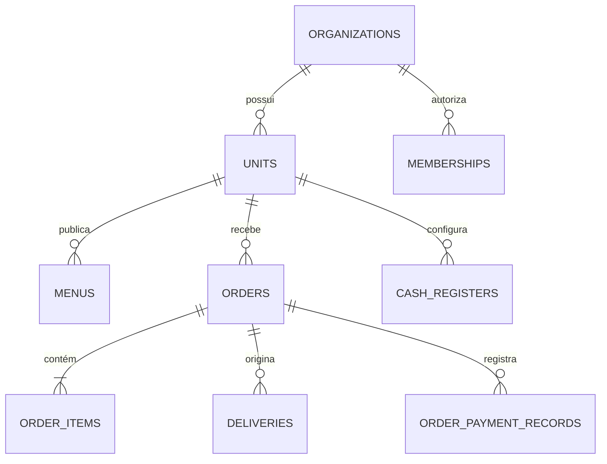

# Tapajiro

## Modelo Físico do Banco de Dados

**Produto:** Tapajiro  
**Banco:** PostgreSQL gerenciado pelo Supabase  
**Versão do documento:** 1.0  
**Data:** 19 de julho de 2026  
**Status:** Especificação física para revisão antes das migrations  
**Documentos de origem:** Tapajiro PRD v1.1 e Arquitetura Técnica v1.0  

---

## 1. Objetivo

Este documento define o modelo físico do PostgreSQL para o MVP do Tapajiro. Ele especifica schemas, tabelas, colunas, tipos, chaves, constraints, índices, funções, triggers, views, ordem de migrations e critérios de aceite.

Não é uma migration executável. A implementação deverá decompor esta especificação em migrations pequenas, testáveis e compatíveis com as políticas de RLS descritas no documento `TAPAJIRO_RLS_SECURITY.md`.

---

## 2. Decisões físicas

| Código | Decisão |
|---|---|
| DB-001 | PostgreSQL é a fonte única da verdade |
| DB-002 | Banco e schema compartilhados, com isolamento por `organization_id` e `unit_id` |
| DB-003 | IDs internos usam `uuid` com `gen_random_uuid()` |
| DB-004 | Valores monetários usam `bigint` em centavos |
| DB-005 | Datas técnicas usam `timestamptz` em UTC |
| DB-006 | Fusos usam nomes IANA |
| DB-007 | Estados usam `text` com `check`, facilitando evolução controlada |
| DB-008 | Tabelas filhas repetem `organization_id` e, quando aplicável, `unit_id` para RLS e índices |
| DB-009 | FKs compostas impedem relação entre tenants diferentes |
| DB-010 | Pedidos preservam snapshots comerciais |
| DB-011 | Históricos, auditoria e eventos são append-only |
| DB-012 | Mutações críticas ocorrem por RPC transacional |
| DB-013 | Conteúdo público é entregue por RPC/view restrita, não por acesso anônimo às tabelas base |
| DB-014 | Dados internos e privilegiados ficam no schema `private` não exposto pela Data API |
| DB-015 | Relatórios complexos ficam no schema `reporting` e são acessados por RPCs autorizadas |
| DB-016 | Não existem tabelas de carteira, saldo, liquidação, split, repasse ou antecipação de pedidos |

---

## 3. Schemas e extensões

### 3.1. Schemas

| Schema | Exposição | Finalidade |
|---|---|---|
| `auth` | Gerenciado | Identidades Supabase |
| `storage` | Gerenciado | Metadados do Supabase Storage |
| `public` | Data API sob RLS | Entidades operacionais do produto |
| `private` | Não exposto | Contadores, tokens, idempotência, auditoria, filas e suporte |
| `reporting` | Não exposto diretamente | Views e projeções gerenciais |
| `extensions` | Não exposto | Extensões instaladas |

### 3.2. Extensões

| Extensão | Uso | Obrigatória no MVP |
|---|---|---|
| `pgcrypto` | UUID e hashes | Sim |
| `pg_trgm` | Busca tolerante em produto/cliente | P1 |
| `unaccent` | Busca pt-BR | P1 |
| `pgtap` | Testes do banco em ambiente de desenvolvimento/CI | Sim no fluxo de teste |
| `pg_cron` | Jobs agendados | P1, se suportado pelo plano |

Extensões devem ser instaladas em schema apropriado e não podem ampliar privilégios do cliente.

---

## 4. Convenções

### 4.1. Nomes

- tabelas e colunas em `snake_case`;
- tabelas no plural;
- PK denominada `id`;
- FKs terminam em `_id`;
- dinheiro termina em `_cents`;
- timestamps terminam em `_at`;
- datas de negócio usam `_date`;
- booleanos usam prefixos `is_`, `has_` ou adjetivo inequívoco;
- checks usam `chk_<table>_<rule>`;
- uniques usam `uq_<table>_<columns>`;
- índices usam `idx_<table>_<columns>`;
- políticas usam `<table>_<operation>_<scope>`.

### 4.2. Colunas transversais

Entidades mutáveis devem possuir, quando aplicável:

| Coluna | Tipo | Regra |
|---|---|---|
| `id` | `uuid` | PK, default `gen_random_uuid()` |
| `organization_id` | `uuid` | Tenant obrigatório |
| `unit_id` | `uuid` | Unidade obrigatória no domínio local |
| `created_at` | `timestamptz` | `not null default now()` |
| `updated_at` | `timestamptz` | `not null default now()` |
| `created_by` | `uuid` | FK opcional para `profiles.id` |
| `updated_by` | `uuid` | FK opcional para `profiles.id` |
| `deleted_at` | `timestamptz` | Somente onde soft delete é permitido |
| `version` | `integer` | `not null default 1`, incremento controlado |

### 4.3. Tipos de dados

- `text` para strings, com checks de tamanho onde houver risco operacional.
- `citext` não será obrigatório; normalização explícita evita comportamento implícito.
- `numeric(9,6)` para latitude e longitude.
- `jsonb` somente para snapshot, configuração limitada, diffs seguros ou payload de evento.
- Colunas consultadas frequentemente não devem ficar apenas em `jsonb`.
- `char(3)` para moeda, inicialmente `BRL`.
- `smallint` para dia da semana e posições pequenas.
- `integer` para quantidades do MVP.

### 4.4. Dinheiro

- Todo valor é inteiro em centavos.
- `currency` é obrigatório onde o registro possa sobreviver a expansão de moeda.
- Valores não podem ser negativos, exceto quando o tipo de movimento permitir sinal controlado.
- Percentuais usam basis points: `10000 = 100%`.
- Nenhum campo financeiro usa `real`, `float` ou `double precision`.

### 4.5. Multiempresa por FK composta

Pais relevantes expõem uma chave única adicional:

```sql
unique (organization_id, id)
```

Filhos usam:

```sql
foreign key (organization_id, parent_id)
references public.parent_table (organization_id, id)
```

Quando houver unidade:

```sql
foreign key (organization_id, unit_id)
references public.units (organization_id, id)
```

Isso impede que uma linha da organização A referencie um recurso da organização B, mesmo em operação privilegiada.

---

## 5. Visão de relacionamentos



---

## 6. Organização e unidades

### 6.1. `public.organizations`

| Coluna | Tipo | Nulo | Default | Regra |
|---|---|---:|---|---|
| `id` | uuid | Não | `gen_random_uuid()` | PK |
| `legal_name` | text | Não | — | 2–160 caracteres |
| `trade_name` | text | Não | — | 2–120 caracteres |
| `document_type` | text | Não | `'cnpj'` | `cnpj`, `cpf`, `other` |
| `document_normalized` | text | Sim | — | Somente dígitos quando CPF/CNPJ |
| `status` | text | Não | `'trial'` | `trial`, `active`, `past_due`, `suspended`, `cancelled` |
| `default_currency` | char(3) | Não | `'BRL'` | Código de moeda |
| `created_at` | timestamptz | Não | `now()` | — |
| `updated_at` | timestamptz | Não | `now()` | — |
| `version` | integer | Não | `1` | Maior que zero |

Constraints e índices:

- unique parcial em `document_normalized` quando preenchido e organização não cancelada, sujeito à política comercial;
- unique `(id, id)` não é necessário; filhos da organização referenciam apenas `id`;
- índice `(status)` para backoffice.

### 6.2. `public.units`

| Coluna | Tipo | Nulo | Default | Regra |
|---|---|---:|---|---|
| `id` | uuid | Não | `gen_random_uuid()` | PK |
| `organization_id` | uuid | Não | — | FK organizations |
| `name` | text | Não | — | 2–120 caracteres |
| `public_name` | text | Não | — | Nome do cardápio |
| `slug` | text | Não | — | Lowercase, `a-z0-9-`, 3–80 |
| `timezone` | text | Não | `'America/Santarem'` | Nome IANA validado pela aplicação |
| `phone_normalized` | text | Sim | — | E.164 quando preenchido |
| `email_normalized` | text | Sim | — | Lowercase |
| `status` | text | Não | `'active'` | `active`, `paused`, `inactive` |
| `pause_reason` | text | Sim | — | Obrigatório quando paused |
| `pause_until` | timestamptz | Sim | — | Opcional |
| `street` | text | Sim | — | Endereço da unidade |
| `number` | text | Sim | — | — |
| `district` | text | Sim | — | — |
| `city` | text | Sim | — | — |
| `state_code` | char(2) | Sim | — | UF |
| `postal_code` | text | Sim | — | Normalizado |
| `latitude` | numeric(9,6) | Sim | — | -90 a 90 |
| `longitude` | numeric(9,6) | Sim | — | -180 a 180 |
| `created_at` | timestamptz | Não | `now()` | — |
| `updated_at` | timestamptz | Não | `now()` | — |
| `version` | integer | Não | `1` | — |

Constraints e índices:

- unique `(organization_id, id)`;
- unique global em `lower(slug)` onde status não seja `inactive`;
- índice `(organization_id, status)`;
- FK `organization_id → organizations.id` com `on delete restrict`;
- check que exige `pause_reason` quando `status = 'paused'`.

### 6.3. `public.unit_settings`

| Coluna | Tipo | Nulo | Default | Regra |
|---|---|---:|---|---|
| `unit_id` | uuid | Não | — | PK e FK units |
| `organization_id` | uuid | Não | — | Tenant |
| `delivery_enabled` | boolean | Não | `true` | — |
| `pickup_enabled` | boolean | Não | `true` | — |
| `counter_enabled` | boolean | Não | `false` | — |
| `delivery_minimum_cents` | bigint | Não | `0` | >= 0 |
| `pickup_minimum_cents` | bigint | Não | `0` | >= 0 |
| `counter_minimum_cents` | bigint | Não | `0` | >= 0 |
| `prep_time_min_minutes` | smallint | Não | `20` | 0–1440 |
| `prep_time_max_minutes` | smallint | Não | `40` | >= mínimo e <= 1440 |
| `accept_immediate_orders` | boolean | Não | `true` | — |
| `accept_scheduled_orders` | boolean | Não | `false` | P1 |
| `order_number_reset` | text | Não | `'daily'` | Valor fixo `daily` no MVP; novos modos exigem migration |
| `pix_key_type` | text | Sim | — | `cpf`, `cnpj`, `email`, `phone`, `random` |
| `pix_key_value` | text | Sim | — | Chave do próprio estabelecimento |
| `created_at` | timestamptz | Não | `now()` | — |
| `updated_at` | timestamptz | Não | `now()` | — |
| `version` | integer | Não | `1` | — |

O Tapajiro armazena somente a chave Pix informada pelo estabelecimento, nunca credenciais bancárias.

### 6.4. `public.business_hours`

| Coluna | Tipo | Nulo | Regra |
|---|---|---:|---|
| `id` | uuid | Não | PK |
| `organization_id` | uuid | Não | Tenant |
| `unit_id` | uuid | Não | FK composta units |
| `weekday` | smallint | Não | 0–6 |
| `sequence` | smallint | Não | >= 1 |
| `opens_at` | time | Não | — |
| `closes_at` | time | Não | Pode cruzar meia-noite por flag |
| `crosses_midnight` | boolean | Não | default false |
| `active` | boolean | Não | default true |
| `created_at` | timestamptz | Não | — |
| `updated_at` | timestamptz | Não | — |

Unique `(unit_id, weekday, sequence)` e índice `(organization_id, unit_id, weekday)`.

### 6.5. `public.business_hour_exceptions`

| Coluna | Tipo | Nulo | Regra |
|---|---|---:|---|
| `id` | uuid | Não | PK |
| `organization_id` | uuid | Não | Tenant |
| `unit_id` | uuid | Não | FK composta |
| `business_date` | date | Não | Data local da unidade |
| `state` | text | Não | `closed`, `custom_hours`, `normal` |
| `opens_at` | time | Sim | Exigido em custom_hours |
| `closes_at` | time | Sim | Exigido em custom_hours |
| `crosses_midnight` | boolean | Não | default false |
| `reason` | text | Sim | Até 240 caracteres |
| `created_at` | timestamptz | Não | — |
| `updated_at` | timestamptz | Não | — |

Unique `(unit_id, business_date)`.

### 6.6. `public.delivery_zones`

| Coluna | Tipo | Nulo | Regra |
|---|---|---:|---|
| `id` | uuid | Não | PK |
| `organization_id` | uuid | Não | Tenant |
| `unit_id` | uuid | Não | FK composta |
| `name` | text | Não | Bairro ou zona |
| `normalized_name` | text | Não | Busca/unique |
| `fee_cents` | bigint | Não | >= 0 |
| `estimated_minutes` | smallint | Sim | 0–1440 |
| `minimum_order_cents` | bigint | Não | default 0, >= 0 |
| `active` | boolean | Não | default true |
| `position` | integer | Não | default 0 |
| `created_at` | timestamptz | Não | — |
| `updated_at` | timestamptz | Não | — |
| `deleted_at` | timestamptz | Sim | Soft delete |

Unique parcial `(unit_id, normalized_name)` onde `deleted_at is null`.

---

## 7. Identidade, papéis e vínculos

### 7.1. `public.profiles`

| Coluna | Tipo | Nulo | Regra |
|---|---|---:|---|
| `id` | uuid | Não | PK e FK `auth.users.id` |
| `full_name` | text | Não | 2–120 |
| `phone_normalized` | text | Sim | E.164 |
| `avatar_path` | text | Sim | Storage autorizado |
| `status` | text | Não | `active`, `blocked` |
| `created_at` | timestamptz | Não | default now |
| `updated_at` | timestamptz | Não | default now |
| `version` | integer | Não | default 1 |

E-mail permanece em `auth.users` e não é duplicado sem necessidade.

### 7.2. `public.roles`

| Coluna | Tipo | Nulo | Regra |
|---|---|---:|---|
| `id` | uuid | Não | PK |
| `organization_id` | uuid | Sim | Nulo para template do sistema |
| `name` | text | Não | 2–80 |
| `system_key` | text | Sim | owner, manager, attendant, cashier, kitchen, dispatch, driver, finance |
| `is_system` | boolean | Não | default false |
| `active` | boolean | Não | default true |
| `created_at` | timestamptz | Não | — |
| `updated_at` | timestamptz | Não | — |

- Unique `(organization_id, lower(name))` para papéis customizados.
- Unique parcial `system_key` para templates do sistema.

### 7.3. `public.permissions`

| Coluna | Tipo | Nulo | Regra |
|---|---|---:|---|
| `id` | uuid | Não | PK |
| `key` | text | Não | Unique, formato `domain.action` |
| `description` | text | Não | — |
| `risk_level` | text | Não | `low`, `medium`, `high`, `critical` |
| `active` | boolean | Não | default true |

O catálogo é administrado por migration, não pelo tenant.

### 7.4. `public.role_permissions`

| Coluna | Tipo | Nulo | Regra |
|---|---|---:|---|
| `role_id` | uuid | Não | FK roles |
| `permission_id` | uuid | Não | FK permissions |
| `created_at` | timestamptz | Não | default now |
| `created_by` | uuid | Sim | FK profiles |

PK composta `(role_id, permission_id)`.

### 7.5. `public.memberships`

| Coluna | Tipo | Nulo | Regra |
|---|---|---:|---|
| `id` | uuid | Não | PK |
| `organization_id` | uuid | Não | FK organizations |
| `profile_id` | uuid | Não | FK profiles |
| `role_id` | uuid | Não | Papel da mesma organização ou template permitido |
| `status` | text | Não | `invited`, `active`, `suspended`, `revoked` |
| `all_units` | boolean | Não | default false |
| `joined_at` | timestamptz | Sim | — |
| `created_at` | timestamptz | Não | — |
| `updated_at` | timestamptz | Não | — |
| `version` | integer | Não | default 1 |

- Unique `(organization_id, profile_id)`.
- Índices `(profile_id, status)` e `(organization_id, status)`.
- O último proprietário ativo não pode ser revogado sem transferência válida.

### 7.6. `public.membership_units`

| Coluna | Tipo | Nulo | Regra |
|---|---|---:|---|
| `membership_id` | uuid | Não | FK memberships |
| `organization_id` | uuid | Não | Tenant redundante |
| `unit_id` | uuid | Não | FK composta units |
| `created_at` | timestamptz | Não | — |

PK `(membership_id, unit_id)`. Usada somente quando `memberships.all_units = false`.

### 7.7. `public.invitations`

| Coluna | Tipo | Nulo | Regra |
|---|---|---:|---|
| `id` | uuid | Não | PK |
| `organization_id` | uuid | Não | Tenant |
| `email_normalized` | text | Não | Destinatário |
| `role_id` | uuid | Não | Papel válido |
| `all_units` | boolean | Não | — |
| `unit_ids` | uuid[] | Sim | Validado server-side |
| `token_hash` | bytea | Não | Nunca guardar token bruto |
| `status` | text | Não | `pending`, `accepted`, `expired`, `revoked` |
| `expires_at` | timestamptz | Não | — |
| `invited_by` | uuid | Não | FK profiles |
| `accepted_by` | uuid | Sim | FK profiles |
| `created_at` | timestamptz | Não | — |
| `updated_at` | timestamptz | Não | — |

Unique parcial `(organization_id, email_normalized)` onde status = `pending`.

---

## 8. Cardápio

### 8.1. `public.menus`

| Coluna | Tipo | Nulo | Regra |
|---|---|---:|---|
| `id` | uuid | Não | PK |
| `organization_id` | uuid | Não | Tenant |
| `unit_id` | uuid | Não | FK composta units |
| `name` | text | Não | 2–100 |
| `status` | text | Não | `draft`, `published`, `archived` |
| `current_version_id` | uuid | Sim | FK diferida para menu_versions |
| `created_at` | timestamptz | Não | — |
| `updated_at` | timestamptz | Não | — |
| `version` | integer | Não | default 1 |

Unique parcial `(unit_id)` onde status em `draft`, `published` para o MVP de um cardápio ativo por unidade.

### 8.2. `public.menu_versions`

| Coluna | Tipo | Nulo | Regra |
|---|---|---:|---|
| `id` | uuid | Não | PK |
| `organization_id` | uuid | Não | Tenant |
| `unit_id` | uuid | Não | Unidade |
| `menu_id` | uuid | Não | FK composta menus |
| `version_number` | integer | Não | > 0 |
| `snapshot` | jsonb | Não | Cardápio público completo e validado |
| `checksum` | text | Não | SHA-256 do snapshot canônico |
| `published_at` | timestamptz | Não | default now |
| `published_by` | uuid | Não | FK profiles |
| `created_at` | timestamptz | Não | — |

- Unique `(menu_id, version_number)`.
- Snapshot é imutável.
- Índice `(unit_id, published_at desc)`.

### 8.3. `public.categories`

| Coluna | Tipo | Nulo | Regra |
|---|---|---:|---|
| `id` | uuid | Não | PK |
| `organization_id` | uuid | Não | Tenant |
| `unit_id` | uuid | Não | Unidade |
| `menu_id` | uuid | Não | FK composta |
| `name` | text | Não | 1–80 |
| `description` | text | Sim | Até 500 |
| `position` | integer | Não | default 0 |
| `active` | boolean | Não | default true |
| `created_at` | timestamptz | Não | — |
| `updated_at` | timestamptz | Não | — |
| `deleted_at` | timestamptz | Sim | Soft delete |
| `version` | integer | Não | default 1 |

Índice `(unit_id, menu_id, active, position)`.

### 8.4. `public.products`

| Coluna | Tipo | Nulo | Regra |
|---|---|---:|---|
| `id` | uuid | Não | PK |
| `organization_id` | uuid | Não | Tenant |
| `unit_id` | uuid | Não | Unidade |
| `category_id` | uuid | Não | FK composta categories |
| `name` | text | Não | 1–120 |
| `description` | text | Sim | Até 2000 |
| `image_path` | text | Sim | Asset próprio |
| `sku` | text | Sim | Identificador interno |
| `active` | boolean | Não | default true |
| `available` | boolean | Não | default true |
| `position` | integer | Não | default 0 |
| `created_at` | timestamptz | Não | — |
| `updated_at` | timestamptz | Não | — |
| `deleted_at` | timestamptz | Sim | Soft delete |
| `version` | integer | Não | default 1 |

- Unique parcial `(unit_id, sku)` onde SKU preenchido e não deletado.
- Índices `(category_id, active, available, position)` e busca por nome no P1.

### 8.5. `public.product_variants`

| Coluna | Tipo | Nulo | Regra |
|---|---|---:|---|
| `id` | uuid | Não | PK |
| `organization_id` | uuid | Não | Tenant |
| `unit_id` | uuid | Não | Unidade |
| `product_id` | uuid | Não | FK composta products |
| `name` | text | Não | Ex.: Único, Médio, Grande |
| `price_cents` | bigint | Não | >= 0 |
| `active` | boolean | Não | default true |
| `available` | boolean | Não | default true |
| `position` | integer | Não | default 0 |
| `created_at` | timestamptz | Não | — |
| `updated_at` | timestamptz | Não | — |
| `deleted_at` | timestamptz | Sim | — |
| `version` | integer | Não | default 1 |

Unique parcial `(product_id, lower(name))` onde não deletado.

### 8.6. `public.option_groups`

| Coluna | Tipo | Nulo | Regra |
|---|---|---:|---|
| `id` | uuid | Não | PK |
| `organization_id` | uuid | Não | Tenant |
| `unit_id` | uuid | Não | Unidade |
| `product_id` | uuid | Não | FK composta products |
| `name` | text | Não | 1–100 |
| `min_select` | smallint | Não | default 0, >= 0 |
| `max_select` | smallint | Não | default 1, >= min_select |
| `position` | integer | Não | default 0 |
| `active` | boolean | Não | default true |
| `created_at` | timestamptz | Não | — |
| `updated_at` | timestamptz | Não | — |
| `deleted_at` | timestamptz | Sim | — |
| `version` | integer | Não | default 1 |

`required` é derivado de `min_select > 0`.

### 8.7. `public.options`

| Coluna | Tipo | Nulo | Regra |
|---|---|---:|---|
| `id` | uuid | Não | PK |
| `organization_id` | uuid | Não | Tenant |
| `unit_id` | uuid | Não | Unidade |
| `option_group_id` | uuid | Não | FK composta |
| `name` | text | Não | 1–100 |
| `price_delta_cents` | bigint | Não | default 0, >= 0 |
| `max_quantity` | smallint | Não | default 1, > 0 |
| `active` | boolean | Não | default true |
| `available` | boolean | Não | default true |
| `position` | integer | Não | default 0 |
| `created_at` | timestamptz | Não | — |
| `updated_at` | timestamptz | Não | — |
| `deleted_at` | timestamptz | Sim | — |
| `version` | integer | Não | default 1 |

### 8.8. `public.availability_rules`

| Coluna | Tipo | Nulo | Regra |
|---|---|---:|---|
| `id` | uuid | Não | PK |
| `organization_id` | uuid | Não | Tenant |
| `unit_id` | uuid | Não | Unidade |
| `product_id` | uuid | Sim | Um alvo obrigatório |
| `variant_id` | uuid | Sim | Um alvo obrigatório |
| `weekday` | smallint | Sim | 0–6 |
| `starts_at` | time | Sim | — |
| `ends_at` | time | Sim | — |
| `starts_on` | date | Sim | Período opcional |
| `ends_on` | date | Sim | >= starts_on |
| `state` | text | Não | `available`, `unavailable` |
| `priority` | smallint | Não | default 0 |
| `active` | boolean | Não | default true |
| `created_at` | timestamptz | Não | — |
| `updated_at` | timestamptz | Não | — |

Check XOR: exatamente um de `product_id` ou `variant_id` deve ser preenchido.

### 8.9. `public.product_allergens`

| Coluna | Tipo | Nulo | Regra |
|---|---|---:|---|
| `organization_id` | uuid | Não | Tenant |
| `product_id` | uuid | Não | FK composta |
| `allergen_key` | text | Não | Catálogo controlado |
| `created_at` | timestamptz | Não | — |

PK `(product_id, allergen_key)`.

---

## 9. Clientes

### 9.1. `public.customers`

| Coluna | Tipo | Nulo | Regra |
|---|---|---:|---|
| `id` | uuid | Não | PK |
| `organization_id` | uuid | Não | Tenant |
| `full_name` | text | Não | 1–120 |
| `phone_normalized` | text | Não | E.164 |
| `email_normalized` | text | Sim | Lowercase |
| `status` | text | Não | `active`, `blocked`, `anonymized` |
| `first_order_at` | timestamptz | Sim | Projeção atualizável |
| `last_order_at` | timestamptz | Sim | Projeção atualizável |
| `created_at` | timestamptz | Não | — |
| `updated_at` | timestamptz | Não | — |
| `deleted_at` | timestamptz | Sim | Processo controlado |
| `version` | integer | Não | default 1 |

- Unique parcial `(organization_id, phone_normalized)` onde status <> `anonymized` e `deleted_at is null`.
- Índices `(organization_id, last_order_at desc)` e busca por nome/telefone.

### 9.2. `public.customer_addresses`

| Coluna | Tipo | Nulo | Regra |
|---|---|---:|---|
| `id` | uuid | Não | PK |
| `organization_id` | uuid | Não | Tenant |
| `customer_id` | uuid | Não | FK composta customers |
| `label` | text | Sim | Casa, trabalho |
| `street` | text | Não | — |
| `number` | text | Não | — |
| `complement` | text | Sim | — |
| `district` | text | Não | — |
| `city` | text | Não | — |
| `state_code` | char(2) | Não | — |
| `postal_code` | text | Sim | — |
| `reference` | text | Sim | Até 500 |
| `latitude` | numeric(9,6) | Sim | — |
| `longitude` | numeric(9,6) | Sim | — |
| `active` | boolean | Não | default true |
| `created_at` | timestamptz | Não | — |
| `updated_at` | timestamptz | Não | — |
| `deleted_at` | timestamptz | Sim | — |

### 9.3. `public.customer_consents`

| Coluna | Tipo | Nulo | Regra |
|---|---|---:|---|
| `id` | uuid | Não | PK |
| `organization_id` | uuid | Não | Tenant |
| `customer_id` | uuid | Não | FK composta |
| `purpose` | text | Não | `marketing_whatsapp`, `marketing_email`, outros controlados |
| `granted` | boolean | Não | — |
| `source` | text | Não | `checkout`, `operator`, `import`, `request` |
| `occurred_at` | timestamptz | Não | — |
| `evidence` | jsonb | Não | default `{}`, sem segredo |
| `created_at` | timestamptz | Não | — |

Append-only; estado atual é a ocorrência mais recente por finalidade.

### 9.4. `public.customer_notes`

| Coluna | Tipo | Nulo | Regra |
|---|---|---:|---|
| `id` | uuid | Não | PK |
| `organization_id` | uuid | Não | Tenant |
| `customer_id` | uuid | Não | FK composta |
| `note` | text | Não | 1–1000, sem dado excessivo |
| `created_by` | uuid | Não | FK profiles |
| `created_at` | timestamptz | Não | — |
| `deleted_at` | timestamptz | Sim | Exclusão auditada |

---

## 10. Pedidos

### 10.1. `private.unit_order_counters`

| Coluna | Tipo | Nulo | Regra |
|---|---|---:|---|
| `organization_id` | uuid | Não | Tenant |
| `unit_id` | uuid | Não | Unidade |
| `business_date` | date | Não | Data local |
| `last_value` | integer | Não | >= 0 |
| `updated_at` | timestamptz | Não | — |

PK `(unit_id, business_date)`. Atualização com `insert ... on conflict ... do update` dentro da transação do pedido.

### 10.2. `public.orders`

| Coluna | Tipo | Nulo | Regra |
|---|---|---:|---|
| `id` | uuid | Não | PK |
| `organization_id` | uuid | Não | Tenant |
| `unit_id` | uuid | Não | Unidade |
| `customer_id` | uuid | Sim | FK composta customers |
| `order_number` | integer | Não | Número amigável |
| `business_date` | date | Não | Data local da unidade |
| `channel` | text | Não | `public_menu`, `counter`, `phone`, `whatsapp`, `marketplace`, `manual` |
| `modality` | text | Não | `delivery`, `pickup`, `counter` |
| `status` | text | Não | Máquina de estado aprovada |
| `notes` | text | Sim | Até 1000 |
| `subtotal_cents` | bigint | Não | >= 0 |
| `discount_cents` | bigint | Não | default 0, >= 0 |
| `delivery_fee_cents` | bigint | Não | default 0, >= 0 |
| `total_cents` | bigint | Não | `subtotal - discount + delivery_fee` |
| `currency` | char(3) | Não | default BRL |
| `estimated_ready_at` | timestamptz | Sim | — |
| `scheduled_for` | timestamptz | Sim | P1 |
| `confirmed_at` | timestamptz | Sim | — |
| `completed_at` | timestamptz | Sim | — |
| `cancelled_at` | timestamptz | Sim | — |
| `created_by` | uuid | Sim | Nulo para pedido público |
| `created_at` | timestamptz | Não | — |
| `updated_at` | timestamptz | Não | — |
| `version` | integer | Não | default 1 |

Constraints e índices:

- unique `(organization_id, id)` e `(organization_id, unit_id, id)`;
- unique `(unit_id, business_date, order_number)`;
- check `discount_cents <= subtotal_cents`;
- check de total exato;
- check `delivery_fee_cents = 0` quando modality não for delivery;
- índice `(organization_id, unit_id, status, created_at desc)`;
- índice `(organization_id, customer_id, created_at desc)`;
- índice parcial para pedidos operacionais não terminais.

### 10.3. `private.order_public_tokens`

| Coluna | Tipo | Nulo | Regra |
|---|---|---:|---|
| `order_id` | uuid | Não | PK/FK orders |
| `organization_id` | uuid | Não | Tenant |
| `token_hash` | bytea | Não | SHA-256 do token bruto |
| `expires_at` | timestamptz | Sim | Prazo de acesso detalhado |
| `revoked_at` | timestamptz | Sim | — |
| `created_at` | timestamptz | Não | — |

Unique `token_hash`. O token bruto é retornado uma vez e nunca persistido.

### 10.4. `public.order_customers`

| Coluna | Tipo | Nulo | Regra |
|---|---|---:|---|
| `order_id` | uuid | Não | PK/FK composta orders |
| `organization_id` | uuid | Não | Tenant |
| `unit_id` | uuid | Não | Unidade |
| `customer_name_snapshot` | text | Não | Nome operacional |
| `customer_phone_snapshot` | text | Sim | Telefone necessário à operação |
| `created_at` | timestamptz | Não | — |

Separar o snapshot de cliente impede que papéis como cozinha leiam PII apenas por possuírem `order.read`.

### 10.5. `public.order_addresses`

| Coluna | Tipo | Nulo | Regra |
|---|---|---:|---|
| `order_id` | uuid | Não | PK/FK composta orders |
| `organization_id` | uuid | Não | Tenant |
| `unit_id` | uuid | Não | Unidade |
| `delivery_zone_id` | uuid | Sim | Referência histórica opcional |
| `recipient_name` | text | Não | — |
| `street` | text | Não | — |
| `number` | text | Não | — |
| `complement` | text | Sim | — |
| `district` | text | Não | — |
| `city` | text | Não | — |
| `state_code` | char(2) | Não | — |
| `postal_code` | text | Sim | — |
| `reference` | text | Sim | — |
| `latitude` | numeric(9,6) | Sim | — |
| `longitude` | numeric(9,6) | Sim | — |
| `created_at` | timestamptz | Não | — |

Existe somente para modalidade `delivery`; constraint de domínio é aplicada na RPC.

### 10.6. `public.order_items`

| Coluna | Tipo | Nulo | Regra |
|---|---|---:|---|
| `id` | uuid | Não | PK |
| `organization_id` | uuid | Não | Tenant |
| `unit_id` | uuid | Não | Unidade |
| `order_id` | uuid | Não | FK composta orders |
| `product_id` | uuid | Sim | Referência informativa |
| `variant_id` | uuid | Sim | Referência informativa |
| `product_name_snapshot` | text | Não | — |
| `variant_name_snapshot` | text | Não | — |
| `quantity` | integer | Não | > 0 |
| `unit_base_cents` | bigint | Não | >= 0 |
| `unit_options_cents` | bigint | Não | >= 0 |
| `unit_total_cents` | bigint | Não | base + options |
| `line_total_cents` | bigint | Não | unit_total × quantity |
| `notes` | text | Sim | Até 500 |
| `position` | integer | Não | >= 0 |
| `created_at` | timestamptz | Não | — |

Índice `(order_id, position)`; linhas são imutáveis após criação, exceto fluxo explícito de correção pré-produção no futuro.

### 10.7. `public.order_item_options`

| Coluna | Tipo | Nulo | Regra |
|---|---|---:|---|
| `id` | uuid | Não | PK |
| `organization_id` | uuid | Não | Tenant |
| `unit_id` | uuid | Não | Unidade |
| `order_item_id` | uuid | Não | FK composta order_items |
| `option_id` | uuid | Sim | Referência informativa |
| `group_name_snapshot` | text | Não | — |
| `option_name_snapshot` | text | Não | — |
| `quantity` | integer | Não | > 0 |
| `unit_delta_cents` | bigint | Não | >= 0 |
| `total_delta_cents` | bigint | Não | delta × quantity |
| `position` | integer | Não | >= 0 |
| `created_at` | timestamptz | Não | — |

### 10.8. `public.order_adjustments`

| Coluna | Tipo | Nulo | Regra |
|---|---|---:|---|
| `id` | uuid | Não | PK |
| `organization_id` | uuid | Não | Tenant |
| `unit_id` | uuid | Não | Unidade |
| `order_id` | uuid | Não | FK composta |
| `type` | text | Não | `discount`, `delivery_fee`, `manual_correction` |
| `amount_cents` | bigint | Não | >= 0 |
| `reason` | text | Não | — |
| `coupon_id` | uuid | Sim | P1 |
| `authorized_by` | uuid | Sim | FK profiles |
| `created_at` | timestamptz | Não | — |

Append-only. O agregado deve conciliar com as colunas do pedido.

### 10.9. `public.order_status_history`

| Coluna | Tipo | Nulo | Regra |
|---|---|---:|---|
| `id` | uuid | Não | PK |
| `organization_id` | uuid | Não | Tenant |
| `unit_id` | uuid | Não | Unidade |
| `order_id` | uuid | Não | FK composta |
| `from_status` | text | Sim | Nulo na criação |
| `to_status` | text | Não | Estado controlado |
| `actor_profile_id` | uuid | Sim | Nulo para sistema/cliente |
| `source` | text | Não | `customer`, `operator`, `driver`, `system`, `integration` |
| `reason_code` | text | Sim | Catálogo controlado |
| `reason_text` | text | Sim | Até 500 |
| `occurred_at` | timestamptz | Não | default now |
| `correlation_id` | uuid | Não | — |

Append-only; índice `(order_id, occurred_at)`.

### 10.10. `public.order_events`

| Coluna | Tipo | Nulo | Regra |
|---|---|---:|---|
| `id` | uuid | Não | PK |
| `organization_id` | uuid | Não | Tenant |
| `unit_id` | uuid | Não | Unidade |
| `order_id` | uuid | Não | FK composta |
| `event_type` | text | Não | Catálogo controlado |
| `payload_safe` | jsonb | Não | default `{}` |
| `occurred_at` | timestamptz | Não | — |
| `correlation_id` | uuid | Não | — |

Append-only e sem PII desnecessária.

### 10.11. `public.preparation_records`

| Coluna | Tipo | Nulo | Regra |
|---|---|---:|---|
| `order_id` | uuid | Não | PK/FK composta |
| `organization_id` | uuid | Não | Tenant |
| `unit_id` | uuid | Não | Unidade |
| `started_at` | timestamptz | Sim | — |
| `started_by` | uuid | Sim | FK profiles |
| `ready_at` | timestamptz | Sim | >= started_at |
| `ready_by` | uuid | Sim | FK profiles |
| `updated_at` | timestamptz | Não | — |

### 10.12. `private.idempotency_keys`

| Coluna | Tipo | Nulo | Regra |
|---|---|---:|---|
| `id` | uuid | Não | PK |
| `organization_id` | uuid | Não | Tenant resolvido |
| `unit_id` | uuid | Não | Unidade |
| `operation` | text | Não | Ex.: `public_create_order` |
| `idempotency_key` | uuid | Não | Chave do cliente |
| `payload_hash` | bytea | Não | SHA-256 |
| `resource_type` | text | Sim | — |
| `resource_id` | uuid | Sim | Pedido criado |
| `response_status` | integer | Sim | HTTP lógico |
| `response_body_safe` | jsonb | Sim | Resposta reusável sem segredo |
| `created_at` | timestamptz | Não | — |
| `expires_at` | timestamptz | Não | — |

Unique `(unit_id, operation, idempotency_key)` e índice para expiração.

---

## 11. Expedição e entrega

### 11.1. `public.drivers`

| Coluna | Tipo | Nulo | Regra |
|---|---|---:|---|
| `id` | uuid | Não | PK |
| `organization_id` | uuid | Não | Tenant |
| `profile_id` | uuid | Sim | Obrigatório para usar modo entregador |
| `display_name` | text | Não | — |
| `phone_normalized` | text | Sim | E.164 |
| `status` | text | Não | `available`, `busy`, `unavailable`, `inactive` |
| `vehicle_type` | text | Sim | `bike`, `motorcycle`, `car`, `other` |
| `created_at` | timestamptz | Não | — |
| `updated_at` | timestamptz | Não | — |
| `deleted_at` | timestamptz | Sim | — |
| `version` | integer | Não | default 1 |

Unique parcial `(organization_id, profile_id)` onde profile preenchido e não deletado.

### 11.2. `public.driver_units`

| Coluna | Tipo | Nulo | Regra |
|---|---|---:|---|
| `driver_id` | uuid | Não | FK drivers |
| `organization_id` | uuid | Não | Tenant |
| `unit_id` | uuid | Não | FK composta units |
| `active` | boolean | Não | default true |
| `created_at` | timestamptz | Não | — |

PK `(driver_id, unit_id)`.

### 11.3. `public.deliveries`

| Coluna | Tipo | Nulo | Regra |
|---|---|---:|---|
| `id` | uuid | Não | PK |
| `organization_id` | uuid | Não | Tenant |
| `unit_id` | uuid | Não | Unidade |
| `order_id` | uuid | Não | FK composta orders |
| `driver_id` | uuid | Sim | FK composta drivers |
| `status` | text | Não | `unassigned`, `assigned`, `accepted_by_driver`, `picked_up`, `on_route`, `delivered`, `failed`, `cancelled` |
| `assigned_at` | timestamptz | Sim | — |
| `accepted_at` | timestamptz | Sim | — |
| `picked_up_at` | timestamptz | Sim | — |
| `on_route_at` | timestamptz | Sim | — |
| `delivered_at` | timestamptz | Sim | — |
| `confirmation_code_hash` | bytea | Sim | P1; nunca código bruto |
| `failure_reason_code` | text | Sim | Obrigatório em failed |
| `failure_reason_text` | text | Sim | — |
| `created_at` | timestamptz | Não | — |
| `updated_at` | timestamptz | Não | — |
| `version` | integer | Não | default 1 |

- Unique parcial `(order_id)` onde status não for `cancelled`.
- Índices `(unit_id, status, created_at)` e `(driver_id, status, assigned_at)`.

### 11.4. `public.delivery_status_history`

| Coluna | Tipo | Nulo | Regra |
|---|---|---:|---|
| `id` | uuid | Não | PK |
| `organization_id` | uuid | Não | Tenant |
| `unit_id` | uuid | Não | Unidade |
| `delivery_id` | uuid | Não | FK composta deliveries |
| `from_status` | text | Sim | — |
| `to_status` | text | Não | Estado controlado |
| `actor_profile_id` | uuid | Sim | — |
| `source` | text | Não | `operator`, `driver`, `system` |
| `reason_code` | text | Sim | — |
| `reason_text` | text | Sim | — |
| `occurred_at` | timestamptz | Não | — |
| `correlation_id` | uuid | Não | — |

Append-only; índice `(delivery_id, occurred_at)`.

### 11.5. `public.driver_compensation_rules`

| Coluna | Tipo | Nulo | Regra |
|---|---|---:|---|
| `id` | uuid | Não | PK |
| `organization_id` | uuid | Não | Tenant |
| `unit_id` | uuid | Não | Unidade |
| `name` | text | Não | — |
| `rule_type` | text | Não | `fixed_per_delivery` no MVP |
| `amount_cents` | bigint | Não | >= 0 |
| `active` | boolean | Não | default true |
| `valid_from` | date | Não | — |
| `valid_until` | date | Sim | >= valid_from |
| `created_at` | timestamptz | Não | — |
| `updated_at` | timestamptz | Não | — |

### 11.6. `public.driver_compensation_records`

| Coluna | Tipo | Nulo | Regra |
|---|---|---:|---|
| `id` | uuid | Não | PK |
| `organization_id` | uuid | Não | Tenant |
| `unit_id` | uuid | Não | Unidade |
| `delivery_id` | uuid | Não | FK composta deliveries |
| `driver_id` | uuid | Não | FK composta drivers |
| `calculated_amount_cents` | bigint | Não | >= 0 |
| `rule_snapshot` | jsonb | Não | Regra usada |
| `status` | text | Não | `calculated`, `reviewed`, `marked_paid_externally`, `void` |
| `reviewed_by` | uuid | Sim | FK profiles |
| `reviewed_at` | timestamptz | Sim | — |
| `external_note` | text | Sim | Sem dados bancários |
| `created_at` | timestamptz | Não | — |
| `updated_at` | timestamptz | Não | — |

Unique `(delivery_id)`. Esta tabela nunca instrui ou executa pagamento.

---

## 12. Registro de pagamento

### 12.1. `public.payment_methods`

| Coluna | Tipo | Nulo | Regra |
|---|---|---:|---|
| `id` | uuid | Não | PK |
| `organization_id` | uuid | Não | Tenant |
| `unit_id` | uuid | Não | Unidade |
| `type` | text | Não | `cash`, `card_on_delivery`, `pix_manual`, `counter`, `external_provider` |
| `label` | text | Não | Texto público |
| `delivery_enabled` | boolean | Não | default true |
| `pickup_enabled` | boolean | Não | default true |
| `counter_enabled` | boolean | Não | default true |
| `requires_change_input` | boolean | Não | true somente para cash |
| `active` | boolean | Não | default true |
| `position` | integer | Não | default 0 |
| `created_at` | timestamptz | Não | — |
| `updated_at` | timestamptz | Não | — |
| `version` | integer | Não | default 1 |

Unique parcial `(unit_id, type, lower(label))` onde active.

### 12.2. `public.order_payment_records`

| Coluna | Tipo | Nulo | Regra |
|---|---|---:|---|
| `id` | uuid | Não | PK |
| `organization_id` | uuid | Não | Tenant |
| `unit_id` | uuid | Não | Unidade |
| `order_id` | uuid | Não | FK composta orders |
| `payment_method_id` | uuid | Não | FK composta payment_methods |
| `amount_cents` | bigint | Não | > 0 |
| `currency` | char(3) | Não | default BRL |
| `status` | text | Não | `pending`, `pay_on_delivery`, `reported_as_paid`, `confirmed`, `failed`, `refunded_externally`, `cancelled` |
| `source` | text | Não | `customer_report`, `operator`, `external_provider`, `system` |
| `change_for_cents` | bigint | Sim | >= amount para cash |
| `change_due_cents` | bigint | Sim | Derivado na confirmação |
| `confirmed_by` | uuid | Sim | FK profiles |
| `confirmed_at` | timestamptz | Sim | — |
| `external_refund_amount_cents` | bigint | Sim | <= amount; informativo |
| `created_at` | timestamptz | Não | — |
| `updated_at` | timestamptz | Não | — |
| `version` | integer | Não | default 1 |

- Índice `(order_id, status)`.
- Soma e coerência com total são validadas pela RPC.
- Nenhum trigger cria saldo, transferência ou liquidação.

### 12.3. `public.payment_status_history`

| Coluna | Tipo | Nulo | Regra |
|---|---|---:|---|
| `id` | uuid | Não | PK |
| `organization_id` | uuid | Não | Tenant |
| `unit_id` | uuid | Não | Unidade |
| `payment_record_id` | uuid | Não | FK composta |
| `from_status` | text | Sim | — |
| `to_status` | text | Não | Estado controlado |
| `actor_profile_id` | uuid | Sim | — |
| `source` | text | Não | Origem controlada |
| `reason` | text | Sim | — |
| `occurred_at` | timestamptz | Não | — |
| `correlation_id` | uuid | Não | — |

Append-only.

### 12.4. `public.external_payment_references` — P2

| Coluna | Tipo | Nulo | Regra |
|---|---|---:|---|
| `id` | uuid | Não | PK |
| `organization_id` | uuid | Não | Tenant |
| `unit_id` | uuid | Não | Unidade |
| `payment_record_id` | uuid | Não | FK composta |
| `provider_key` | text | Não | Adaptador aprovado |
| `merchant_reference` | text | Não | Conta recebedora do estabelecimento |
| `external_reference` | text | Não | ID opaco do provedor |
| `external_status` | text | Não | Estado normalizado ou seguro |
| `last_event_at` | timestamptz | Sim | — |
| `created_at` | timestamptz | Não | — |
| `updated_at` | timestamptz | Não | — |

- Unique `(provider_key, external_reference)`.
- Proibido armazenar PAN, CVV, conta bancária completa ou credencial do provedor.

---

## 13. Caixa e gestão gerencial

### 13.1. `public.cash_registers`

| Coluna | Tipo | Nulo | Regra |
|---|---|---:|---|
| `id` | uuid | Não | PK |
| `organization_id` | uuid | Não | Tenant |
| `unit_id` | uuid | Não | Unidade |
| `name` | text | Não | 1–80 |
| `active` | boolean | Não | default true |
| `created_at` | timestamptz | Não | — |
| `updated_at` | timestamptz | Não | — |

Unique parcial `(unit_id, lower(name))` onde active.

### 13.2. `public.cash_sessions`

| Coluna | Tipo | Nulo | Regra |
|---|---|---:|---|
| `id` | uuid | Não | PK |
| `organization_id` | uuid | Não | Tenant |
| `unit_id` | uuid | Não | Unidade |
| `cash_register_id` | uuid | Não | FK composta |
| `status` | text | Não | `open`, `closing`, `discrepancy_review`, `closed` |
| `opening_cents` | bigint | Não | >= 0 |
| `opened_by` | uuid | Não | FK profiles |
| `opened_at` | timestamptz | Não | default now |
| `closing_started_at` | timestamptz | Sim | — |
| `closed_by` | uuid | Sim | FK profiles |
| `closed_at` | timestamptz | Sim | — |
| `reopened_from_id` | uuid | Sim | Referência a sessão anterior |
| `notes` | text | Sim | — |
| `created_at` | timestamptz | Não | — |
| `updated_at` | timestamptz | Não | — |
| `version` | integer | Não | default 1 |

- Unique parcial `(cash_register_id)` onde status em `open`, `closing`, `discrepancy_review`.
- Índice `(unit_id, opened_at desc)`.

### 13.3. `public.cash_movements`

| Coluna | Tipo | Nulo | Regra |
|---|---|---:|---|
| `id` | uuid | Não | PK |
| `organization_id` | uuid | Não | Tenant |
| `unit_id` | uuid | Não | Unidade |
| `cash_session_id` | uuid | Não | FK composta |
| `order_id` | uuid | Sim | FK composta orders |
| `payment_record_id` | uuid | Sim | FK composta |
| `movement_type` | text | Não | `opening`, `sale_record`, `cash_supply`, `cash_drop`, `expense_record`, `external_refund_record`, `adjustment` |
| `direction` | text | Não | `in`, `out` |
| `amount_cents` | bigint | Não | > 0 |
| `payment_method_type` | text | Sim | Snapshot |
| `category` | text | Sim | Obrigatória em movimento manual |
| `description` | text | Sim | Obrigatória em movimento manual |
| `occurred_at` | timestamptz | Não | default now |
| `created_by` | uuid | Sim | Nulo para reflexo automático |
| `correlation_id` | uuid | Não | — |
| `created_at` | timestamptz | Não | — |

Append-only. Unique parcial pode impedir duplicação de reflexo automático por `payment_record_id` e tipo.

### 13.4. `public.cash_reconciliations`

| Coluna | Tipo | Nulo | Regra |
|---|---|---:|---|
| `id` | uuid | Não | PK |
| `organization_id` | uuid | Não | Tenant |
| `unit_id` | uuid | Não | Unidade |
| `cash_session_id` | uuid | Não | FK composta |
| `payment_method_type` | text | Não | — |
| `expected_cents` | bigint | Não | >= 0, calculado |
| `counted_cents` | bigint | Não | >= 0, informado |
| `difference_cents` | bigint | Não | counted - expected |
| `justification` | text | Sim | Obrigatória se diferença != 0 |
| `reviewed_by` | uuid | Sim | — |
| `created_at` | timestamptz | Não | — |

Unique `(cash_session_id, payment_method_type)`.

---

## 14. Plataforma SaaS e governança

### 14.1. `public.plans`

| Coluna | Tipo | Nulo | Regra |
|---|---|---:|---|
| `id` | uuid | Não | PK |
| `key` | text | Não | Unique |
| `name` | text | Não | — |
| `status` | text | Não | `active`, `inactive` |
| `price_cents` | bigint | Sim | Mensalidade própria do SaaS |
| `currency` | char(3) | Não | default BRL |
| `created_at` | timestamptz | Não | — |
| `updated_at` | timestamptz | Não | — |

### 14.2. `public.plan_limits`

| Coluna | Tipo | Nulo | Regra |
|---|---|---:|---|
| `plan_id` | uuid | Não | FK plans |
| `metric_key` | text | Não | Ex.: units, users, monthly_orders |
| `limit_value` | bigint | Sim | Nulo = ilimitado |
| `created_at` | timestamptz | Não | — |

PK `(plan_id, metric_key)`.

### 14.3. `public.subscriptions`

| Coluna | Tipo | Nulo | Regra |
|---|---|---:|---|
| `id` | uuid | Não | PK |
| `organization_id` | uuid | Não | Unique tenant |
| `plan_id` | uuid | Não | FK plans |
| `status` | text | Não | `trial`, `active`, `past_due`, `suspended`, `cancelled` |
| `trial_ends_at` | timestamptz | Sim | — |
| `current_period_start` | timestamptz | Sim | — |
| `current_period_end` | timestamptz | Sim | — |
| `provider_key` | text | Sim | Provedor da mensalidade Tapajiro |
| `external_customer_ref` | text | Sim | Referência própria da assinatura |
| `external_subscription_ref` | text | Sim | — |
| `created_at` | timestamptz | Não | — |
| `updated_at` | timestamptz | Não | — |
| `version` | integer | Não | default 1 |

Tabela e integrações da assinatura não referenciam `orders` ou recebimentos do restaurante.

### 14.4. `public.usage_counters`

| Coluna | Tipo | Nulo | Regra |
|---|---|---:|---|
| `organization_id` | uuid | Não | Tenant |
| `metric_key` | text | Não | — |
| `period_start` | date | Não | — |
| `period_end` | date | Não | >= início |
| `value` | bigint | Não | >= 0 |
| `updated_at` | timestamptz | Não | — |

PK `(organization_id, metric_key, period_start)`.

### 14.5. `private.platform_admins`

| Coluna | Tipo | Nulo | Regra |
|---|---|---:|---|
| `profile_id` | uuid | Não | PK/FK profiles |
| `role` | text | Não | `support`, `operations`, `super_admin` |
| `status` | text | Não | `active`, `suspended` |
| `mfa_required` | boolean | Não | default true |
| `created_at` | timestamptz | Não | — |
| `updated_at` | timestamptz | Não | — |

### 14.6. `private.support_access_grants`

| Coluna | Tipo | Nulo | Regra |
|---|---|---:|---|
| `id` | uuid | Não | PK |
| `organization_id` | uuid | Não | Tenant autorizado |
| `support_profile_id` | uuid | Não | Platform admin |
| `scope` | text[] | Não | Permissões mínimas |
| `reason` | text | Não | Obrigatória |
| `approved_by` | uuid | Não | Platform admin distinto quando exigido |
| `starts_at` | timestamptz | Não | — |
| `expires_at` | timestamptz | Não | > starts_at, curta duração |
| `revoked_at` | timestamptz | Sim | — |
| `created_at` | timestamptz | Não | — |

Índice `(support_profile_id, organization_id, expires_at)`.

### 14.7. `private.audit_logs`

| Coluna | Tipo | Nulo | Regra |
|---|---|---:|---|
| `id` | uuid | Não | PK |
| `organization_id` | uuid | Sim | Nulo para evento global |
| `unit_id` | uuid | Sim | — |
| `actor_profile_id` | uuid | Sim | — |
| `actor_type` | text | Não | `user`, `support`, `system`, `integration` |
| `action` | text | Não | Catálogo estável |
| `resource_type` | text | Não | — |
| `resource_id` | uuid | Sim | — |
| `safe_diff` | jsonb | Não | default `{}` |
| `ip_hash` | bytea | Sim | Quando necessário e definido em política |
| `user_agent_summary` | text | Sim | Reduzido |
| `correlation_id` | uuid | Não | — |
| `occurred_at` | timestamptz | Não | default now |

Append-only, indexado por `(organization_id, occurred_at desc)` e `(resource_type, resource_id, occurred_at)`.

### 14.8. `private.outbox_events`

| Coluna | Tipo | Nulo | Regra |
|---|---|---:|---|
| `id` | uuid | Não | PK |
| `organization_id` | uuid | Sim | — |
| `unit_id` | uuid | Sim | — |
| `event_type` | text | Não | — |
| `aggregate_type` | text | Não | — |
| `aggregate_id` | uuid | Não | — |
| `payload_safe` | jsonb | Não | — |
| `status` | text | Não | `pending`, `processing`, `completed`, `failed`, `dead` |
| `attempts` | smallint | Não | default 0 |
| `next_attempt_at` | timestamptz | Não | default now |
| `locked_at` | timestamptz | Sim | — |
| `locked_by` | text | Sim | Worker |
| `last_error_code` | text | Sim | Sem stack sensível |
| `created_at` | timestamptz | Não | — |
| `completed_at` | timestamptz | Sim | — |

Índice parcial `(next_attempt_at)` onde status em `pending`, `failed`.

### 14.9. `private.notification_jobs`

| Coluna | Tipo | Nulo | Regra |
|---|---|---:|---|
| `id` | uuid | Não | PK |
| `outbox_event_id` | uuid | Não | FK outbox |
| `channel` | text | Não | `in_app`, `email`, `web_push`, `whatsapp` |
| `recipient_ref` | text | Não | Referência minimizada |
| `template_key` | text | Não | — |
| `template_version` | integer | Não | — |
| `status` | text | Não | `pending`, `sent`, `failed`, `dead` |
| `provider_message_ref` | text | Sim | — |
| `attempts` | smallint | Não | default 0 |
| `created_at` | timestamptz | Não | — |
| `sent_at` | timestamptz | Sim | — |

### 14.10. `private.integration_events`

| Coluna | Tipo | Nulo | Regra |
|---|---|---:|---|
| `id` | uuid | Não | PK |
| `integration_key` | text | Não | — |
| `external_event_id` | text | Não | — |
| `organization_id` | uuid | Sim | Resolvido após validação |
| `payload_hash` | bytea | Não | — |
| `event_type` | text | Não | — |
| `status` | text | Não | `received`, `processed`, `ignored`, `failed` |
| `received_at` | timestamptz | Não | — |
| `processed_at` | timestamptz | Sim | — |
| `error_code` | text | Sim | — |

Unique `(integration_key, external_event_id)`.

### 14.11. `private.feature_flags`

| Coluna | Tipo | Nulo | Regra |
|---|---|---:|---|
| `id` | uuid | Não | PK |
| `key` | text | Não | — |
| `scope_type` | text | Não | `global`, `plan`, `organization`, `unit`, `profile` |
| `scope_id` | uuid | Sim | Nulo somente para global |
| `enabled` | boolean | Não | — |
| `config` | jsonb | Não | default `{}` |
| `owner` | text | Não | — |
| `expires_at` | timestamptz | Sim | Flags temporárias |
| `created_at` | timestamptz | Não | — |
| `updated_at` | timestamptz | Não | — |

Unique `(key, scope_type, scope_id)` com tratamento de escopo global.

---

## 15. Views e relatórios

### 15.1. Views previstas

| View | Schema | Conteúdo | Acesso |
|---|---|---|---|
| `unit_daily_sales` | reporting | Totais por unidade, data e status | RPC `get_daily_dashboard` |
| `unit_payment_summary` | reporting | Registros por meio e estado | RPC `get_payment_summary` |
| `cash_session_expected` | reporting | Esperado por sessão e meio | RPC/fechamento |
| `order_operational_queue` | reporting | Pedidos ativos com tempos calculados | Painel/KDS sob permissão |
| `driver_delivery_summary` | reporting | Entregas e remuneração calculada | Relatório autorizado |
| `product_sales_summary` | reporting | Quantidade e valor por produto snapshot | P1 |

### 15.2. Regras

- Views devem preservar `organization_id` e `unit_id`.
- Views expostas pela Data API precisam de `security_invoker = true` quando suportado e RLS nas tabelas base.
- Preferência por RPC de relatório para aplicar período, limite e autorização.
- Nenhuma view usa `security definer` sem revisão específica.
- Relatórios financeiros são gerenciais, não extratos bancários.
- Views materializadas somente após medição de necessidade.

---

## 16. Funções e RPCs

### 16.1. Helpers privados de autorização

Definidos em detalhe no documento RLS:

```text
private.is_active_org_member
private.has_unit_access
private.has_permission
private.is_platform_admin
private.has_support_access
private.is_driver_for_delivery
```

### 16.2. RPCs autenticadas P0

| Função | Security | Efeito |
|---|---|---|
| `public.create_manual_order` | definer revisada | Pedido de balcão/telefone com recálculo |
| `public.transition_order_status` | definer revisada | Estado e histórico atômicos |
| `public.assign_driver` | definer revisada | Entrega, motorista e histórico |
| `public.transition_delivery_status` | definer revisada | Estado de entrega autorizado |
| `public.confirm_payment_record` | definer revisada | Confirmação informativa e histórico |
| `public.open_cash_session` | definer revisada | Abre caixa e movimento inicial |
| `public.record_cash_movement` | definer revisada | Movimento manual auditado |
| `public.close_cash_session` | definer revisada | Calcula e fecha caixa |
| `public.reopen_cash_session` | definer revisada | Procedimento gerencial auditado |
| `public.publish_menu_version` | definer revisada | Snapshot/checksum e ativação |
| `public.invite_member` | definer revisada | Convite com token hash |
| `public.change_membership` | definer revisada | Papel, unidades ou status |

### 16.3. Funções públicas anônimas

Devem retornar apenas dados mínimos e aplicar rate limit na Edge Function quando a operação for sensível:

| Função privada chamada pelo backend | Retorno |
|---|---|
| `private.get_public_menu_by_slug` | Snapshot publicado e dados públicos da unidade |
| `private.create_order_atomic` | Pedido, número e token bruto gerado na transação |
| `private.get_public_order_status` | Número, modalidade, status e estimativa, sem PII |

O papel `anon` não recebe execução direta de `private.create_order_atomic`.

### 16.4. Requisitos de função privilegiada

```sql
security definer
set search_path = pg_catalog, public, private
```

Além disso:

- owner dedicado sem login;
- `revoke all ... from public`;
- grant somente aos papéis necessários;
- validação de `auth.uid()` ou identidade server-side;
- autorização por tenant/unidade;
- schema qualificado em todas as relações;
- teste de injeção de `search_path`;
- contrato de erro estável;
- `correlation_id` propagado;
- auditoria na mesma transação.

---

## 17. Triggers

### 17.1. Permitidos

| Trigger | Tabelas | Função |
|---|---|---|
| `set_updated_at` | Entidades mutáveis | Atualizar timestamp |
| `increment_version` | Entidades com lock otimista | Incrementar versão quando apropriado |
| `prevent_mutation` | Históricos/audit | Bloquear update/delete |
| `validate_tenant_fk` | Somente onde FK composta não bastar | Impedir relação cruzada |
| `broadcast_operational_change` | orders/deliveries | Emitir payload mínimo Realtime |
| `handle_new_auth_user` | auth.users | Criar profile mínimo de forma segura |

### 17.2. Não recomendados

- cálculos comerciais complexos ocultos;
- chamadas HTTP dentro de trigger;
- criação automática de movimento financeiro por simples update genérico;
- auditoria com dump completo da linha;
- cascatas amplas e difíceis de rastrear.

Regras de domínio críticas ficam nas RPCs, onde o comando é explícito e testável.

---

## 18. Storage

### 18.1. Buckets

| Bucket | Público | Convenção de caminho |
|---|---:|---|
| `public-branding` | Sim | `<organization_id>/<unit_id>/<asset_id>.<ext>` |
| `public-catalog` | Sim | `<organization_id>/<unit_id>/<product_id>/<asset_id>.<ext>` |
| `private-exports` | Não | `<organization_id>/<profile_id>/<export_id>.<ext>` |
| `private-support` | Não | `<organization_id>/<grant_id>/<asset_id>.<ext>` |

### 18.2. Metadados de aplicação

O MVP pode referenciar somente `image_path` nas entidades. Uma tabela `media_assets` será criada no P1 caso seja necessário controlar variantes, tamanho, checksum, autoria, status de processamento e retenção.

### 18.3. Regras

- policies do `storage.objects` validam o primeiro segmento como tenant;
- upload exige permissão de domínio;
- arquivo privado usa URL assinada curta;
- MIME, tamanho e imagem real são validados server-side;
- EXIF desnecessário é removido;
- URLs externas dos protótipos não são persistidas.

---

## 19. Índices consolidados

### 19.1. Obrigatórios

- todas as FKs usadas em joins ou deleção;
- todas as colunas usadas por RLS helpers;
- `(profile_id, organization_id, status)` em memberships;
- `(membership_id, unit_id)` em membership_units;
- `(role_id, permission_id)` em role_permissions;
- `(organization_id, unit_id, status, created_at desc)` em orders;
- `(order_id, occurred_at)` em históricos;
- `(unit_id, status, created_at)` em deliveries;
- `(driver_id, status, assigned_at)` em deliveries;
- `(order_id, status)` em payment records;
- `(unit_id, opened_at desc)` em cash sessions;
- `(cash_session_id, occurred_at)` em cash movements;
- `(status, next_attempt_at)` parcial em outbox;
- `(organization_id, occurred_at desc)` em audit logs.

### 19.2. Política

- Índice não é adicionado apenas “por garantia”.
- Índices compostos refletem filtro e ordenação reais.
- Índices redundantes são detectados em revisão periódica.
- Performance de RLS é testada com volume representativo.
- Busca textual P1 usa `unaccent`/trigram após medição e política de normalização.

---

## 20. Imutabilidade e deleção

### 20.1. Tabelas append-only

```text
menu_versions
customer_consents
order_items após criação
order_item_options após criação
order_customers
order_addresses
order_adjustments
order_status_history
order_events
delivery_status_history
payment_status_history
cash_movements
cash_reconciliations após fechamento
private.audit_logs
private.integration_events após processamento
```

### 20.2. Soft delete

Permitido em catálogo, endereços, notas e entregadores. Pedidos, pagamentos registrados, caixa e auditoria não são deletados por operação comum.

### 20.3. Anonimização

Solicitação válida de titular deve usar procedimento específico que:

1. avalia obrigação de retenção;
2. preserva totais e integridade histórica;
3. substitui identificadores pessoais quando permitido;
4. mantém auditoria da ação sem reter o dado removido no diff;
5. não executa cascata destrutiva indiscriminada.

---

## 21. Guardrail financeiro

### 21.1. Entidades permitidas

```text
payment_methods
order_payment_records
payment_status_history
external_payment_references
cash_registers
cash_sessions
cash_movements
cash_reconciliations
driver_compensation_rules
driver_compensation_records
subscriptions — somente mensalidade do Tapajiro
```

### 21.2. Entidades proibidas para valores de pedidos

```text
wallets
balances
merchant_balances
payouts
settlements
transfers
split_rules
beneficiaries
advances
withdrawals
escrow_accounts
custody_ledgers
```

O CI deve sinalizar termos e finalidades equivalentes em migrations. A revisão é semântica: renomear uma carteira não a torna permitida.

### 21.3. Separação da assinatura

- `subscriptions` e seu provedor representam receita própria do SaaS.
- Nenhuma FK liga cobrança SaaS a `orders`, `order_payment_records` ou `cash_sessions`.
- Secrets, webhooks e relatórios de assinatura são separados.
- Nenhum valor de pedido entra na conta do Tapajiro.

---

## 22. Ordem de migrations

| Ordem | Migration | Conteúdo |
|---:|---|---|
| 001 | schemas_extensions | Schemas e extensões |
| 002 | common_functions | updated_at, helpers básicos e grants |
| 003 | organizations_units | Organização, unidades, horários e zonas |
| 004 | identity_access | Profiles, roles, permissions, memberships e convites |
| 005 | rls_foundation | Helpers e policies do núcleo |
| 006 | catalog | Menus, categorias, produtos e opções |
| 007 | customers | Clientes, endereços, consentimentos e notas |
| 008 | ordering | Pedidos, itens, snapshots, tokens e idempotência |
| 009 | order_rpcs | Criação e transições |
| 010 | fulfillment_delivery | Produção, entregadores e entregas |
| 011 | payment_records | Meios e registros informativos |
| 012 | cash | Caixa e fechamento |
| 013 | platform | Planos, assinatura e limites |
| 014 | governance | Auditoria, outbox, notificações e integrações |
| 015 | storage_policies | Buckets e policies |
| 016 | realtime | Autorização e broadcast |
| 017 | reporting | Views/RPCs gerenciais |
| 018 | seed_system_catalog | Permissões, papéis modelo e plano demo |
| 019 | database_tests | pgTAP e fixtures de CI, fora de produção quando aplicável |

Cada migration de tabela exposta deve incluir RLS no mesmo PR. A ordem pode ser dividida ainda mais, mas não combinada em uma migration monolítica.

---

## 23. Seed de desenvolvimento

Deve conter:

- duas organizações fictícias;
- ao menos duas unidades em uma organização;
- um usuário por papel;
- uma organização sem vínculo para teste negativo;
- cardápio com variantes e adicionais;
- clientes e endereços fictícios;
- pedidos em todos os estados;
- entrega própria e alheia para testes do motorista;
- registros de dinheiro, cartão na entrega e Pix manual;
- caixa aberto, fechado e com divergência;
- nenhum dado bancário real;
- nenhuma senha de produção;
- nomes explicitamente demonstrativos.

O seed é idempotente e nunca executado automaticamente em produção.

---

## 24. Testes do schema

### 24.1. Integridade

- FK cruzada entre tenants falha.
- Unit de outra organização falha.
- Totais inconsistentes de pedido falham.
- Dinheiro negativo falha.
- Slug duplicado falha.
- Horário inválido falha.
- Grupo com máximo menor que mínimo falha.
- Pedido duplicado por número/data falha.
- Idempotência repetida com payload diferente falha.
- Caixa simultaneamente aberto no mesmo register falha.
- Histórico não pode ser atualizado ou deletado.
- Token público bruto não existe no banco.

### 24.2. Concorrência

- dois checkouts com mesma chave geram um pedido;
- dois pedidos simultâneos recebem números diferentes;
- duas transições com mesma versão têm um vencedor;
- dois fechamentos de caixa não duplicam reconciliação;
- dois workers não processam o mesmo outbox simultaneamente.

### 24.3. Não intermediação

- migrations não criam entidades proibidas;
- confirmar pagamento não cria transferência;
- remuneração do entregador apenas registra cálculo;
- reembolso usa `refunded_externally`;
- subscription não referencia pedido;
- Pix pertence à unidade.

---

## 25. Critérios de aceite

O modelo físico estará pronto para implementação quando:

- todas as tabelas P0 possuírem coluna, tipo e constraint definidos;
- FKs compostas impedirem mistura de tenant;
- matriz RLS estiver aprovada;
- funções críticas possuírem contrato;
- índices de autorização e operação estiverem definidos;
- estados coincidirem com PRD e arquitetura;
- RLS e grants fizerem parte do plano de migrations;
- seeds cobrirem dois tenants;
- testes negativos e de concorrência estiverem especificados;
- guardrails financeiros estiverem aprovados;
- responsável técnico aprovar as decisões pendentes.

---

## 26. Decisões pendentes

| Decisão | Prazo | Recomendação |
|---|---|---|
| Documento CPF/CNPJ único por organização | Antes da migration 003 | Validar organizações com múltiplas marcas/documentos |
| Um ou vários cardápios ativos por unidade | Antes da migration 006 | Um no MVP |
| Duração do token público do pedido | Antes da migration 008 | Status mínimo por prazo maior; PII com prazo curto |
| Retenção de pedidos e auditoria | Antes de produção | Jurídico/contábil |
| Geração de QR Pix | Antes do checkout | Payload para chave própria, sem integração financeira |
| Conta de entregador sem e-mail individual | Antes do piloto | Evitar conta compartilhada; validar onboarding por telefone/OTP no P1 |
| Materialização de relatórios | Após teste de carga | Não materializar sem necessidade |
| `pg_cron` no plano contratado | Antes da outbox em produção | Worker agendado alternativo se indisponível |

---

## 27. Referências oficiais

- [PostgreSQL — Data Definition](https://www.postgresql.org/docs/current/ddl.html)
- [PostgreSQL — Constraints](https://www.postgresql.org/docs/current/ddl-constraints.html)
- [PostgreSQL — Indexes](https://www.postgresql.org/docs/current/indexes.html)
- [PostgreSQL — Row Security](https://www.postgresql.org/docs/current/ddl-rowsecurity.html)
- [Supabase — Database](https://supabase.com/docs/guides/database/overview)
- [Supabase — Row Level Security](https://supabase.com/docs/guides/database/postgres/row-level-security)
- [Supabase — Securing the Data API](https://supabase.com/docs/guides/api/securing-your-api)
- [Supabase — Storage Access Control](https://supabase.com/docs/guides/storage/security/access-control)

---

**Fim do documento — Tapajiro Modelo Físico do Banco de Dados v1.0**
