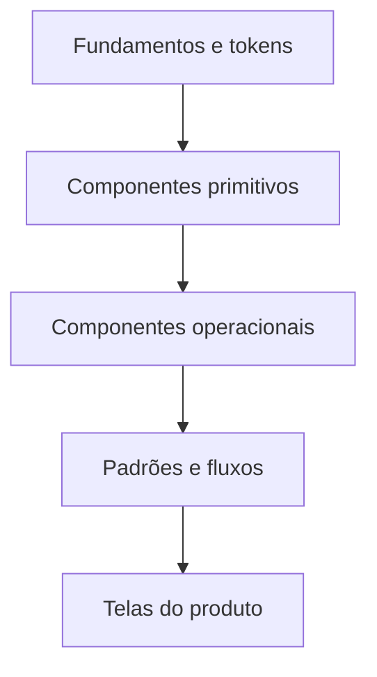

# TAPAJIRO — Design System

**Versão:** 1.0  
**Status:** Baseline oficial para o MVP  
**Produto:** Tapajiro — PWA de gestão de restaurantes e delivery  
**Mercado inicial:** Santarém e região do Tapajós, Pará  
**Atualizado em:** 19 de julho de 2026  
**Documentos relacionados:** PRD, Arquitetura Técnica, Database Schema e RLS & Security

---

## 1. Objetivo do documento

Este documento estabelece a linguagem visual, os componentes, os padrões de interação e os critérios de qualidade que devem orientar todas as interfaces do Tapajiro. Ele transforma o projeto inicial produzido no Stitch em um sistema coerente, acessível e implementável, válido para o painel administrativo, operação de pedidos, KDS, expedição, entregas, catálogo, relatórios, cardápio público e experiências móveis.

O Design System é a fonte de verdade para decisões de interface. Propostas visuais geradas por IA, protótipos e implementações em código devem respeitar estas regras. Quando houver conflito entre uma tela inicial e este documento, prevalece este documento.

## 2. Princípios do produto

### 2.1 Clareza operacional

O usuário deve compreender o estado da operação em poucos segundos. Pedido, tempo de espera, próxima ação e exceções precisam ter hierarquia visual inequívoca.

### 2.2 Velocidade com segurança

Ações recorrentes devem exigir poucos passos. Ações irreversíveis, financeiras ou destrutivas devem pedir confirmação e explicar o impacto.

### 2.3 Calma sob pressão

O Tapajiro será usado em ambientes com ruído, movimento e alta demanda. A interface deve reduzir a carga cognitiva, evitar animações excessivas e reservar cores intensas para situações relevantes.

### 2.4 Identidade regional sem folclorização

A marca pode transmitir pertencimento ao Tapajós por meio do nome, da linguagem, da fotografia e de campanhas. A interface operacional deve continuar contemporânea, profissional e universal. Elementos regionais não devem comprometer legibilidade nem transformar o produto em uma caricatura visual.

### 2.5 Acessibilidade desde a origem

Contraste, navegação por teclado, foco, leitores de tela, alvos de toque e redução de movimento fazem parte da definição de pronto, não de uma etapa posterior.

### 2.6 Gestão, não intermediação financeira

O Tapajiro registra pedidos, formas de pagamento, confirmações, cancelamentos e conciliações gerenciais. O pagamento ocorre diretamente entre consumidor e restaurante ou por provedor contratado pelo estabelecimento. O Tapajiro não recebe, custodia, divide, transfere ou antecipa valores.

---

## 3. Escopo do sistema visual

O sistema cobre quatro contextos:

| Contexto | Usuários | Prioridade de experiência |
|---|---|---|
| Gestão | Proprietário, gerente, financeiro | Visão consolidada, filtros, análise e configuração |
| Operação | Atendimento, caixa, cozinha e expedição | Velocidade, atualização em tempo real e baixa ambiguidade |
| Entrega | Entregador e despachante | Uso móvel, localização, contato autorizado e confirmação |
| Compra | Cliente final | Descoberta, personalização, checkout e acompanhamento |

O painel administrativo deve funcionar a partir de 360 px, mas as experiências de KDS e análises densas possuem composições próprias para telas maiores. O cardápio público e a área do entregador são mobile first.

---

## 4. Auditoria do projeto inicial

O pacote inicial contém oito propostas: Dashboard, Central de Pedidos, KDS, Detalhe do Pedido, Expedição, Entregas, Financeiro e Catálogo. A direção visual — superfícies claras, azul como ação e laranja como atenção — é válida, porém as telas ainda não devem ser tratadas como especificação final.

### 4.1 Elementos aprovados como direção

- Paleta principal fornecida para a marca;
- Sora para títulos e indicadores, Inter para leitura operacional;
- Fundo Off White, cards brancos e sombras discretas;
- Estrutura com navegação lateral em desktop;
- Cards de pedido com forte indicação temporal;
- Densidade compatível com uma plataforma SaaS operacional;
- Uso de drawers para contexto sem abandonar a fila principal.

### 4.2 Correções obrigatórias

| Achado | Decisão oficial |
|---|---|
| Símbolo da marca varia entre letra, caminhão e talheres | Usar wordmark TAPAJIRO; símbolo único somente após aprovação formal |
| Descritor varia entre “Gestão Premium”, “Gestão Logística” e inglês | Usar o descritor funcional “Gestão de restaurantes e delivery” quando necessário |
| Central de Pedidos está visualmente quebrada | Regenerar a tela integralmente com o padrão deste documento |
| Financeiro representa carteira, saldo e repasse | Substituir por visão gerencial de vendas e recebimentos registrados |
| Mapa contém marca legada | Utilizar componente real de mapa ou placeholder neutro do Tapajiro |
| Há imagens externas e imagem incorreta em produto | Usar ativos próprios, licenciados e armazenados pelo produto |
| Estados e nomes das ações variam entre telas | Aplicar o vocabulário e a máquina de estados definidos neste documento |
| Cores intensas aparecem sem verificação de contraste | Aplicar os pares de foreground/background aqui aprovados |
| Informações pessoais podem alcançar contextos indevidos | Exibir somente o mínimo permitido pelo papel e pela etapa operacional |

### 4.3 Ativos que não podem chegar à produção

- Marca, texto ou rodapé “DELIVERY360”;
- Imagens geradas externamente sem procedência, licença e aprovação;
- Fotografias que não correspondam ao produto cadastrado;
- Ícones retirados de bibliotecas diferentes na mesma interface;
- Mapas incorporados como screenshot;
- Logotipos provisórios conflitantes;
- Textos financeiros que indiquem custódia ou movimentação de dinheiro pelo Tapajiro.

---

## 5. Fundamentos de marca

### 5.1 Nome

O nome oficial do produto é **Tapajiro**. Em aplicações de marca e títulos principais, pode ser usado como **TAPAJIRO**. Em textos corridos, usar “Tapajiro”. Não separar, abreviar, traduzir nem adicionar sufixos ao nome.

### 5.2 Wordmark e símbolo

Até a aprovação do desenho vetorial definitivo, o wordmark tipográfico é a aplicação oficial. Um único símbolo provisório pode ser usado dentro do produto somente se documentado no arquivo mestre de marca. Nunca alternar entre caminhão, talheres, letra T ou outros ícones como se todos fossem a marca.

Regras mínimas:

- Área de proteção equivalente à altura da letra “T” ao redor do wordmark;
- Altura mínima digital de 20 px para o wordmark isolado;
- Não distorcer, inclinar, contornar ou aplicar gradiente;
- Não alterar a ordem ou as cores internamente;
- Em fundos complexos, usar contêiner sólido aprovado;
- Não usar o ícone de marca como ícone funcional.

### 5.3 Descritor funcional

Quando o contexto exigir explicação, usar **“Gestão de restaurantes e delivery”**. Esse texto é um descritor de produto, não um slogan de campanha. O slogan comercial permanece pendente de uma etapa específica de branding.

### 5.4 Tom da marca

O Tapajiro comunica domínio operacional com proximidade. O texto deve ser direto, respeitoso, brasileiro e útil. Evitar linguagem bancária, promessas absolutas, termos técnicos desnecessários e exageros como “revolucionário” ou “premium” dentro da operação.

---

## 6. Arquitetura do Design System



1. **Fundamentos:** cor, tipografia, espaçamento, forma, elevação e movimento.
2. **Primitivos:** botão, input, badge, card, tabela e diálogo.
3. **Operacionais:** card de pedido, coluna do KDS, fila de expedição e resumo de recebimentos.
4. **Padrões:** filtros, confirmação, estados assíncronos e atualizações em tempo real.
5. **Telas:** composição contextual dos níveis anteriores.

---

## 7. Paleta oficial

### 7.1 Cores de marca

| Nome | Hex | Função principal |
|---|---:|---|
| Navy Blue | `#002B8F` | Estrutura, navegação e fundos institucionais |
| Royal Blue | `#0D47C9` | Ação primária e confirmação |
| Electric Blue | `#2563EB` | Foco, seleção e ação secundária |
| Bright Orange | `#FF5A00` | Atenção, urgência e novos pedidos |
| Soft Orange | `#FF7A1A` | Destaques de menor intensidade e apoio gráfico |
| Off White | `#F4F4F4` | Fundo principal da aplicação |
| Dark Gray | `#1E1E1E` | Texto e iconografia principal |

### 7.2 Neutros funcionais

| Token | Valor | Uso |
|---|---:|---|
| `neutral.white` | `#FFFFFF` | Superfícies elevadas |
| `neutral.50` | `#FAFAFA` | Hover sutil e fundo de agrupamento |
| `neutral.100` | `#F4F4F4` | Fundo da aplicação |
| `neutral.200` | `#E8E8EC` | Divisores suaves |
| `neutral.300` | `#D8DAE3` | Bordas padrão |
| `neutral.500` | `#71717A` | Ícones e conteúdo complementar |
| `neutral.600` | `#52525B` | Texto secundário |
| `neutral.900` | `#1E1E1E` | Texto principal |

### 7.3 Cores semânticas

As cores semânticas não substituem as cores da marca. Elas comunicam resultado, risco e estado com consistência.

| Semântica | Fundo forte | Fundo suave | Texto/ícone | Exemplos |
|---|---:|---:|---:|---|
| Sucesso | `#166534` | `#DCFCE7` | `#166534` | Entregue, confirmação concluída |
| Erro | `#B91C1C` | `#FEE2E2` | `#B91C1C` | Falha, cancelado, ação destrutiva |
| Atenção | `#FF5A00` | `#FFF0E8` | `#7A2E00` | Atraso, pendência, novo pedido |
| Informação | `#0D47C9` | `#E8EFFE` | `#002B8F` | Atualização, orientação, em rota |
| Neutro | `#52525B` | `#F4F4F4` | `#52525B` | Inativo, rascunho, indisponível |

### 7.4 Contraste aprovado

O alvo mínimo é WCAG 2.2 AA: 4,5:1 para texto comum e 3:1 para texto grande e elementos gráficos essenciais. O Tapajiro prioriza pares que também sejam legíveis em cozinhas e áreas externas.

| Fundo | Conteúdo | Razão | Uso |
|---|---|---:|---|
| Navy Blue | Branco | 12,05:1 | Aprovado para qualquer texto |
| Royal Blue | Branco | 7,60:1 | Aprovado para botões e texto |
| Electric Blue | Branco | 5,17:1 | Aprovado para texto e foco |
| Bright Orange | Dark Gray | 5,33:1 | Aprovado; combinação preferencial |
| Soft Orange | Dark Gray | 6,39:1 | Aprovado; combinação preferencial |
| Off White | Dark Gray | 15,16:1 | Aprovado para conteúdo principal |
| Branco | Cinza secundário | 7,73:1 | Aprovado para conteúdo secundário |
| Verde de sucesso | Branco | 7,13:1 | Aprovado para ação/estado forte |
| Vermelho de erro | Branco | 6,47:1 | Aprovado para ação destrutiva |

**Proibição:** texto branco sobre Bright Orange tem razão 3,13:1 e sobre Soft Orange tem 2,61:1. Essas combinações não podem ser usadas em texto comum. Botões laranja devem usar Dark Gray ou uma tonalidade escura semanticamente equivalente.

### 7.5 Uso proporcional

- 60%: Off White, branco e neutros de superfície;
- 25%: Navy/Royal Blue em estrutura e ação;
- 10%: neutros de texto e borda;
- Até 5%: laranjas e cores semânticas de atenção.

Laranja não deve ser usado como decoração recorrente em telas operacionais, pois perderia o significado de urgência.

---

## 8. Tokens de cor

Componentes devem consumir tokens semânticos, nunca valores hexadecimais diretamente.

```css
:root {
  --color-brand-navy: #002b8f;
  --color-brand-royal: #0d47c9;
  --color-brand-electric: #2563eb;
  --color-brand-orange: #ff5a00;
  --color-brand-orange-soft: #ff7a1a;

  --color-bg-app: #f4f4f4;
  --color-bg-surface: #ffffff;
  --color-bg-subtle: #fafafa;
  --color-text-primary: #1e1e1e;
  --color-text-secondary: #52525b;
  --color-text-disabled: #71717a;
  --color-border-default: #d8dae3;
  --color-border-subtle: #e8e8ec;

  --color-action-primary: #0d47c9;
  --color-action-primary-hover: #002b8f;
  --color-action-focus: #2563eb;
  --color-attention: #ff5a00;
  --color-success: #166534;
  --color-danger: #b91c1c;

  --color-on-primary: #ffffff;
  --color-on-attention: #1e1e1e;
  --color-on-danger: #ffffff;
  --color-scrim: rgb(30 30 30 / 48%);
}
```

Para tema escuro futuro, devem ser criados novos tokens semânticos. Inverter cores automaticamente não é aceito.

---

## 9. Tipografia

### 9.1 Famílias

- **Sora:** títulos de tela, títulos de seção e números de destaque;
- **Inter:** corpo, formulário, tabela, menu, status e dados operacionais;
- **Fallback:** `system-ui, -apple-system, BlinkMacSystemFont, "Segoe UI", sans-serif`.

As fontes devem ser hospedadas localmente ou carregadas por um mecanismo aprovado com política de privacidade e fallback imediato. Evitar bloqueio da renderização.

### 9.2 Escala tipográfica

| Token | Família | Tamanho/linha | Peso | Uso |
|---|---|---:|---:|---|
| `display.lg` | Sora | 48/56 px | 700 | Landing e comunicação, não operação densa |
| `display.md` | Sora | 40/48 px | 700 | Destaque institucional |
| `heading.xl` | Sora | 32/40 px | 650 | Título desktop |
| `heading.lg` | Sora | 24/32 px | 650 | Título mobile e seção principal |
| `heading.md` | Sora | 20/28 px | 600 | Card e subseção |
| `title.lg` | Inter | 18/26 px | 600 | Título de componente |
| `body.lg` | Inter | 16/24 px | 400 | Texto principal confortável |
| `body.md` | Inter | 14/20 px | 400 | Dado e interface padrão |
| `body.sm` | Inter | 12/16 px | 500 | Metadado; não usar para conteúdo crítico |
| `label.lg` | Inter | 14/20 px | 600 | Botão e campo |
| `label.md` | Inter | 12/16 px | 600 | Chip e cabeçalho de tabela |
| `number.kpi` | Sora | 28/36 px | 700 | Indicador gerencial |

### 9.3 Regras

- Não usar corpo menor que 12 px;
- Em mobile, conteúdo essencial deve ter pelo menos 14 px;
- Não usar caixa alta em frases; reservar para siglas curtas e wordmark;
- Valores monetários usam algarismos tabulares quando disponíveis;
- Não comunicar hierarquia somente por tamanho; combinar título, espaçamento e semântica;
- Limitar largura de texto corrido a aproximadamente 72 caracteres.

---

## 10. Espaçamento e grade

### 10.1 Escala

| Token | Valor |
|---|---:|
| `space.0` | 0 px |
| `space.0_5` | 4 px |
| `space.1` | 8 px |
| `space.1_5` | 12 px |
| `space.2` | 16 px |
| `space.3` | 24 px |
| `space.4` | 32 px |
| `space.5` | 40 px |
| `space.6` | 48 px |
| `space.8` | 64 px |

A base é 8 px, com meia unidade de 4 px apenas para ajustes internos compactos.

### 10.2 Breakpoints

| Faixa | Largura | Grade | Margem |
|---|---:|---:|---:|
| Mobile S | 360–479 px | 4 colunas | 16 px |
| Mobile L | 480–767 px | 4 colunas | 20 px |
| Tablet | 768–1023 px | 8 colunas | 24 px |
| Desktop | 1024–1439 px | 12 colunas | 24–32 px |
| Wide | ≥ 1440 px | 12 colunas, conteúdo limitado | 40 px |

Gutter padrão: 16 px em mobile e tablet, 24 px em desktop. O conteúdo gerencial pode ter largura máxima de 1600 px. KDS e mapa podem ocupar toda a largura disponível.

### 10.3 Densidade

O usuário pode escolher densidade confortável ou compacta em tabelas e filas, mas alvos interativos nunca ficam menores que 44 × 44 px. O modo compacto reduz espaçamento, não acessibilidade.

---

## 11. Forma, borda e elevação

### 11.1 Raios

| Token | Valor | Uso |
|---|---:|---|
| `radius.sm` | 8 px | Badges e elementos internos |
| `radius.md` | 12 px | Botões, inputs e controles |
| `radius.lg` | 16 px | Cards e painéis |
| `radius.xl` | 20 px | Dialogs e drawers destacados |
| `radius.full` | 9999 px | Avatar, toggle e pílula |

### 11.2 Bordas

- Padrão: 1 px `border.default`;
- Separador: 1 px `border.subtle`;
- Foco: 2 px Electric Blue com offset de 2 px;
- Erro: 1 px Danger, acompanhado de texto e ícone;
- Não simular borda por sombra.

### 11.3 Sombras

```css
--shadow-1: 0 2px 6px rgb(30 30 30 / 6%);
--shadow-2: 0 8px 24px rgb(30 30 30 / 12%);
--shadow-3: 0 16px 48px rgb(30 30 30 / 18%);
```

- Nível 0: fundo e conteúdo integrado;
- Nível 1: cards e barras fixas;
- Nível 2: popovers e dropdowns;
- Nível 3: dialogs e drawers;
- No máximo três níveis visíveis simultaneamente.

### 11.4 Z-index

| Camada | Valor-base |
|---|---:|
| Conteúdo | 0 |
| Cabeçalho fixo | 100 |
| Dropdown/popover | 300 |
| Scrim | 500 |
| Drawer/dialog | 600 |
| Toast | 800 |

---

## 12. Movimento e feedback

Movimento serve para explicar mudança de estado, nunca para decorar tarefas críticas.

| Token | Duração | Uso |
|---|---:|---|
| `motion.fast` | 120 ms | Hover, foco e microfeedback |
| `motion.base` | 180 ms | Menu, accordion e mudança de estado |
| `motion.slow` | 240 ms | Drawer e dialog |

Usar `ease-out` ao entrar e `ease-in` ao sair. Respeitar `prefers-reduced-motion: reduce`, removendo deslocamentos, pulsos e transições não essenciais. Novo pedido pode gerar destaque breve de cor e sinal sonoro configurável; não usar pulso infinito.

---

## 13. Iconografia

Adotar **Material Symbols Rounded** como conjunto funcional inicial, sempre pelo pacote ou SVG local versionado. Não misturar Material Symbols, Lucide, Font Awesome e emojis na mesma interface.

- 16 px: apoio em badge, sem interação;
- 20 px: controles compactos;
- 24 px: padrão de navegação e ação;
- 32 px ou mais: estado vazio e comunicação;
- Traço visual consistente, preenchimento configurado de forma uniforme;
- Ícone interativo sempre possui nome acessível;
- Nunca depender apenas do ícone em ações críticas;
- Ícones não substituem a marca.

## 14. Fotografia, ilustração e mapa

### 14.1 Produtos

- Preferir imagem real do item, iluminação natural e fundo simples;
- Proporção mestre 1:1, recorte alternativo 4:3;
- Mínimo recomendado de 800 × 800 px;
- Compressão WebP/AVIF com fallback quando necessário;
- Exigir texto alternativo ou marcar como decorativa;
- Usar placeholder neutro quando não houver foto;
- Nunca reutilizar fotografia de pessoa como imagem de alimento;
- Registrar autoria/licença e armazenar em infraestrutura controlada pelo produto.

### 14.2 Identidade regional

Fotografias da região do Tapajós podem aparecer em onboarding, campanhas e áreas institucionais. Não usar imagens de comunidades, pessoas ou manifestações culturais sem autorização e contexto adequado.

### 14.3 Mapas

Mapa deve ser um componente integrado com licença e atribuição corretas. Screenshot de mapa não é aceito. Quando o serviço estiver indisponível, mostrar lista de entregas, última localização conhecida e horário da atualização; nunca apresentar uma posição antiga como atual.

---

## 15. App shell e navegação

### 15.1 Desktop

- Sidebar expandida: 248 px;
- Sidebar recolhida: 72 px;
- Header da área de trabalho: 64 px;
- Logo/wordmark no topo; unidade ativa e status da loja em área dedicada;
- Um item ativo por vez, indicado por fundo, texto e barra lateral — não somente cor;
- Rodapé da sidebar com ajuda, perfil e versão quando necessário.

### 15.2 Tablet

Sidebar recolhida por padrão. Pode abrir como overlay, preservando o contexto da tela.

### 15.3 Mobile

Usar top app bar e navegação inferior com no máximo cinco destinos de alta frequência. Destinos adicionais ficam em “Mais”. No KDS móvel e na área do entregador, a navegação deve ser contextual.

### 15.4 Destinos administrativos

1. Visão geral;
2. Pedidos;
3. Cozinha;
4. Expedição;
5. Entregas;
6. Cardápio;
7. Clientes;
8. Caixa e vendas;
9. Relatórios;
10. Equipe;
11. Configurações.

Visibilidade e ordem devem respeitar o papel. Usuários não devem ver destinos para os quais não possuem acesso.

---

## 16. Componentes primitivos

### 16.1 Button

| Variante | Uso | Cor |
|---|---|---|
| Primary | Próxima ação principal | Royal Blue / branco |
| Secondary | Ação alternativa | Branco / Navy / borda |
| Tertiary | Ação de baixo destaque | Transparente / Royal Blue |
| Attention | Ação associada a urgência real | Bright Orange / Dark Gray |
| Danger | Exclusão ou cancelamento | Danger / branco |

Tamanhos: 40 px compacto, 48 px padrão e 56 px móvel destacado. Ícone à esquerda quando reforça o significado. Estados obrigatórios: default, hover, active, focus-visible, disabled e loading. Durante loading, preservar a largura, desabilitar novo envio e manter rótulo acessível.

Não usar mais de uma ação primária por região decisória. “Desabilitado” não substitui explicação: quando o motivo não for evidente, informar por texto ou tooltip.

### 16.2 Icon button

Área mínima 44 × 44 px, ícone 20 ou 24 px e nome acessível. Ações destrutivas não podem depender de um ícone de lixeira sem confirmação.

### 16.3 Text field e textarea

- Label persistente acima do campo;
- Altura de 48 px no desktop e mínimo 48 px no mobile;
- Placeholder é exemplo, não label;
- Ajuda e erro ficam abaixo do campo;
- Erro inclui mensagem específica e associação por `aria-describedby`;
- Máscaras não devem impedir colar ou editar;
- Campos monetários exibem `R$`, mas armazenam valor normalizado;
- Não validar agressivamente antes de o usuário interagir.

### 16.4 Select, combobox e autocomplete

Usar Select para conjuntos pequenos e estáveis; Combobox quando houver busca ou mais de 10 opções. O menu deve ser navegável por teclado e anunciar quantidade de resultados. Em mobile, listas longas podem abrir em bottom sheet.

### 16.5 Search field

Busca deve informar escopo, aceitar limpeza rápida e ter debounce de 250–400 ms quando remota. Pressionar Enter executa imediatamente. Mostrar “Nenhum resultado” separado de “Não há dados”.

### 16.6 Checkbox, radio e switch

- Checkbox: seleção múltipla;
- Radio: escolha única visível;
- Switch: efeito imediato de ligar/desligar;
- Para mudanças com grande impacto — abrir/fechar loja, pausar canal — solicitar confirmação contextual;
- Label inteira deve ser clicável.

### 16.7 Badge e status chip

Altura mínima de 24 px, texto curto, ícone opcional e cor semântica. Todo status deve apresentar rótulo textual. Badges não são botões, salvo quando desenhados como filtro selecionável com semântica própria.

### 16.8 Tabs e segmented control

Tabs mudam seções equivalentes; segmented control alterna visão ou filtro local. Estado ativo deve ter indicador, contraste e atributo ARIA apropriado. Em mobile, tabs podem rolar horizontalmente sem ocultar a aba ativa.

### 16.9 Card

Card agrupa uma unidade de informação ou ação. Padding padrão 24 px, compacto 16 px. Evitar cards dentro de cards. Um card clicável possui foco completo, mas ações internas continuam independentes.

### 16.10 Table e data grid

- Cabeçalho fixo apenas quando ajuda a leitura;
- Altura de linha: 64 px confortável ou 48 px compacta;
- Ordenação anuncia direção;
- Colunas numéricas alinhadas à direita;
- Ação por linha no final;
- Seleção em massa mostra barra de ações contextual;
- Mobile converte linhas em cartões ou mostra apenas colunas prioritárias;
- Nunca depender de scroll horizontal sem pista visual.

### 16.11 Pagination

Preferir paginação para dados administrativos e carregamento incremental para feeds. Preservar filtros, ordenação e página na URL quando aplicável.

### 16.12 Dialog

Usar para decisão curta e bloqueante. Deve ter título orientado ao resultado, descrição do impacto, ação principal e cancelamento. Foco inicia no primeiro controle seguro e retorna ao elemento acionador ao fechar. Escape fecha somente quando não houver risco de perda silenciosa.

### 16.13 Drawer e bottom sheet

Drawer mantém a lista visível enquanto mostra detalhes. Largura recomendada: 440–560 px no desktop. No mobile ocupa a tela ou abre como bottom sheet quando o conteúdo é curto. Deve possuir título, botão de fechar, foco contido e URL/deep link quando o item puder ser compartilhado internamente.

### 16.14 Toast, banner e alert

- Toast: confirmação transitória sem decisão;
- Banner: situação persistente que afeta a tela ou sistema;
- Inline alert: problema ligado a uma região específica;
- Erros críticos não desaparecem automaticamente;
- Toast deve permanecer tempo suficiente e ser anunciado por live region;
- Não usar toast como única confirmação de uma mudança financeira ou destrutiva.

### 16.15 Tooltip

Somente para explicação complementar. Deve abrir por hover e foco, nunca conter ação e nunca carregar informação essencial.

### 16.16 Skeleton, spinner e progress

- Até 800 ms previstos: evitar spinner que pisca;
- Conteúdo estruturado: skeleton semelhante ao layout;
- Ação pontual: spinner dentro do botão;
- Processo com etapas: progress bar e texto;
- Nunca exibir progresso fictício como percentual exato.

---

## 17. Componentes operacionais

### 17.1 Order card

Estrutura mínima:

1. Número do pedido e canal;
2. Tempo no estado atual e indicador de SLA;
3. Nome curto do cliente quando permitido;
4. Tipo: entrega ou retirada;
5. Quantidade de itens e observações críticas;
6. Status de pagamento registrado;
7. Próxima ação explícita;
8. Menu de ações secundárias.

O card usa borda e fundo neutros. Laranja aparece no tempo ou na faixa de atenção quando o SLA se aproxima; vermelho apenas ao exceder limite crítico ou em erro.

### 17.2 Order board column

Cada coluna representa um estado operacional, exibe contador e possui scroll independente somente em desktop largo. A ordem dos cards deve priorizar SLA e horário, com opção de ordenação claramente visível. Drag and drop pode complementar, mas nunca ser a única forma de mudar estado.

### 17.3 KDS card

Deve ser legível a distância:

- Número e tempo com alto contraste;
- Itens expandidos por padrão;
- Complementos e observações em agrupamento visual;
- Alertas de alergia/dieta com texto e ícone;
- Uma ação principal consistente;
- Sem telefone, endereço, detalhes financeiros ou PII desnecessária;
- Confirmação opcional para avançar vários pedidos ao mesmo tempo.

### 17.4 Order detail drawer

Exibe linha do tempo, itens, totais, forma de recebimento registrada, entrega/retirada e ações autorizadas. Itens devem estar visíveis ou com accordion claramente anunciado; o total nunca pode aparecer sem a composição acessível. Informações pessoais obedecem ao papel.

### 17.5 Driver card

Exibe nome, disponibilidade, entregas ativas, capacidade e última atualização. Telefone é mostrado somente a papéis autorizados e quando necessário. O estado “offline” deve diferenciar indisponibilidade de falha de localização.

### 17.6 Dispatch queue item

Contém pedido, região/bairro, promessa de entrega, prontidão, restrições e ação “Atribuir entregador”. Endereço completo aparece apenas no contexto autorizado e após necessidade operacional.

### 17.7 Delivery tracking card

Exibe entregador, pedido, etapa, previsão, última localização e integridade do sinal. Localização desatualizada deve ter timestamp e aviso explícito.

### 17.8 Payment record badge

Representa o registro informado ao Tapajiro:

- `Recebimento pendente`;
- `Recebimento confirmado`;
- `Falha informada pelo provedor`;
- `Estorno externo registrado`;
- `Pagamento na entrega`;
- `Não aplicável`.

Evitar a palavra isolada “Pago” quando a fonte ou o momento da confirmação não estiver claro.

### 17.9 Sales summary card

Exibe valor de vendas registradas no período, quantidade de pedidos, ticket médio e comparação. Deve incluir fonte, período, filtros e timestamp de atualização. Nunca rotular esses dados como saldo disponível.

### 17.10 Product card

Imagem correta, nome, categoria, preço base, disponibilidade e status. Ações rápidas: editar, duplicar e pausar. Excluir exige confirmação e deve ser bloqueado quando a preservação histórica pedir arquivamento.

---

## 18. Estados de pedidos

O rótulo visível é em português; o identificador técnico pode permanecer estável em inglês no código.

| Estado técnico | Rótulo | Semântica | Próxima ação padrão |
|---|---|---|---|
| `pending` | Novo pedido | Atenção | Aceitar pedido |
| `accepted` | Aceito | Informação | Iniciar preparo |
| `preparing` | Em preparo | Informação | Marcar como pronto |
| `ready` | Pronto | Sucesso | Encaminhar à expedição |
| `awaiting_dispatch` | Aguardando entregador | Atenção | Atribuir entregador |
| `assigned` | Entregador atribuído | Informação | Iniciar entrega |
| `out_for_delivery` | Em rota | Informação | Confirmar entrega |
| `delivered` | Entregue | Sucesso | Ver detalhes |
| `ready_for_pickup` | Pronto para retirada | Sucesso | Confirmar retirada |
| `completed` | Concluído | Sucesso | Ver detalhes |
| `cancelled` | Cancelado | Erro | Ver motivo |
| `rejected` | Recusado | Erro | Ver motivo |

Nem todos os pedidos passam por todos os estados. Retirada ignora expedição e entrega. A ação exibida deve nomear o resultado; evitar “Avançar”, “Continuar” ou “Concluir” sem contexto.

### 18.1 Regras de transição

- Mudanças devem ser idempotentes e gerar feedback imediato;
- Atualização recebida em tempo real deve preservar o foco e não deslocar o usuário inesperadamente;
- Conflito de versão exige recarregar o item e explicar o que mudou;
- Cancelamento exige motivo e, quando pertinente, instrução sobre tratamento externo do pagamento;
- Voltar estado exige permissão e trilha de auditoria;
- Cor nunca é o único sinal do estado.

---

## 19. Estados de entrega

| Estado técnico | Rótulo | Semântica |
|---|---|---|
| `unassigned` | Sem entregador | Atenção |
| `assigned` | Entregador atribuído | Informação |
| `picked_up` | Pedido coletado | Informação |
| `in_transit` | Em rota | Informação |
| `arrived` | Chegou ao destino | Atenção |
| `delivered` | Entrega confirmada | Sucesso |
| `failed` | Tentativa sem sucesso | Erro |
| `returned` | Retornado ao estabelecimento | Erro |

Para falha, solicitar motivo predefinido e observação opcional. Não expor publicamente notas internas ou dados do entregador além do necessário.

---

## 20. Registro de pagamentos e linguagem financeira

### 20.1 O que a interface pode apresentar

- Vendas registradas por período;
- Pedidos por forma de pagamento;
- Recebimentos confirmados ou pendentes conforme fonte disponível;
- Pagamentos na entrega;
- Cancelamentos e estornos realizados fora do Tapajiro;
- Divergências de caixa informadas pelo estabelecimento;
- Taxas configuradas do provedor externo, quando importadas;
- Exportação de relatório e conciliação gerencial;
- Assinatura SaaS do Tapajiro em área separada.

### 20.2 Termos proibidos para a operação do restaurante

- Saldo Tapajiro;
- Saldo disponível;
- Carteira;
- Conta digital;
- Próximo repasse;
- Repasse automático;
- Solicitar antecipação;
- Sacar ou transferir;
- Split de pagamento;
- Dinheiro em custódia;
- Taxa retida pelo Tapajiro.

Esses termos só podem aparecer em documentação de proibição ou para explicar que a função não existe.

### 20.3 Tela oficial “Caixa e vendas”

A antiga proposta “Financeiro” deve ser substituída por:

1. Filtro de período, unidade e canal;
2. Vendas registradas;
3. Pedidos e ticket médio;
4. Resumo por forma de pagamento;
5. Recebimentos confirmados e pendentes;
6. Cancelamentos e estornos externos registrados;
7. Divergências de caixa;
8. Exportar CSV/PDF;
9. Nota persistente: “Os pagamentos são recebidos diretamente pelo estabelecimento. O Tapajiro não movimenta valores.”

Cobrança da assinatura do SaaS deve viver em **Configurações > Plano e assinatura**, com permissões próprias e sem mistura com as vendas do restaurante.

---

## 21. Conteúdo e microcopy

### 21.1 Regras de escrita

- Português brasileiro;
- Sentence case em títulos, botões e labels;
- Frases curtas e voz ativa;
- Verbo no infinitivo em ações: “Aceitar pedido”, “Salvar alterações”;
- Explicar causa e solução em erros;
- Data como `19/07/2026` na interface e formato local completo quando ambíguo;
- Horário de Santarém no formato de 24 horas por padrão;
- Moeda como `R$ 1.234,56`;
- Número do pedido como `#1048`;
- Evitar anglicismos quando houver equivalente claro.

### 21.2 Vocabulário oficial

| Evitar | Usar |
|---|---|
| Avançar status | Nome da próxima ação |
| Concluir pedido, no KDS | Marcar como pronto |
| Driver | Entregador |
| Dispatch | Expedição |
| Order | Pedido |
| Financeiro, quando sugere banco | Caixa e vendas |
| Cliente inexistente | Nenhum cliente encontrado |
| Erro desconhecido | Não foi possível concluir. Tente novamente. |
| Pago via Pix | Recebimento confirmado — Pix |
| Loja ON/OFF | Loja aberta/Loja fechada |

### 21.3 Mensagens modelo

**Sucesso:** “Pedido #1048 marcado como pronto.”  
**Conflito:** “Este pedido foi atualizado por outra pessoa. Revise os dados mais recentes.”  
**Offline:** “Você está sem conexão. As alterações seguras serão sincronizadas quando a internet voltar.”  
**Falha:** “Não foi possível atribuir o entregador. Verifique a conexão e tente novamente.”  
**Cancelamento:** “Cancelar este pedido? Informe o motivo. Se houver pagamento, o tratamento ocorrerá diretamente com o provedor ou cliente.”

---

## 22. Formulários

### 22.1 Estrutura

- Uma coluna até 640 px de largura de conteúdo;
- Campos relacionados podem usar duas colunas no desktop;
- Seções longas usam títulos e texto de ajuda;
- Ações ficam no final; barra fixa apenas quando o formulário é extenso;
- Indicar campos opcionais, evitando asteriscos em quase tudo;
- Preservar rascunho local quando seguro.

### 22.2 Validação

Validar no envio e, após o primeiro erro, também ao corrigir o campo. Levar foco ao resumo de erros e permitir navegar até cada campo. Mensagens devem dizer o que fazer: “Informe um telefone com DDD”, não “Valor inválido”.

### 22.3 Ação destrutiva

Excluir produto, cancelar pedido, remover usuário, fechar caixa com divergência ou alterar uma configuração de alto impacto exige dialog de confirmação. O botão destrutivo aparece depois da alternativa segura e nunca recebe foco inicial por padrão.

---

## 23. Filtros, busca e relatórios

- Filtros principais visíveis; avançados em popover/drawer;
- Chips resumem filtros ativos;
- “Limpar filtros” deve ser facilmente encontrado;
- Resultados informam contagem;
- Filtro de período tem presets e intervalo personalizado;
- URL preserva filtros administrativos compartilháveis;
- Exportação reflete exatamente filtros e fuso horário atuais;
- Relatórios mostram fonte e instante da última atualização;
- Não usar gráficos 3D.

### 23.1 Visualização de dados

- Gráfico deve ter título, período, legenda e alternativa tabular;
- Séries precisam se distinguir por rótulo, forma ou padrão, além de cor;
- Royal/Electric Blue são séries principais; laranja destaca atenção;
- Verde e vermelho mantêm semântica, não comparação decorativa;
- Tooltip é navegável por teclado quando contém dado essencial;
- Eixos e números usam formatação local;
- Donut é permitido para até cinco partes; acima disso, preferir barras.

---

## 24. Estados sistêmicos

Toda tela e componente com dados remotos deve especificar:

| Estado | Comportamento |
|---|---|
| Inicial | Estrutura estável antes da primeira busca |
| Loading | Skeleton ou progresso adequado |
| Vazio | Explica por que está vazio e oferece próxima ação |
| Sem resultados | Mantém filtros visíveis e permite limpá-los |
| Erro recuperável | Mensagem, causa útil e “Tentar novamente” |
| Sem permissão | Explica limite sem revelar dados protegidos |
| Offline | Mostra conectividade e capacidade disponível |
| Dado desatualizado | Exibe timestamp e ação para atualizar |
| Sincronizando | Feedback discreto sem bloquear leitura |
| Conflito | Recarrega versão atual e preserva intenção quando possível |
| Atualização disponível | Oferece recarregar sem perda de trabalho |

### 24.1 Experiência offline do PWA

- App shell, navegação e últimos dados permitidos podem ficar em cache;
- Nunca apresentar dado antigo sem “Atualizado em…”;
- Ações offline só entram em fila quando forem seguras e idempotentes;
- Cancelamentos, mudanças financeiras e ações conflitantes exigem conexão;
- O usuário deve ver itens pendentes de sincronização e falhas;
- Dados pessoais em cache devem obedecer às políticas de segurança e expiração.

---

## 25. Tempo real e notificações

- Novos pedidos podem gerar som, banner e badge conforme preferência do usuário;
- O som exige opt-in/configuração e alternativa visual;
- Atualizações não devem roubar foco;
- Um card recém-chegado pode ser destacado por até 6 segundos, sem animação contínua;
- Badge de contagem deve usar `99+` acima de 99;
- Notificação do navegador precisa de consentimento contextual;
- Pedidos duplicados ou eventos repetidos não podem gerar alertas duplicados;
- Tela deve informar conexão em tempo real interrompida e tentativa de reconexão.

---

## 26. Privacidade e visibilidade por papel

Design e autorização trabalham juntos. Ocultar um elemento não substitui RLS ou controle de acesso, mas a interface deve evitar solicitar ou exibir dados desnecessários.

| Papel | Dados pessoais visíveis |
|---|---|
| Proprietário/gerente | Conforme necessidade gerencial e política de acesso |
| Atendimento | Contato e pedido necessários ao suporte |
| Caixa | Dados mínimos para cobrança/registro e retirada |
| Cozinha | Itens, complementos, observações culinárias e alergias; sem telefone/endereço |
| Expedição | Identificação, bairro/região, promessa e dados necessários ao despacho |
| Entregador | Endereço e contato somente durante entrega atribuída |
| Financeiro | Relatórios e registros; PII do cliente somente quando indispensável e autorizada |

Dados sensíveis não devem aparecer em notificações push, screenshots de exemplo, logs visuais ou mensagens de erro.

---

## 27. Acessibilidade

O objetivo é conformidade **WCAG 2.2 nível AA**, com testes manuais e automatizados.

### 27.1 Requisitos obrigatórios

- Contraste de texto e componentes conforme seção 7;
- Alvo de toque mínimo interno de 44 × 44 px;
- Navegação completa por teclado;
- Foco visível e não oculto por barras fixas;
- Ordem de foco coerente com a leitura;
- Landmarks, headings e nomes acessíveis corretos;
- Labels programáticos em campos;
- Status dinâmicos anunciados sem interromper o usuário;
- Alternativa textual para gráficos e imagens informativas;
- Zoom de 200% sem perda de conteúdo ou função;
- Reflow em 320 CSS px quando aplicável;
- Não depender apenas de cor, posição, som ou gesto;
- Respeitar preferências de movimento e contraste;
- Tempo limite ajustável para tarefas não críticas;
- Atalhos de teclado documentados e desativáveis.

### 27.2 KDS acessível

O KDS deve oferecer modo de alto contraste, escala ampliada e sinal visual alternativo ao som. Tempos não devem ser comunicados apenas em verde/laranja/vermelho; mostrar minutos e rótulo de SLA.

### 27.3 Testes mínimos

- Axe/Lighthouse sem violações críticas;
- Teclado: Chrome e Firefox;
- Leitor de tela: NVDA + Chrome no Windows e VoiceOver + Safari no iOS;
- Zoom 200% e reflow;
- Simulação de daltonismo;
- Teste em sol/alto brilho para entregador;
- Usuários reais em operação de cozinha e atendimento.

---

## 28. Responsividade por módulo

| Módulo | Desktop | Tablet | Mobile |
|---|---|---|---|
| Dashboard | Grid 4/2/1 de KPIs e gráficos | 2 colunas | KPIs horizontais e cards empilhados |
| Pedidos | Board ou lista ampla | Colunas por tabs | Uma fila por vez com filtro de status |
| KDS | 3–5 colunas por etapa | 2–3 colunas | Lista priorizada; ação grande |
| Detalhe | Drawer lateral | Drawer amplo | Tela cheia/bottom sheet |
| Expedição | Fila + entregadores | Tabs ou split | Fluxo sequencial |
| Entregas | Mapa + painel | Alternância mapa/lista | Lista padrão, mapa opcional |
| Caixa e vendas | KPIs, gráfico e tabela | 2 colunas | Cards e tabela resumida |
| Catálogo | Tabela/grid | Grid 2 colunas | Lista com thumbnail |
| Cardápio público | Preview opcional | Mobile-first centralizado | Fluxo primário |
| Entregador | Não prioritário | Adaptado | Mobile-first, ações com uma mão |

No mobile, nenhuma função essencial pode existir apenas em hover, drag and drop ou clique direito.

---

## 29. Especificação das telas iniciais

### 29.1 Visão geral

Manter KPIs, resumo de pedidos, canais e atividade recente. Padronizar logo e descritor; fornecer alternativa tabular aos gráficos; indicar período e última atualização. Alertas críticos aparecem acima dos KPIs. Não mostrar métricas financeiras como saldo.

### 29.2 Central de Pedidos

**Ação:** redesenho integral obrigatório.

- Header com título, busca, filtro, densidade e status de conexão;
- Alternância Board/Lista;
- Colunas por estado com contador e SLA;
- Order cards segundo 17.1;
- Detalhe em drawer;
- Sem sobreposição, corte de texto ou grupos desalinhados;
- Mobile com tabs de estado e uma fila por vez.

### 29.3 KDS

Manter visão em colunas e tempo proeminente. Padronizar `Iniciar preparo` e `Marcar como pronto`. Expandir itens por padrão, separar complementos, omitir PII e incluir modo de alto contraste. A marca não pode ser substituída por ícone de caminhão.

### 29.4 Detalhe do Pedido

Itens e composição de preço devem estar acessíveis. Substituir “PAGO VIA PIX” por “Recebimento confirmado — Pix” quando confirmado por fonte válida. Linha do tempo registra autor e horário conforme permissão. Cancelamento apresenta motivo e orientação de tratamento externo do pagamento.

### 29.5 Expedição

Manter layout de fila e entregadores disponíveis. Mostrar região antes do endereço completo, promessa, prontidão e capacidade do entregador. A atribuição deve funcionar por botão e teclado; drag and drop é opcional.

### 29.6 Entregas

Remover screenshot e marca legada. Implementar mapa real acompanhado de lista acessível. Exibir última localização com timestamp, estados de sinal e fallback. Nunca apresentar rastreamento além do período operacional necessário.

### 29.7 Caixa e vendas

Substituir a tela Financeiro conforme seção 20.3. Remover saldo, repasse e antecipação. Incluir nota de não intermediação e separar cobrança da assinatura SaaS.

### 29.8 Catálogo

Manter busca, categorias, status e edição. Substituir imagens incorretas, retirar dependências externas e oferecer placeholder oficial. Disponibilidade é um switch com confirmação contextual quando afetar pedidos atuais. Preferir arquivar a excluir itens com histórico.

---

## 30. Telas necessárias ainda não cobertas

### 30.1 Acesso e onboarding

- Entrar;
- Recuperar senha;
- Aceitar convite;
- Verificação e sessão expirada;
- Criar empresa e primeira unidade;
- Configurar horários, retirada e entrega;
- Configurar zona/taxa/prazo;
- Cadastrar primeiro produto;
- Convidar equipe;
- Checklist de publicação.

### 30.2 Operação e gestão

- Criar/editar pedido manual;
- Formulário de produto e categoria;
- Complementos, adicionais e disponibilidade;
- Clientes e histórico autorizado;
- Abertura, movimentação e fechamento de caixa;
- Divergência e conciliação;
- Relatórios detalhados;
- Equipe, papéis e convites;
- Unidades, horários, zonas e taxas;
- Integrações;
- Plano e assinatura;
- Auditoria e segurança.

### 30.3 Cliente final

- Cardápio público;
- Busca e categorias;
- Detalhe/personalização do produto;
- Carrinho;
- Identificação;
- Entrega ou retirada;
- Checkout com instrução de pagamento direto;
- Confirmação;
- Acompanhamento do pedido;
- Ajuda e indisponibilidade da loja.

### 30.4 Entregador

- Entrar e disponibilidade;
- Lista de entregas atribuídas;
- Detalhe e navegação externa;
- Confirmar coleta;
- Informar chegada;
- Confirmar entrega;
- Registrar falha;
- Histórico do turno;
- Estado offline e sincronização.

### 30.5 Backoffice Tapajiro

- Gestão de tenants sem exposição indevida;
- Suporte auditável;
- Planos e assinaturas SaaS;
- Feature flags;
- Monitoramento operacional;
- Incidentes e comunicação de status.

---

## 31. Padrões de segurança na interface

- Sessão expirada preserva trabalho não sensível e pede novo login;
- Alteração de papel, senha, integração ou dado crítico pede reautenticação conforme risco;
- Não confirmar se um e-mail inexistente está cadastrado na recuperação de conta;
- Copiar dado pessoal gera feedback e pode exigir auditoria;
- Download/exportação informa escopo e pode exigir permissão adicional;
- Não colocar tokens, IDs internos sensíveis ou stack traces em mensagens;
- Ações administrativas registram ator, horário, unidade e motivo;
- Impersonação de suporte deve ser evidente, temporária e auditada;
- Botões ocultos por papel não substituem proteção no servidor.

---

## 32. Implementação em código

### 32.1 Convenções

- Componentes em PascalCase;
- Props e tokens em inglês técnico estável;
- Conteúdo visível em português por camada de internacionalização;
- Variantes controladas e documentadas;
- Nenhum componente busca dados por conta própria quando isso impedir teste/reuso;
- Estados assíncronos são explícitos;
- Evitar CSS arbitrário fora dos tokens.

### 32.2 Estrutura sugerida

```text
src/
  design-system/
    tokens/
    primitives/
    feedback/
    navigation/
    data-display/
    forms/
  components/
    orders/
    kitchen/
    dispatch/
    delivery/
    catalog/
    sales/
  patterns/
  features/
  pages/
```

### 32.3 Nomes recomendados

`Button`, `IconButton`, `TextField`, `Select`, `Combobox`, `StatusBadge`, `DataTable`, `Dialog`, `Drawer`, `Toast`, `EmptyState`, `OrderCard`, `KdsOrderCard`, `OrderStatusColumn`, `OrderDetailDrawer`, `DriverCard`, `DispatchQueueItem`, `DeliveryTrackingCard`, `SalesSummaryCard` e `ProductCard`.

### 32.4 Tailwind ou CSS-in-JS

Se Tailwind for adotado, cores e espaçamentos devem mapear tokens no tema. Classes arbitrárias como `bg-[#0D47C9]` não são aceitas no produto. Se CSS Modules ou outra solução for escolhida, importar as mesmas custom properties. O Design System não depende de uma biblioteca específica.

### 32.5 Storybook

Cada componente deve ter:

- História padrão;
- Todas as variantes;
- Estados loading, vazio, erro e disabled quando aplicáveis;
- Viewport mobile e desktop;
- Interações automatizadas;
- Verificação de acessibilidade;
- Documentação de props e uso indevido.

---

## 33. Handoff para Stitch e ferramentas de IA

Stitch é usado para explorar e compor telas, não para criar novas regras a cada geração.

Todo prompt deve incluir:

1. Nome Tapajiro e descritor padronizado;
2. Paleta e pares de contraste aprovados;
3. Tipografia Sora + Inter;
4. Componentes e estados deste documento;
5. Perfil, tarefa e viewport da tela;
6. Dados realistas de Santarém sem dados pessoais reais;
7. Versões desktop e mobile;
8. Loading, vazio, erro, offline e permissão;
9. Proibição de ativos externos e marca legada;
10. Restrição de não intermediação financeira.

### 33.1 Prompt-base

> Crie uma tela do PWA Tapajiro, sistema de gestão de restaurantes e delivery para Santarém e região do Tapajós. Aplique o Design System Tapajiro v1.0: Sora em títulos/KPIs, Inter no corpo; Navy #002B8F, Royal #0D47C9, Electric #2563EB, Bright Orange #FF5A00, Soft Orange #FF7A1A, Off White #F4F4F4 e Dark Gray #1E1E1E. Use branco sobre azul e Dark Gray sobre laranja. Preserve grid de 8 px, cards de 16 px, controles de 12 px, foco visível e alvos de 44 px. Use o wordmark TAPAJIRO, sem inventar símbolos, slogans ou marcas externas. Não use imagens ou mapas externos como screenshot. O Tapajiro não recebe, guarda, divide, repassa ou antecipa pagamentos; apresente apenas registros gerenciais. Produza [TELA], para [USUÁRIO/TAREFA], nos viewports [DESKTOP/MOBILE], com estados loading, vazio, erro, offline e sem permissão. Use componentes e vocabulário oficiais, dados fictícios plausíveis e nenhuma PII real.

### 33.2 Critério para aceitar uma geração

Uma geração só vira referência após revisão de consistência, acessibilidade, responsividade, conteúdo, privacidade e viabilidade técnica. Código gerado deve ser refatorado para consumir componentes e tokens oficiais.

---

## 34. Qualidade e Definition of Done de interface

Uma tela está pronta quando:

- Usa somente tokens e componentes aprovados;
- Possui comportamento documentado em todos os breakpoints;
- Possui loading, vazio, erro, offline e sem permissão quando aplicáveis;
- Funciona integralmente por teclado;
- Mantém foco visível e ordem coerente;
- Passa contraste WCAG 2.2 AA;
- Tem nomes acessíveis e semântica correta;
- Não expõe PII além do papel;
- Possui feedback de sucesso e falha;
- Usa o vocabulário oficial;
- Não contém marca legada ou ativo externo sem licença;
- Não sugere intermediação financeira;
- Foi testada com dados curtos, longos, zero e extremos;
- Foi verificada em conexão lenta e perda de conexão;
- Possui eventos de analytics definidos sem registrar conteúdo sensível;
- Foi aprovada por produto, design e engenharia.

---

## 35. Checklist de revisão visual

### Marca

- [ ] Nome escrito como Tapajiro/TAPAJIRO;
- [ ] Wordmark ou símbolo aprovado, nunca ícones alternados;
- [ ] Descritor funcional correto;
- [ ] Nenhuma referência a DELIVERY360;
- [ ] Imagens e mapas com origem autorizada.

### Layout

- [ ] Grade e escala de 8 px respeitadas;
- [ ] Hierarquia clara em até cinco segundos;
- [ ] Sem sobreposição, corte ou overflow invisível;
- [ ] Responsivo em 360, 768, 1024 e 1440 px;
- [ ] Alvos interativos de pelo menos 44 px.

### Componentes

- [ ] Variantes oficiais;
- [ ] Uma ação primária por contexto;
- [ ] Estados de hover, focus, loading e disabled;
- [ ] Ação destrutiva confirmada;
- [ ] Status contém texto e não apenas cor.

### Conteúdo

- [ ] Sentence case e português brasileiro;
- [ ] Ações nomeiam o resultado;
- [ ] Erros explicam recuperação;
- [ ] Datas, horários e moeda localizados;
- [ ] Nenhum dado pessoal real em exemplos.

### Financeiro

- [ ] Tela nomeada “Caixa e vendas” quando aplicável;
- [ ] Vendas descritas como registros;
- [ ] Nota de pagamento direto presente;
- [ ] Sem saldo, carteira, repasse, antecipação, saque ou split;
- [ ] Assinatura SaaS separada da operação.

---

## 36. Governança

### 36.1 Responsáveis

- **Produto:** intenção, prioridade e coerência com o PRD;
- **Design:** tokens, componentes, acessibilidade e padrões;
- **Engenharia:** implementação, performance e contrato técnico;
- **Segurança/privacidade:** acesso, PII e auditoria;
- **Operação:** validação em contexto real.

### 36.2 Versionamento

- Patch (`1.0.1`): correção sem mudança de API visual;
- Minor (`1.1.0`): novo componente ou variante compatível;
- Major (`2.0.0`): mudança incompatível de token, componente ou padrão.

Toda mudança deve registrar problema, decisão, impacto, migração e responsável. Componentes depreciados permanecem sinalizados por uma versão antes da remoção, salvo risco de segurança.

### 36.3 Fonte de verdade

Tokens implementados, documentação do componente e Storybook devem permanecer sincronizados. Screenshot não é fonte de verdade. Design divergente deve ser atualizado ou explicitamente marcado como exploração.

---

## 37. Plano de implantação do Design System

### Fase 1 — Fundação

1. Aprovar wordmark e símbolo único;
2. Implementar tokens de cor, tipografia, espaçamento, sombra e movimento;
3. Configurar fontes, ícones e lint de tokens;
4. Criar AppShell e padrões responsivos;
5. Criar Storybook e testes de acessibilidade.

### Fase 2 — Primitivos

1. Button, IconButton e links;
2. Formulários;
3. Badge, tabs e filtros;
4. Card, table e pagination;
5. Dialog, drawer, toast e estados sistêmicos.

### Fase 3 — Operação

1. OrderCard e OrderBoardColumn;
2. KdsOrderCard;
3. OrderDetailDrawer;
4. DriverCard e DispatchQueueItem;
5. DeliveryTrackingCard;
6. ProductCard e SalesSummaryCard.

### Fase 4 — Reconstrução das telas

1. Central de Pedidos;
2. KDS e Detalhe do Pedido;
3. Expedição e Entregas;
4. Caixa e vendas;
5. Catálogo;
6. Dashboard;
7. Fluxos mobile do cliente e entregador.

### Fase 5 — Validação

1. Testes de usabilidade em restaurante/hamburgueria;
2. Auditoria WCAG 2.2 AA;
3. Testes de rede instável e PWA;
4. Revisão de privacidade por papel;
5. Validação de performance em dispositivos de entrada;
6. Fechamento de inconsistências antes do MVP.

---

## 38. Prioridades imediatas

| Prioridade | Entrega | Motivo |
|---:|---|---|
| P0 | Tokens + AppShell + componentes básicos | Base para evitar divergência no código |
| P0 | Redesenhar Central de Pedidos | Tela central está inutilizável no conceito atual |
| P0 | Redesenhar Caixa e vendas | Corrigir incompatibilidade com o modelo de negócio |
| P0 | Padronizar estados e ações | Evitar erros operacionais |
| P0 | Remover marca/ativos legados | Integridade da marca e risco legal |
| P1 | Consolidar KDS, detalhe e expedição | Fluxo principal do restaurante |
| P1 | Implementar responsividade e offline | Requisito essencial do PWA |
| P1 | Testes de acessibilidade | Qualidade e redução de retrabalho |
| P2 | Refinar dashboard e relatórios | Valor gerencial após operação básica |
| P2 | Tema escuro específico do KDS | Melhoria, não requisito para iniciar MVP |

---

## 39. Critérios de aprovação do baseline

O Design System v1.0 é considerado aprovado quando produto, design e engenharia concordarem com:

1. Paleta e combinações acessíveis;
2. Aplicação única da marca;
3. Tipografia, grid, formas e movimento;
4. Componentes primitivos e operacionais do MVP;
5. Máquina de estados e vocabulário;
6. Responsividade e estados sistêmicos;
7. Tratamento de dados pessoais por papel;
8. Tela Caixa e vendas sem intermediação financeira;
9. Plano de correção das oito telas iniciais;
10. Definition of Done e governança.

---

## 40. Referências normativas

- [Web Content Accessibility Guidelines (WCAG) 2.2](https://www.w3.org/TR/WCAG22/)
- [WAI-ARIA Authoring Practices Guide](https://www.w3.org/WAI/ARIA/apg/)
- PRD oficial do Tapajiro;
- Arquitetura Técnica oficial do Tapajiro;
- Database Schema oficial do Tapajiro;
- RLS & Security oficial do Tapajiro;
- Projeto inicial de telas e branding do Tapajiro.

---

## 41. Decisões consolidadas

Este baseline fixa as seguintes decisões: Tapajiro é o nome oficial; o descritor funcional é “Gestão de restaurantes e delivery”; não haverá alternância de símbolos; as cores fornecidas permanecem oficiais com combinações de contraste controladas; Sora e Inter formam a tipografia; o sistema utiliza base de 8 px e componentes acessíveis; o produto registra vendas e recebimentos, sem intermediar dinheiro; a Central de Pedidos será regenerada; a área financeira será “Caixa e vendas”; imagens, mapas e marcas legadas serão removidos; e toda nova tela será avaliada por responsividade, acessibilidade, privacidade e estados de conexão.

O próximo artefato recomendado é o **Backlog do MVP**, decompondo PRD, arquitetura e Design System em épicos, histórias, critérios de aceite, dependências e ordem de implementação no Antigravity.
