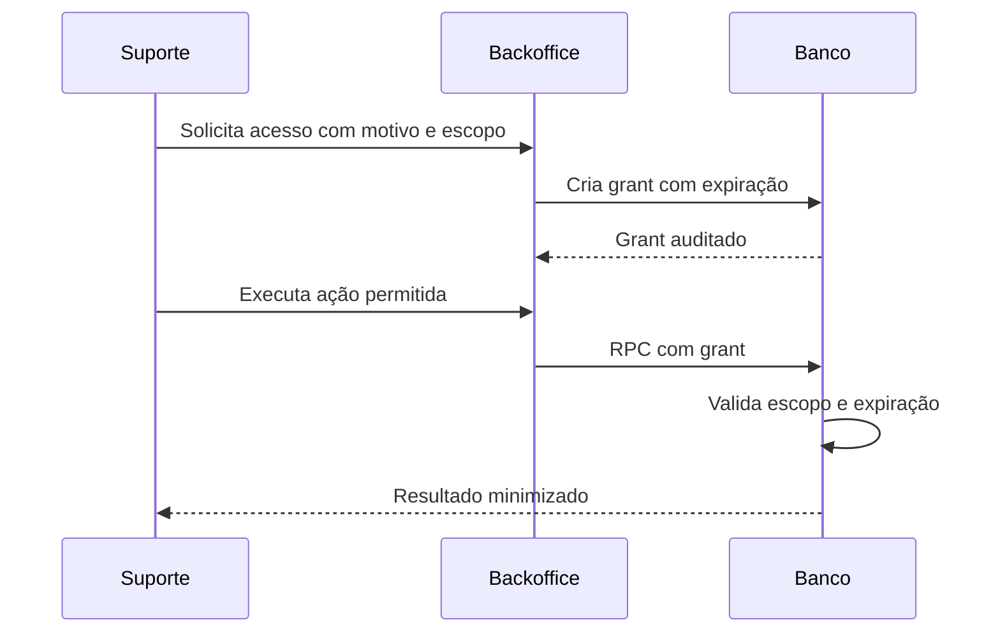

# Tapajiro

## Matriz de RLS, RBAC e Segurança de Dados

**Produto:** Tapajiro  
**Banco:** PostgreSQL/Supabase  
**Versão do documento:** 1.0  
**Data:** 19 de julho de 2026  
**Status:** Especificação para revisão antes das policies  
**Documentos de origem:** PRD v1.1, Arquitetura Técnica v1.0 e Modelo Físico v1.0  

---

## 1. Objetivo

Este documento define como identidades, vínculos, papéis, permissões, Row Level Security, funções privilegiadas, Storage, Realtime e suporte excepcional protegerão os dados do Tapajiro.

Os objetivos prioritários são:

1. impedir leitura ou escrita entre organizações;
2. limitar usuários às unidades autorizadas;
3. aplicar permissões no banco, independentemente da interface;
4. restringir entregadores às próprias entregas;
5. impedir mutação direta de estados críticos;
6. impedir acesso anônimo a tabelas base;
7. controlar ações privilegiadas e `service_role`;
8. auditar suporte e mudanças sensíveis;
9. garantir que registros de pagamento não evoluam para intermediação financeira.

---

## 2. Princípios de autorização

- RLS fica habilitada e forçada em toda tabela exposta.
- Ausência de policy significa negação.
- Policies são específicas por operação.
- `USING` controla linhas existentes; `WITH CHECK` controla novas versões.
- Permissão de interface nunca substitui permissão de banco.
- O JWT identifica o usuário, mas memberships e permissões são consultadas no banco.
- `organization_id` e `unit_id` recebidos são sempre validados.
- Tabelas internas não são expostas pela Data API.
- Históricos não aceitam update/delete do cliente.
- Comandos críticos usam RPC, não update direto.
- `service_role` nunca existe no frontend.
- Suporte não assume automaticamente vínculo com a organização.
- Toda exceção é curta, justificada, auditada e revogável.
- Valores dos pedidos não geram carteira, saldo, split, transferência ou liquidação.

---

## 3. Ameaças cobertas

| Código | Ameaça | Controle |
|---|---|---|
| TH-001 | Usuário de A lê B alterando filtro do cliente | RLS por tenant |
| TH-002 | Usuário de uma unidade acessa outra | `has_unit_access` |
| TH-003 | Papel operacional altera preço ou caixa | Permissão atômica e RPC |
| TH-004 | Entregador enumera pedidos | Policy por `driver.profile_id` e delivery |
| TH-005 | Usuário suspenso mantém acesso com JWT válido | Membership ativa consultada no banco |
| TH-006 | Função definer ignora tenant | Helper, search_path fixo e teste negativo |
| TH-007 | Anônimo consulta PII | RPC pública mínima e token hash |
| TH-008 | Suporte consulta cliente sem autorização | Grant temporário e auditoria |
| TH-009 | Storage revela arquivo de outro tenant | Policy por caminho e tenant |
| TH-010 | Realtime transmite evento de outro tenant | Canal privado e RLS em mensagens |
| TH-011 | Frontend usa chave administrativa | Secret scanning e bloqueio arquitetural |
| TH-012 | Registro de pagamento cria fluxo financeiro | Entidades, grants e RPCs limitados a registro informativo |

---

## 4. Papéis técnicos do PostgreSQL/Supabase

| Papel técnico | Uso | Acesso |
|---|---|---|
| `anon` | Cliente público sem sessão interna | RPCs públicas explicitamente concedidas e assets públicos |
| `authenticated` | Usuário interno autenticado | Tabelas sob RLS e RPCs concedidas |
| `service_role` | Edge Functions e jobs controlados | Bypass privilegiado; nunca confiado sem validação de domínio |
| owner de migrations | CI/administração | DDL, não usado pela aplicação |
| owner de funções | Papel sem login | Dono de helpers/definers, menor privilégio |

Papéis do restaurante não serão papéis PostgreSQL. Eles são dados em `roles`, `permissions`, `role_permissions` e `memberships`.

---

## 5. Catálogo de permissões da aplicação

### 5.1. Organização e unidade

| Permissão | Risco | Uso |
|---|---|---|
| `organization.read` | baixo | Ler identidade básica do tenant |
| `organization.update` | alto | Alterar dados da organização |
| `unit.read` | baixo | Ler unidade autorizada |
| `unit.update` | alto | Alterar dados, horário e operação |
| `unit.pause_orders` | alto | Pausar/reabrir pedidos |

### 5.2. Equipe

| Permissão | Risco | Uso |
|---|---|---|
| `team.read` | médio | Consultar equipe e papéis |
| `team.invite` | alto | Convidar usuário |
| `team.manage` | crítico | Alterar papel, unidade ou status |
| `role.manage` | crítico | Customizar papéis e permissões |

### 5.3. Cardápio e clientes

| Permissão | Risco | Uso |
|---|---|---|
| `catalog.read` | baixo | Consultar catálogo interno |
| `catalog.manage` | alto | Criar/editar itens e preços |
| `catalog.publish` | alto | Publicar versão pública |
| `customer.read` | médio | Consultar cliente e endereço |
| `customer.manage` | alto | Criar/alterar cliente e endereço |
| `customer.note` | alto | Criar nota interna |

### 5.4. Pedidos e operação

| Permissão | Risco | Uso |
|---|---|---|
| `order.read` | médio | Ler pedidos autorizados |
| `order.create` | alto | Criar pedido interno |
| `order.accept` | alto | Aceitar/rejeitar pedido pendente |
| `order.cancel` | crítico | Cancelar pedido |
| `order.discount` | crítico | Aplicar desconto autorizado |
| `order.reprint` | médio | Reimprimir com auditoria |
| `kds.operate` | alto | Iniciar preparo e marcar pronto |
| `dispatch.operate` | alto | Conferir e expedir |

### 5.5. Entregas

| Permissão | Risco | Uso |
|---|---|---|
| `delivery.read` | médio | Ler fila e entregas da unidade |
| `delivery.assign` | alto | Atribuir entregador |
| `delivery.manage_drivers` | alto | Cadastrar/alterar entregadores |
| `delivery.operate_own` | alto | Entregador altera apenas própria entrega |
| `delivery.compensation_read` | médio | Ler cálculo gerencial |
| `delivery.compensation_manage` | alto | Revisar/marcar pagamento externo |

### 5.6. Registros de pagamento, caixa e relatórios

| Permissão | Risco | Uso |
|---|---|---|
| `payment_method.manage` | alto | Configurar meios recebidos pelo restaurante |
| `payment_record.read` | alto | Ler estado e meio registrado |
| `payment_record.confirm` | crítico | Confirmar recebimento direto |
| `cash.read` | alto | Consultar caixa |
| `cash.open` | crítico | Abrir sessão |
| `cash.move` | crítico | Sangria, suprimento e ajuste |
| `cash.close` | crítico | Fechar sessão |
| `cash.reopen` | crítico | Reabrir por procedimento gerencial |
| `report.read` | alto | Ler indicadores gerenciais |
| `report.export` | crítico | Exportar dados |

### 5.7. Governança

| Permissão | Risco | Uso |
|---|---|---|
| `audit.read` | crítico | Consultar auditoria do tenant |
| `subscription.read` | médio | Ler plano e situação |
| `subscription.manage` | crítico | Gerenciar assinatura própria do SaaS |

---

## 6. Matriz padrão de papéis

Legenda: `✓` permitido; `—` não permitido; `P` permitido por política/configuração adicional; `PRÓPRIA` apenas recurso atribuído ao usuário.

| Permissão | Proprietário | Gerente | Atendente | Caixa | Cozinha | Expedição | Entregador | Financeiro |
|---|:---:|:---:|:---:|:---:|:---:|:---:|:---:|:---:|
| organization.read | ✓ | ✓ | ✓ | ✓ | ✓ | ✓ | ✓ | ✓ |
| organization.update | ✓ | — | — | — | — | — | — | — |
| unit.read | ✓ | ✓ | ✓ | ✓ | ✓ | ✓ | ✓ | ✓ |
| unit.update | ✓ | ✓ | — | — | — | — | — | — |
| unit.pause_orders | ✓ | ✓ | — | — | — | — | — | — |
| team.read | ✓ | ✓ | — | — | — | — | — | — |
| team.invite | ✓ | P | — | — | — | — | — | — |
| team.manage | ✓ | P | — | — | — | — | — | — |
| role.manage | ✓ | — | — | — | — | — | — | — |
| catalog.read | ✓ | ✓ | ✓ | ✓ | ✓ | ✓ | — | ✓ |
| catalog.manage | ✓ | ✓ | — | — | — | — | — | — |
| catalog.publish | ✓ | ✓ | — | — | — | — | — | — |
| customer.read | ✓ | ✓ | ✓ | ✓ | — | — | — | — |
| customer.manage | ✓ | ✓ | ✓ | ✓ | — | — | — | — |
| customer.note | ✓ | ✓ | ✓ | P | — | — | — | — |
| order.read | ✓ | ✓ | ✓ | ✓ | ✓ | ✓ | — | — |
| order.create | ✓ | ✓ | ✓ | ✓ | — | — | — | — |
| order.accept | ✓ | ✓ | ✓ | P | — | — | — | — |
| order.cancel | ✓ | ✓ | P | — | — | — | — | — |
| order.discount | ✓ | ✓ | P | P | — | — | — | — |
| order.reprint | ✓ | ✓ | ✓ | ✓ | ✓ | ✓ | — | — |
| kds.operate | ✓ | ✓ | — | — | ✓ | — | — | — |
| dispatch.operate | ✓ | ✓ | — | — | — | ✓ | — | — |
| delivery.read | ✓ | ✓ | ✓ | ✓ | — | ✓ | PRÓPRIA | — |
| delivery.assign | ✓ | ✓ | — | — | — | ✓ | — | — |
| delivery.manage_drivers | ✓ | ✓ | — | — | — | P | — | — |
| delivery.operate_own | — | — | — | — | — | — | PRÓPRIA | — |
| delivery.compensation_read | ✓ | ✓ | — | — | — | — | PRÓPRIA | ✓ |
| delivery.compensation_manage | ✓ | ✓ | — | — | — | — | — | ✓ |
| payment_method.manage | ✓ | ✓ | — | — | — | — | — | ✓ |
| payment_record.read | ✓ | ✓ | ✓ | ✓ | — | ✓ | PRÓPRIA | ✓ |
| payment_record.confirm | ✓ | ✓ | — | ✓ | — | P | P | ✓ |
| cash.read | ✓ | ✓ | — | ✓ | — | — | — | ✓ |
| cash.open | ✓ | ✓ | — | ✓ | — | — | — | — |
| cash.move | ✓ | ✓ | — | ✓ | — | — | — | — |
| cash.close | ✓ | ✓ | — | ✓ | — | — | — | P |
| cash.reopen | ✓ | ✓ | — | — | — | — | — | — |
| report.read | ✓ | ✓ | — | P | — | — | — | ✓ |
| report.export | ✓ | ✓ | — | — | — | — | — | ✓ |
| audit.read | ✓ | ✓ | — | — | — | — | — | P |
| subscription.read | ✓ | ✓ | — | — | — | — | — | ✓ |
| subscription.manage | ✓ | — | — | — | — | — | — | — |

Permissões `P` não entram no papel padrão sem decisão de produto. A organização poderá customizar papéis no P1, respeitando permissões não delegáveis.

### 6.1. Permissões não delegáveis

- conceder `organization.update`;
- conceder `role.manage`;
- remover ou suspender o último proprietário;
- ampliar o próprio papel;
- conceder acesso a unidade fora do próprio escopo;
- conceder permissão inexistente no plano;
- criar papel de plataforma;
- conceder capacidade financeira proibida.

---

## 7. Funções auxiliares de autorização

As helpers ficam em `private`, não são expostas pela Data API e são executadas por policies ou RPCs.

### 7.1. `private.is_active_org_member`

```sql
private.is_active_org_member(
  p_user_id uuid,
  p_organization_id uuid
) returns boolean
```

Verdadeiro quando existe membership `active` para `profile_id = p_user_id` e organização ativa em condição compatível com acesso.

### 7.2. `private.has_unit_access`

```sql
private.has_unit_access(
  p_user_id uuid,
  p_organization_id uuid,
  p_unit_id uuid
) returns boolean
```

Requer membership ativa e:

- `all_units = true`; ou
- linha ativa em `membership_units` da mesma organização/unidade.

### 7.3. `private.has_permission`

```sql
private.has_permission(
  p_user_id uuid,
  p_organization_id uuid,
  p_unit_id uuid,
  p_permission_key text
) returns boolean
```

Fluxo:

1. valida membership ativa;
2. valida acesso à unidade quando fornecida;
3. resolve papel ativo;
4. verifica `role_permissions` e `permissions.active`;
5. retorna false por padrão.

### 7.4. `private.is_platform_admin`

Valida `private.platform_admins`, status ativo e nível exigido. Não concede acesso a dados de tenant por si só.

### 7.5. `private.has_support_access`

Valida:

- platform admin ativo;
- grant não revogado;
- horário entre início e expiração;
- organização correspondente;
- ação contida no `scope`;
- MFA/nível exigido verificado no fluxo de suporte.

### 7.6. `private.is_driver_for_delivery`

Compara `auth.uid()` ao `drivers.profile_id` associado ao `deliveries.driver_id`, exige driver ativo e, quando aplicável, vínculo ativo com a unidade.

### 7.7. Segurança das helpers

- `language sql` quando suficiente;
- `stable` para leitura de autorização;
- `security definer` apenas para evitar recursão/RLS nas tabelas de autorização;
- `set search_path = pg_catalog, public, private`;
- tabelas sempre schema-qualified;
- owner sem login;
- `revoke all from public`;
- `grant execute` apenas ao papel técnico necessário;
- parâmetros nunca interpolados em SQL dinâmico;
- índices suportam todas as condições.

---

## 8. Padrões de policy

### 8.1. Leitura de unidade

```sql
create policy orders_select_unit
on public.orders
for select
to authenticated
using (
  private.has_permission(
    auth.uid(), organization_id, unit_id, 'order.read'
  )
);
```

### 8.2. Escrita administrativa simples

```sql
create policy products_insert_manage
on public.products
for insert
to authenticated
with check (
  private.has_permission(
    auth.uid(), organization_id, unit_id, 'catalog.manage'
  )
);
```

### 8.3. Update com isolamento

```sql
create policy products_update_manage
on public.products
for update
to authenticated
using (
  private.has_permission(
    auth.uid(), organization_id, unit_id, 'catalog.manage'
  )
)
with check (
  private.has_permission(
    auth.uid(), organization_id, unit_id, 'catalog.manage'
  )
);
```

### 8.4. Entrega própria

```sql
create policy deliveries_select_own
on public.deliveries
for select
to authenticated
using (
  private.is_driver_for_delivery(auth.uid(), id)
);
```

Policies de entregador são combinadas com policies da equipe. Como policies permissivas são OR por padrão, cada policy deve conceder somente o conjunto pretendido.

### 8.5. Delete

Delete físico fica negado por padrão. Catálogo usa RPC/soft delete sob permissão. Tabelas temporárias ou relações específicas podem receber delete após revisão.

---

## 9. Matriz RLS — organização e acesso

`—` significa sem policy/grant direto. `RPC` significa que a mutação ocorre somente por função autorizada.

| Tabela | Anon | Select authenticated | Insert | Update | Delete | Observação |
|---|---|---|---|---|---|---|
| organizations | — | Membro ativo ou suporte com grant | RPC | RPC | — | Status e documento não ficam em update livre |
| units | — | `unit.read` + acesso à unidade | RPC | RPC `unit.update` | — | Pause por RPC própria |
| unit_settings | — | `unit.read` | — | RPC `unit.update` | — | Pix deve pertencer à unidade |
| business_hours | — | `unit.read` | `unit.update` | `unit.update` | Soft delete/RPC | FK composta obrigatória |
| business_hour_exceptions | — | `unit.read` | `unit.update` | `unit.update` | Soft delete/RPC | Data local da unidade |
| delivery_zones | — | `unit.read` | `unit.update` | `unit.update` | Soft delete/RPC | Taxa validada no servidor |
| profiles | — | Próprio perfil; `team.read` para membros do mesmo tenant | — | RPC próprio | — | Não expor e-mail de auth desnecessariamente |
| roles | — | Próprio papel; `team.read` no tenant | RPC | RPC `role.manage` | — | Templates system imutáveis |
| permissions | — | `team.read` retorna catálogo necessário | — | — | — | Seed/migration only |
| role_permissions | — | `team.read` no tenant | RPC | — | RPC | Não ampliar o próprio papel |
| memberships | — | Próprio vínculo; `team.read` no tenant | RPC | RPC `team.manage` | — | Último owner protegido |
| membership_units | — | Próprio vínculo; `team.read` | RPC | — | RPC | Escopo não excede o gestor |
| invitations | — | `team.read` | RPC `team.invite` | RPC | RPC/revoke | Token bruto nunca é retornado após criação |

### 9.1. Regras especiais de profiles

- Usuário sempre pode ler o próprio perfil.
- `team.read` permite nome, papel, status e unidades de colegas; telefone pode ser mascarado conforme necessidade.
- E-mail é obtido por RPC restrita quando necessário para gestão, não por join público indiscriminado com `auth.users`.
- Update do próprio nome/avatar ocorre por RPC com allowlist de campos.
- Usuário não altera `status`, memberships ou papel pelo update do perfil.

### 9.2. Regras especiais de memberships

- Policy de leitura própria não concede leitura da organização inteira.
- Mutações passam por `invite_member` e `change_membership`.
- Gerente com delegação não concede permissões que não possui.
- Papel de proprietário só pode ser concedido/transferido por proprietário ativo.
- Suspensão é efetiva imediatamente porque helpers consultam status.

---

## 10. Matriz RLS — cardápio

| Tabela | Anon | Select authenticated | Insert | Update | Delete | Observação |
|---|---|---|---|---|---|---|
| menus | — | `catalog.read` | `catalog.manage` | `catalog.manage` | — | Publicação por RPC |
| menu_versions | — | `catalog.read` | RPC `catalog.publish` | — | — | Imutável |
| categories | — | `catalog.read` | `catalog.manage` | `catalog.manage` | Soft delete por RPC | — |
| products | — | `catalog.read` | `catalog.manage` | `catalog.manage` | Soft delete por RPC | Preço em variants |
| product_variants | — | `catalog.read` | `catalog.manage` | `catalog.manage` | Soft delete por RPC | `price_cents` auditado |
| option_groups | — | `catalog.read` | `catalog.manage` | `catalog.manage` | Soft delete por RPC | — |
| options | — | `catalog.read` | `catalog.manage` | `catalog.manage` | Soft delete por RPC | — |
| availability_rules | — | `catalog.read` | `catalog.manage` | `catalog.manage` | RPC/soft delete | — |
| product_allergens | — | `catalog.read` | `catalog.manage` | — | `catalog.manage` | Relação simples |

### 10.1. Leitura pública

O papel `anon` não lê tabelas do catálogo. O cardápio público é retornado por snapshot por meio de uma função server-side controlada:

```text
Edge/endpoint → private.get_public_menu_by_slug(slug)
```

O retorno inclui apenas:

- unidade pública ativa;
- estado aberto/fechado e estimativa;
- modalidades e taxas públicas;
- snapshot publicado;
- meios de pagamento públicos habilitados;
- branding publicado.

Não inclui configurações internas, IDs sensíveis, memberships, custos ou dados de outros menus.

### 10.2. Publicação

`publish_menu_version` exige `catalog.publish`, valida acesso à unidade, recalcula snapshot e checksum, insere versão imutável e atualiza o menu na mesma transação.

---

## 11. Matriz RLS — clientes

| Tabela | Anon | Select authenticated | Insert | Update | Delete | Observação |
|---|---|---|---|---|---|---|
| customers | — | `customer.read` | `customer.manage` | `customer.manage` | RPC de anonimização/soft delete | Tenant obrigatório |
| customer_addresses | — | `customer.read` | `customer.manage` | `customer.manage` | Soft delete | PII |
| customer_consents | — | `customer.read` | RPC/`customer.manage` | — | — | Append-only |
| customer_notes | — | `customer.read` | `customer.note` | — | RPC auditada | Nota não é editada silenciosamente |

### 11.1. Minimização

- Cozinha não recebe `customer.read`.
- Entregador não acessa customers ou customer_addresses; recebe snapshot mínimo por policy de delivery.
- Expedição pode ler endereço apenas para pedidos da unidade.
- Financeiro usa RPCs de relatório e não recebe select direto de cliente, endereço ou pedido.
- Exports exigem `report.export` e não usam select irrestrito da tabela.

### 11.2. Pedido público

O checkout anônimo não insere diretamente em customers. A Edge Function valida, normaliza e chama `private.create_order_atomic`, que cria/resolve o cliente dentro do tenant determinado pelo slug.

---

## 12. Matriz RLS — pedidos e produção

| Tabela | Anon | Select authenticated | Insert | Update | Delete | Observação |
|---|---|---|---|---|---|---|
| orders | — | `order.read` na unidade | RPC | RPC | — | Sem nome, telefone ou endereço do cliente |
| order_customers | — | `customer.read` ou `dispatch.operate`; entregador via view própria | RPC | — | — | Snapshot de PII restrito |
| order_addresses | — | `customer.read` ou `dispatch.operate`; entregador via view própria | RPC | — | — | PII restrita |
| order_items | — | `order.read`; entregador recebe resumo necessário | RPC | — | — | Imutável |
| order_item_options | — | Herdado do pedido autorizado | RPC | — | — | Imutável |
| order_adjustments | — | `order.read` | RPC `order.discount` | — | — | Append-only |
| order_status_history | — | `order.read` | RPC de transição | — | — | Append-only |
| order_events | — | `order.read`, payload seguro | RPC/sistema | — | — | Append-only |
| preparation_records | — | `order.read` | RPC `kds.operate` | RPC `kds.operate` | — | Estado coerente com order |

### 12.1. Leitura por entregador

O papel entregador não recebe `order.read`. Uma policy/view específica retorna apenas pedidos cuja entrega esteja atribuída ao driver ligado a `auth.uid()`.

Campos permitidos:

- número e modalidade;
- itens ou resumo necessário à conferência;
- nome do recebedor;
- endereço e referência durante entrega ativa;
- telefone operacional quando necessário;
- total e meio a receber diretamente;
- observação de entrega;
- status da entrega.

Campos negados:

- histórico completo do cliente;
- notas internas;
- auditoria;
- margem, relatórios e outros pedidos;
- dados após o período de necessidade definido.

### 12.2. Criação de pedido

| Origem | Entrada | Função |
|---|---|---|
| Cardápio público | Edge Function autenticada tecnicamente | `private.create_order_atomic` |
| Balcão/telefone | Usuário com `order.create` | `public.create_manual_order` |
| Marketplace P2 | Adapter/webhook validado | Função privada específica |

Nenhum desses fluxos aceita total final do cliente como autoridade.

### 12.3. Transição de estado

`transition_order_status` valida:

- membership e unidade;
- permissão conforme transição;
- status atual;
- `expected_version`;
- motivo obrigatório;
- efeitos em preparação/entrega;
- histórico, audit e outbox na mesma transação.

Mapeamento inicial:

| Transição | Permissão |
|---|---|
| pending → confirmed/rejected | `order.accept` |
| confirmed → in_preparation | `kds.operate` |
| in_preparation → ready | `kds.operate` |
| ready → awaiting_pickup/completed | `dispatch.operate` |
| ready → out_for_delivery | `dispatch.operate` + entrega atribuída |
| qualquer cancelamento permitido | `order.cancel` |
| out_for_delivery → delivered | Função de delivery, não update de order isolado |

---

## 13. Matriz RLS — entrega

| Tabela | Anon | Select equipe | Select entregador | Insert | Update | Delete |
|---|---|---|---|---|---|---|
| drivers | — | `delivery.read`/`manage_drivers` | Próprio registro mínimo | RPC | RPC | Soft delete RPC |
| driver_units | — | `delivery.manage_drivers` | Próprios vínculos | RPC | RPC | RPC |
| deliveries | — | `delivery.read` | `is_driver_for_delivery` | RPC | RPC | — |
| delivery_status_history | — | `delivery.read` | Própria entrega | RPC | — | — |
| driver_compensation_rules | — | `delivery.compensation_read` | — | RPC manage | RPC manage | — |
| driver_compensation_records | — | `delivery.compensation_read` | Próprio valor, se produto aprovar | RPC | RPC manage | — |

### 13.1. Atribuição

`assign_driver` exige `delivery.assign` e valida:

- pedido da mesma unidade;
- modalidade delivery;
- status pronto/permitido;
- driver ativo e vinculado à unidade;
- ausência de entrega ativa incompatível;
- versão esperada;
- histórico e auditoria.

### 13.2. Operação do entregador

`transition_delivery_status` aceita `delivery.operate_own` quando o usuário é o driver atribuído. O entregador não altera `driver_id`, total, endereço, pedido ou registro de pagamento por update direto.

Confirmação de recebimento na entrega usa RPC separada e permissão/condição explícita; ela apenas registra que o restaurante recebeu diretamente.

---

## 14. Matriz RLS — registro de pagamento

| Tabela | Anon | Select | Insert | Update | Delete | Observação |
|---|---|---|---|---|---|---|
| payment_methods | — | `unit.read` para checkout interno; público via snapshot | `payment_method.manage` | `payment_method.manage` | Soft disable | Meios do restaurante |
| order_payment_records | — | `payment_record.read`; entregador somente própria entrega | RPC | RPC confirm | — | Sem saldo |
| payment_status_history | — | `payment_record.read` | RPC | — | — | Append-only |
| external_payment_references | — | `payment_record.read` com mascaramento | Edge/RPC P2 | Edge/RPC P2 | — | Sem credencial/PAN/CVV |

### 14.1. Confirmação

`confirm_payment_record` exige:

- `payment_record.confirm` ou condição autorizada de entrega própria;
- pedido e registro da mesma unidade;
- estado de origem compatível;
- valor não alterado pelo cliente;
- origem registrada;
- ator e horário;
- history, audit e eventual movimento gerencial de caixa idempotente.

### 14.2. Restrições permanentes

Nenhuma policy, função ou grant pode:

- criar carteira ou saldo;
- transferir valor;
- gerar split;
- liquidar ou antecipar recebível;
- executar reembolso;
- inserir credenciais financeiras;
- misturar assinatura SaaS com pagamento do pedido.

`refunded_externally` registra um fato externo e exige justificativa/referência permitida.

---

## 15. Matriz RLS — caixa

| Tabela | Anon | Select | Insert | Update | Delete | Observação |
|---|---|---|---|---|---|---|
| cash_registers | — | `cash.read` | RPC/admin autorizado | RPC | — | — |
| cash_sessions | — | `cash.read` | RPC `cash.open` | RPC close/reopen | — | Sem update livre |
| cash_movements | — | `cash.read` | RPC `cash.move` ou efeito server-side | — | — | Append-only |
| cash_reconciliations | — | `cash.read` | RPC `cash.close` | — | — | Append-only após fechamento |

### 15.1. Regras

- `cash.open` não permite duas sessões abertas no mesmo caixa.
- `cash.move` exige sessão aberta, categoria e descrição em movimento manual.
- Reflexo de venda é idempotente e referencia payment record.
- `cash.close` calcula esperado no servidor.
- `cash.reopen` cria procedimento auditado; não apaga reconciliação anterior.
- Financeiro gerencial não é extrato bancário.

---

## 16. Matriz RLS — assinatura, relatórios e governança

| Recurso | Anon | Select tenant | Mutação tenant | Plataforma |
|---|---|---|---|---|
| plans | — | `subscription.read` | — | Administrador autorizado |
| plan_limits | — | `subscription.read` | — | Administrador autorizado |
| subscriptions | — | `subscription.read` na organização | RPC própria limitada | Backoffice autorizado |
| usage_counters | — | `subscription.read` | — | Sistema/backoffice |
| reporting views | — | RPC com `report.read` | — | Conforme escopo |
| exports | — | Solicitante com `report.export` | Edge Function | Suporte somente com grant |
| audit logs | — | RPC com `audit.read` | — | Suporte com grant/auditoria |
| feature flags | — | Resultado efetivo mínimo | — | Plataforma autorizada |

### 16.1. Planos e assinatura

- A organização lê apenas sua assinatura.
- Catálogo de planos pode ser retornado por RPC quando necessário.
- Mudança de plano não é update direto do tenant.
- Cobrança da assinatura é operação própria do Tapajiro e usa integração separada.
- Nenhum dado de assinatura concede acesso a pedidos de outra organização.

### 16.2. Relatórios

RPC de relatório exige:

- `report.read`;
- escopo de organização/unidades;
- período máximo;
- limite/paginação;
- campos permitidos;
- auditoria para exportação;
- arquivo privado e expiração para export grande.

### 16.3. Auditoria

`private.audit_logs` não é acessível diretamente pelo tenant. `get_audit_log` retorna registros da própria organização, aplica período/limite, redige dados e exige `audit.read`.

---

## 17. Schema private

### 17.1. Regra padrão

```sql
revoke all on schema private from public, anon, authenticated;
revoke all on all tables in schema private from public, anon, authenticated;
```

Default privileges devem manter a negação em objetos futuros.

### 17.2. Acesso por objeto

| Objeto | Cliente | Edge/worker | Leitura via RPC |
|---|---|---|---|
| unit_order_counters | — | Função de pedido | — |
| order_public_tokens | — | Status/criação de pedido | Apenas status público mínimo |
| idempotency_keys | — | Criação de pedido | — |
| platform_admins | — | Backoffice/auth helpers | — |
| support_access_grants | — | Backoffice/helpers | Resumo autorizado |
| audit_logs | — | RPCs/sistema | RPC `audit.read` |
| outbox_events | — | Worker | Métricas no backoffice |
| notification_jobs | — | Worker | Status restrito |
| integration_events | — | Webhook worker | Diagnóstico restrito |
| feature_flags | — | Avaliador server-side | Resultado efetivo mínimo |

### 17.3. Default privileges

Owners de migrations e funções devem configurar default privileges para que novas tabelas/functions não recebam `execute` ou DML automaticamente de `public`, `anon` ou `authenticated`.

---

## 18. Suporte excepcional

### 18.1. Fluxo



### 18.2. Requisitos

- MFA obrigatório.
- Identidade de suporte ativa.
- Motivo mínimo e ticket/incidente quando houver.
- Escopo por ações, não “acesso total”.
- Organização explícita.
- Duração curta; recomendação inicial de até 60 minutos.
- Revogação antecipada possível.
- Toda consulta e ação auditada.
- Exports bloqueados por padrão.
- Acesso a dados de cliente mascarado quando suficiente.
- Suporte nunca usa conta do proprietário.

### 18.3. Dupla aprovação

Obrigatória antes do comercial para:

- exportar dados de cliente;
- alterar membership de proprietário;
- reabrir caixa via suporte;
- executar correção de dados em produção;
- ampliar grant além do limite padrão.

---

## 19. Acesso público e papel anon

### 19.1. Grants permitidos

O papel `anon` pode:

- invocar endpoint/RPC de cardápio público;
- invocar Edge Function de criação de pedido;
- consultar status mínimo por token;
- ler assets dos buckets públicos.

### 19.2. Grants proibidos

O papel `anon` não pode selecionar ou modificar diretamente:

```text
organizations
units
customers
customer_addresses
orders
order_items
deliveries
order_payment_records
cash_*
memberships
roles
audit
private.*
```

### 19.3. Token de pedido

- mínimo de 128 bits de entropia;
- token bruto entregue uma vez;
- banco armazena SHA-256;
- comparação por hash;
- rate limit por IP/rede/token;
- retorno sem telefone/endereço completo;
- revogação e expiração suportadas;
- número amigável não autentica acesso.

### 19.4. Checkout

- Slug resolve unidade server-side.
- Rate limit e limite de payload.
- Chave idempotente obrigatória.
- Preço e disponibilidade recalculados.
- Organization/unit não são confiados a partir do payload.
- Falha não retorna existência de recurso de outro tenant.

---

## 20. Storage RLS

### 20.1. Convenção de path

```text
<organization_id>/<unit_id>/<resource...>/<asset_id>.<ext>
```

O caminho é gerado pela aplicação; o nome original não define tenant.

### 20.2. Buckets públicos

| Bucket | Select | Insert | Update | Delete |
|---|---|---|---|---|
| public-branding | anon/auth public assets | `unit.update` no path | `unit.update` | `unit.update` |
| public-catalog | anon/auth public assets | `catalog.manage` no path | `catalog.manage` | `catalog.manage` |

Policies de escrita validam:

- `bucket_id` exato;
- primeiro segmento igual à organização autorizada;
- segundo segmento igual à unidade autorizada;
- permissão correspondente;
- tamanho/MIME também validado server-side.

### 20.3. Buckets privados

| Bucket | Select | Insert | Update | Delete |
|---|---|---|---|---|
| private-exports | URL assinada ao solicitante autorizado | Edge Function | — | Worker de expiração/admin |
| private-support | Grant específico | Edge/backoffice | — | Backoffice autorizado |

Não conceder `select` amplo em `storage.objects` apenas porque o usuário pertence ao tenant.

### 20.4. Exemplo conceitual

```sql
private.has_permission(
  auth.uid(),
  ((storage.foldername(name))[1])::uuid,
  ((storage.foldername(name))[2])::uuid,
  'catalog.manage'
)
```

O SQL final deve tratar casts inválidos sem expor erro e usar helpers revisadas.

---

## 21. Realtime Authorization

### 21.1. Tópicos

```text
org:<organization_id>:unit:<unit_id>:orders
org:<organization_id>:unit:<unit_id>:kds
org:<organization_id>:unit:<unit_id>:dispatch
driver:<profile_id>:deliveries
```

### 21.2. Regras

| Canal | Receber | Publicar pelo cliente |
|---|---|---|
| orders | `order.read` na unidade | Não |
| kds | `order.read` ou `kds.operate` | Não |
| dispatch | `dispatch.operate` ou `delivery.read` | Não |
| driver | Somente o próprio profile | Presence controlada; broadcast de domínio não |

Broadcast de domínio é produzido pelo servidor/banco. Cliente usa mutation/RPC e não publica um “pedido confirmado” diretamente.

### 21.3. Payload

Permitido:

```json
{
  "event": "order.updated",
  "resourceId": "uuid",
  "version": 4,
  "occurredAt": "ISO-8601"
}
```

Proibido no broadcast:

- telefone;
- endereço;
- nome completo;
- observações;
- itens completos;
- valores financeiros detalhados;
- token público.

O cliente recebe o evento e refaz a consulta sob RLS.

---

## 22. `service_role` e operações privilegiadas

### 22.1. Uso permitido

- Edge Function de checkout público;
- worker de outbox;
- webhook validado;
- tarefas de manutenção explicitamente autorizadas;
- testes de integração server-side separados dos testes de usuário.

### 22.2. Uso proibido

- frontend;
- variáveis `VITE_*`;
- script distribuído ao restaurante;
- contornar bug de RLS;
- relatório comum;
- import sem validação de tenant;
- teste E2E que deveria provar a policy de usuário.

### 22.3. Regra de validação

`service_role` pode ignorar RLS; portanto cada operação privilegiada deve validar explicitamente:

- origem/autenticidade;
- tenant resolvido por dado confiável;
- unidade;
- payload/schema;
- idempotência;
- autorização do ator, quando houver;
- invariantes de negócio;
- auditoria e correlação.

Nunca reutilizar `organization_id` fornecido pelo cliente sem resolver slug, token, membership ou referência externa confiável.

---

## 23. Segurança de RPCs

### 23.1. Inventário

| RPC | Papel | Permissão/condição |
|---|---|---|
| create_manual_order | authenticated | order.create |
| transition_order_status | authenticated | Permissão por transição |
| assign_driver | authenticated | delivery.assign |
| transition_delivery_status | authenticated | dispatch.operate ou operate_own |
| confirm_payment_record | authenticated | payment_record.confirm/condição própria |
| open_cash_session | authenticated | cash.open |
| record_cash_movement | authenticated | cash.move |
| close_cash_session | authenticated | cash.close |
| reopen_cash_session | authenticated | cash.reopen |
| publish_menu_version | authenticated | catalog.publish |
| invite_member | authenticated | team.invite |
| change_membership | authenticated | team.manage |
| get_report_* | authenticated | report.read |
| export_report | authenticated/Edge | report.export |
| get_audit_log | authenticated | audit.read |
| public menu | anon/Edge | Unidade pública ativa |
| public create order | Edge only | Rate limit + domínio |
| public order status | anon/Edge | Token válido |

### 23.2. Checklist de RPC definer

- [ ] `search_path` fixo.
- [ ] owner sem login.
- [ ] grants explícitos.
- [ ] tenant e unidade validados.
- [ ] `auth.uid()` validado quando autenticada.
- [ ] permission key validada.
- [ ] input schema e limites.
- [ ] lock/versão/idempotência.
- [ ] history/audit na mesma transação.
- [ ] erro sem informação sensível.
- [ ] teste de chamada cruzada entre tenants.
- [ ] teste com vínculo suspenso.
- [ ] nenhuma capacidade financeira proibida.

---

## 24. Testes de RLS

### 24.1. Fixtures mínimas

```text
org_a
├── unit_a1
├── unit_a2
├── owner_a
├── manager_a1
├── cashier_a1
├── kitchen_a1
├── dispatch_a1
├── driver_a1
└── finance_a

org_b
├── unit_b1
├── owner_b
└── driver_b1
```

Criar pedidos, clientes, entregas, registros de pagamento e caixas em A1, A2 e B1.

### 24.2. Testes globais por tabela de tenant

Para cada tabela exposta:

1. usuário sem sessão não seleciona;
2. usuário sem membership não seleciona;
3. membership suspensa não seleciona;
4. usuário A não lê B;
5. usuário A não insere apontando para B;
6. usuário A não atualiza linha para B;
7. usuário A1 limitado não lê A2;
8. `WITH CHECK` bloqueia troca de unit/tenant;
9. delete permanece negado quando não especificado;
10. support sem grant permanece negado.

### 24.3. Casos por papel

| Caso | Resultado esperado |
|---|---|
| Atendente lê pedidos A1 | Permitido |
| Atendente lê pedidos A2 sem acesso | Negado |
| Cozinha lê KDS A1 | Permitido |
| Cozinha altera product price | Negado |
| Cozinha lê customer_addresses | Negado |
| Caixa confirma payment record A1 | Permitido |
| Caixa reabre sessão | Negado |
| Expedição atribui driver A1 | Permitido |
| Expedição atribui driver B1 | Negado |
| Driver A1 lê sua entrega | Permitido |
| Driver A1 lê outra entrega A1 | Negado |
| Driver A1 lê customer history | Negado |
| Financeiro lê relatório A | Permitido |
| Financeiro publica cardápio | Negado |
| Gerente cancela pedido | Permitido |
| Atendente sem flag cancela | Negado |
| Owner A altera membership B | Negado |
| Manager amplia próprio papel | Negado |

### 24.4. Policies combinadas

Testar explicitamente OR entre policies:

- equipe com `delivery.read` lê fila da unidade;
- driver sem `delivery.read` lê somente própria entrega;
- adicionar policy de equipe não amplia driver;
- grant de suporte não concede tenant diferente;
- leitura própria de profile não revela profiles do tenant.

### 24.5. Helpers

- `is_active_org_member` false para invited/suspended/revoked.
- `has_unit_access` respeita `all_units` e membership_units.
- `has_permission` false para permission/role inactive.
- helper não entra em recursão RLS.
- query usa índices com volume representativo.
- parâmetros nulos retornam false.
- `has_support_access` expira automaticamente.

### 24.6. RPCs

- chamada autorizada funciona;
- permissão ausente falha;
- tenant cruzado falha;
- unit cruzada falha;
- versão antiga falha;
- payload inválido falha;
- mesma idempotency key retorna mesmo pedido;
- mesma key com payload diferente gera conflito;
- audit e history são gravados;
- erro não revela existência de outro tenant.

### 24.7. Papel anon

- select direto em tabelas base falha;
- cardápio publicado funciona;
- cardápio draft não aparece;
- unidade pausada informa estado sem configuração interna;
- token inválido não revela pedido;
- order number sozinho não autentica;
- checkout altera organization_id e ainda resolve pelo slug confiável;
- spam aciona rate limit sem criar pedido.

### 24.8. Não intermediação financeira

- `payment_record.confirm` não cria carteira ou transferência;
- nenhuma policy expõe credential de provedor;
- driver pode informar recebimento permitido, não alterar valor;
- reembolso é apenas externo;
- compensation record não gera payout;
- tabela subscription não aparece em relatório do restaurante como venda;
- schema não contém entidade proibida.

---

## 25. Testes de Storage

- usuário A não lista path de B;
- usuário A1 não grava no path A2;
- cozinha não envia imagem de produto;
- catalog manager envia asset válido;
- path com UUID inválida falha;
- arquivo com MIME disfarçado falha na validação server-side;
- export privado não fica público;
- URL assinada expira;
- suporte sem grant não lê evidence;
- nome original não altera path.

---

## 26. Testes de Realtime

- usuário A não assina canal B;
- usuário A1 não assina canal A2 sem acesso;
- cozinha assina KDS A1;
- driver assina somente próprio canal;
- cliente não publica evento de domínio;
- payload não contém PII;
- vínculo suspenso perde autorização na reconexão;
- grant expirado bloqueia suporte;
- falha do canal não contorna RLS no refetch.

---

## 27. Performance de RLS

### 27.1. Índices críticos

```text
memberships(profile_id, organization_id, status)
memberships(organization_id, profile_id, status)
membership_units(membership_id, unit_id)
role_permissions(role_id, permission_id)
permissions(key, active)
drivers(profile_id, organization_id, status)
deliveries(driver_id, status)
support_access_grants(support_profile_id, organization_id, expires_at)
```

### 27.2. Regras

- Helpers `stable` podem ser chamadas via subselect quando recomendado pelo plano de execução.
- Evitar join repetido desnecessário por linha.
- Não colocar claims de permission como única fonte para “otimizar”.
- Testar policies com pelo menos 100 mil pedidos e múltiplos tenants.
- `EXPLAIN ANALYZE` das queries críticas deve fazer parte do gate de piloto.
- Otimização não pode reduzir o isolamento.

---

## 28. Ordem de implementação

| Ordem | Entrega |
|---:|---|
| 1 | Schemas, owners e default privileges |
| 2 | Organizations, units, profiles e memberships |
| 3 | Permissions, roles e seeds padrão |
| 4 | Helpers privadas com testes unitários SQL |
| 5 | RLS de organização/acesso |
| 6 | Testes de dois tenants |
| 7 | Cardápio e policies |
| 8 | Clientes e policies de PII |
| 9 | Pedidos somente leitura direta + RPCs |
| 10 | Entrega e policy própria do driver |
| 11 | Registros de pagamento e caixa por RPC |
| 12 | Storage policies |
| 13 | Realtime policies |
| 14 | Support grants/backoffice |
| 15 | Relatórios, exports e auditoria |
| 16 | Performance, carga e hardening |

Nenhum domínio novo entra sem policies e testes no mesmo PR.

---

## 29. Checklist de revisão de policy

- [ ] RLS enabled e forced.
- [ ] Grants de tabela revisados.
- [ ] Policy separada por operação.
- [ ] `USING` e `WITH CHECK` presentes onde necessários.
- [ ] Tenant e unidade considerados.
- [ ] Permission key correta.
- [ ] Membership suspensa bloqueada.
- [ ] FK composta impede tenant cruzado.
- [ ] Delete negado ou justificado.
- [ ] Anon negado por padrão.
- [ ] Entregador limitado ao próprio recurso.
- [ ] Suporte requer grant.
- [ ] Helper indexada e sem recursão.
- [ ] Testes positivos e negativos.
- [ ] Teste de policy combinada.
- [ ] `service_role` não usado para provar RLS.
- [ ] Histórico continua imutável.
- [ ] PII minimizada.
- [ ] Nenhuma capacidade financeira proibida.

---

## 30. Critérios de aceite

A especificação RLS estará pronta para virar migration quando:

- catálogo de permissões for aprovado por produto;
- matriz padrão de papéis for aprovada pelo operador piloto;
- todas as tabelas expostas tiverem estratégia S/I/U/D;
- helpers tiverem contratos e índices;
- ações críticas estiverem restritas a RPC;
- acesso público não selecionar tabelas base;
- motorista estiver limitado à própria entrega;
- suporte estiver limitado por grant temporário;
- Storage e Realtime tiverem policies previstas;
- testes de dois tenants cobrirem todos os domínios P0;
- papel `service_role` estiver isolado;
- guardrail de não intermediação estiver aprovado;
- responsável técnico revisar SQL final antes da aplicação.

---

## 31. Decisões pendentes

| Decisão | Prazo | Recomendação |
|---|---|---|
| Gerente pode gerir equipe | Antes do seed de papéis | Permissão opcional P, sem owner/role.manage |
| Atendente pode cancelar pedido | Antes do piloto | Apenas pending e com flag/limite |
| Caixa pode aceitar pedido | Antes do piloto | Habilitar somente se acumular atendimento |
| Expedição confirma recebimento na entrega | Antes do piloto | Permitir apenas para pedido atribuído e método compatível |
| Driver vê valor de remuneração | Antes do piloto | Sim apenas valor próprio, após validação do estabelecimento |
| Financeiro fecha caixa | Antes do piloto | Somente papel customizado; padrão leitura |
| Retenção do acesso do driver ao endereço | Antes de produção | Remover após janela operacional definida |
| Duração padrão do grant de suporte | Antes do backoffice | 60 minutos |
| MFA para proprietário | Antes do comercial | Recomendado/obrigatório para ações críticas a decidir |

---

## 32. Referências oficiais

- [PostgreSQL — Row Security Policies](https://www.postgresql.org/docs/current/ddl-rowsecurity.html)
- [PostgreSQL — CREATE POLICY](https://www.postgresql.org/docs/current/sql-createpolicy.html)
- [PostgreSQL — GRANT](https://www.postgresql.org/docs/current/sql-grant.html)
- [PostgreSQL — Function Security](https://www.postgresql.org/docs/current/perm-functions.html)
- [Supabase — Row Level Security](https://supabase.com/docs/guides/database/postgres/row-level-security)
- [Supabase — Securing your API](https://supabase.com/docs/guides/api/securing-your-api)
- [Supabase — Realtime Authorization](https://supabase.com/docs/guides/realtime/authorization)
- [Supabase — Storage Access Control](https://supabase.com/docs/guides/storage/security/access-control)
- [Supabase — Auth](https://supabase.com/docs/guides/auth)

---

**Fim do documento — Tapajiro Matriz de RLS, RBAC e Segurança de Dados v1.0**
